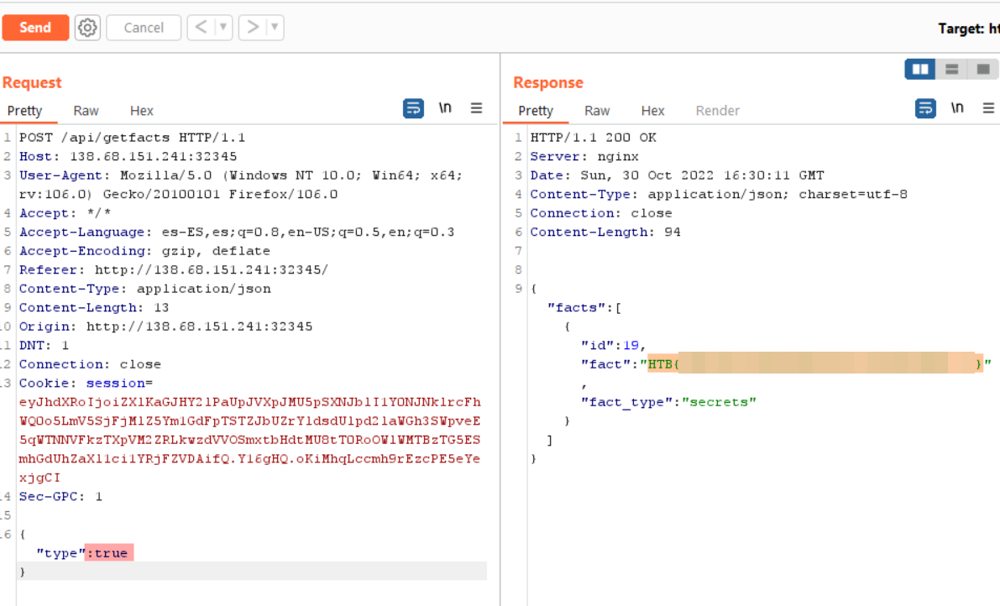

# Juggling Facts

Difficulty:: #easy 

---
## Disclaimer ⚠️

**I DID NOT SOLVE THIS CHALLENGE DURING THE CTF**, I took the guide from [Siunam's website writeup](https://siunam321.github.io/ctf/hacktheboo/Web/Juggling-Facts/) to solve it in the after event. Thank you Siuman.

---
## Introduction
The box is a php app with a api that retrieve data to render in the main page accordin to the type string that is send into the request. The way that do this is using a swith case that works with the input in the api request. But swith case performs a loosse comparison. It means that a case with a specific string can be bypasses using a boolean `true` value. This is known like  [PHP juggling type vulnerability](https://github.com/swisskyrepo/PayloadsAllTheThings/tree/master/Type%20Juggling). 

## Target data
- `Spawn Docker`: `138.68.151.241:32345` 
- `Source Code`: `web_juggling_facts.zip`

## Challenge Description
*An organization seems to possess knowledge of the true nature of pumpkins. Can you find out what they honestly know and uncover this centuries-long secret once and for all?*.


## Enumeration
```
http://138.68.151.241:32345/
```


First download the source code and identify a PHP app so I go to the `web_juggling_facts/challenge/index.php` to see the endpoints availables.

```shell
magor$ tree web_juggling_facts
web_juggling_facts
├── Dockerfile
├── build-docker.sh
├── challenge
│   ├── Database.php
│   ├── Router.php
│   ├── controllers
│   │   ├── Controller.php
│   │   └── IndexController.php
│   ├── index.php
│   ├── models
│   │   ├── FactModel.php
│   │   └── Model.php
│   ├── static
│   │   ├── css
│   │   │   └── index.css
│   │   └── js
│   │       └── index.js
│   └── views
│       └── index.php
├── config
│   ├── fpm.conf
│   ├── nginx.conf
│   └── supervisord.conf
└── entrypoint.sh
```

I found a interesting endpoint `/api/getfacts` that redirects to `IndexController@getfacts`.
```php
# web_juggling_facts/challenge/index.php
<?php spl_autoload_register(function ($name) {
    if (preg_match('/Controller$/', $name)) {
        $name = "controllers/${name}";
    } elseif (preg_match('/Model$/', $name)) {
        $name = "models/${name}";
    }
    include_once "${name}.php";
});

$database = new Database('localhost', 'root', 'M@k3l@R!d3s$', 'web_juggling_facts');
$database->connect();

$router = new Router();
$router->new('GET', '/', 'IndexController@index');

$router->new('POST','/api/getfacts', 'IndexController@getfacts');

die($router->match());
```

### IndexController
So I open the `web_juggling_facts/challenge/controllers/IndexController.php` 

```php
# web_juggling_facts/challenge/controllers/IndexController.php`
# ...SNIP...
   public function getfacts($router)
    {
    ➊    $jsondata = json_decode(file_get_contents('php://input') , true);

       ➋ if ( empty($jsondata) || !array_key_exists('type', $jsondata))
        {
            return $router->jsonify(['message' => 'Insufficient parameters!']);
        }

       ➌ if ($jsondata['type'] === 'secrets' && $_SERVER['REMOTE_ADDR'] !== '127.0.0.1')
        {
            return $router->jsonify(['message' => 'Currently this type can be only accessed through localhost!']);
        }

      ➍  switch ($jsondata['type'])
        {
            case 'secrets':
                return $router->jsonify([
                    'facts' => $this->facts->➎get_facts('secrets')
                ]);

            case 'spooky':
                return $router->jsonify([
                    'facts' => $this->facts->get_facts('spooky')
                ]);
            
            case 'not_spooky':
                return $router->jsonify([
                    'facts' => $this->facts->get_facts('not_spooky')
                ]);
            
            default:
                return $router->jsonify([
                    'message' => 'Invalid type!'
                ]);
        }
    }
# ...SNIP...
```
The `getfacts()` function use `file_get_contents` to parse the POST body  and decodify the json ➊
The json must contain the kee `type`  ➋ and we see a `switcc case` ➍ so `type` only can have `secrets`, `spooky` or `not_spooky` strings. But only the `secrets` can be requested locally ➌ due to check that the ip should be `127.0.0.1`.  The `get_facts()` function ➎ is part of the `FactModel` found in `web_juggling_facts/challenge/models/FactModel.php`:

### FactModel

```php
# ...SNIP...

    public function get_facts($facts_type)
    {
        $facts = $this->database->query('SELECT * FROM facts WHERE fact_type = ?',[
            's' => [
                $facts_type
            ]
        ]);

        return $facts->fetch_all(MYSQLI_ASSOC) ?? [];
    }
```

The `get_facts()` function do a SELECT query using the `type` input. So checking the database setup in the `entrypoint.sh` file:

```shell
mysql -u root << EOF
CREATE DATABASE web_juggling_facts;
USE web_juggling_facts;

CREATE TABLE facts (
    id        INT NOT NULL AUTO_INCREMENT,
    fact      TEXT NOT NULL,
    fact_type VARCHAR(255) NOT NULL,
    primary key(id)
);

INSERT INTO facts(fact, fact_type) VALUES (
    '<p>Around <span class="highlight-number">90%</span> to <span class="highlight-number letter-ss17">95%</span> of the processed <span class=":pumpkin:">:pumpkin:</span>s in the United States are grown in <span class="highlight-word letter-ss17">Illinois</span></p>',
    'spooky'
),
...SNIP...
(
    'HTB{f4k3_fl4g_f0r_t3st1ng}',
    'secrets'
);
```

The `secrets` has the flag, so here I thought that I could abuse the `file_get_contents('php://input') ` to do a `http smuggling` attack and perform a server side request forgey to request the `secrets`. I even felt that it was the right path since i found [this bug in php](https://bugs.php.net/bug.php?id=81690), but not, it was more easy than that, but before seeing it was really hard for me, I couldn't figure out.

So after the event I read the [Siunam's website writeup](https://siunam321.github.io/ctf/hacktheboo/Web/Juggling-Facts/) who does a clear explanaiton about the [PHP juggling type vulnerability](https://github.com/swisskyrepo/PayloadsAllTheThings/tree/master/Type%20Juggling). 

The [type juggling](https://www.php.net/manual/en/language.types.type-juggling.php) is similar to the dinamic type in languages like Python. There are two ways to compare PHP variaables:

-   Loose comparison using `== or !=` : both variables have "the same value".
-   Strict comparison using `=== or !==` : both variables have "the same type and the same value".

The **loose comparison** is "the dangerous one", php offers a table with the result of the differents type comparison: and look the one higligth:


If i loose compare a random string with a bolean it returns `true`. I test it in the [`w3schools php compiler`](https://www.w3schools.com/php/phptryit.asp?filename=tryphp_compiler) and it returns `1`, that its interpreted like `true`.

```php
<?php echo "r4nd0m 5tr1ng" == true; ?>
```


So with that in mind, back to check if exists some comparison that would be vulnerable:

```php
# ...SNIP...
       ➊ if ($jsondata['type'] === 'secrets' && $_SERVER['REMOTE_ADDR'] !== '127.0.0.1')
        {
            return $router->jsonify(['message' => 'Currently this type can be only accessed through localhost!']);
        }

      ➋  switch ($jsondata['type'])
        {
          ➌ case 'secrets':
                return $router->jsonify([
                    'facts' => $this->facts-> get_facts('secrets')
                ]);

            case 'spooky':
                return $router->jsonify([
                    'facts' => $this->facts->get_facts('spooky')
                ]);
         # ...SNIP...
```

The verification that the request would be doing in localhost ➊ is stric comparison, so there is no vulnerabilitie. But how switch case ➋ works under the hood?. The [`swith docs`](https://www.php.net/manual/en/control-structures.switch.php) have a note saying  that *switch/case does [loose comparison](https://www.php.net/manual/en/types.comparisons.php#types.comparisions-loose).* This means, that if `type` is `true`  the first `case` ➌ will return true. And the first case is conveniently `secrets`!

Send the `{"test":true}`:



> ==ALWAYS TEST  DE APP BEHAIVOR UNDER DIFERENT DATA INPUTS==