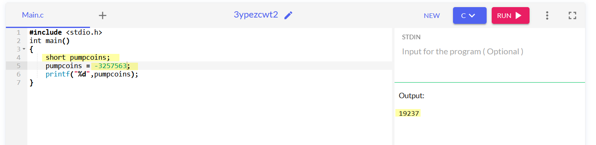

# Pumpkin Stand

Difficulty:: #easy 

## Introduction

This challenge give us a linux binary that performs a calculation using the user inputs and suffers from a [Integer overflow](https://en.wikipedia.org/wiki/Integer_overflow). This is a cool challenge to undesrtand basic concept of assembly code.

## Target data
- `Spawn Docker`:  `10`
- `File`: `pwn_pumpkin_stand.zip`

## Challenge Description

*This time of the year, we host our big festival and the one who craves the pumpkin faster and make it as scary as possible, gets an amazing prize! Be fast and try to crave this hard pumpkin!*

## Enumeration

We are given thef following data: 
```shell
magor$ tree pwn_pumpkin_stand
pwn_pumpkin_stand
└── challenge
    ├── flag.txt
    ├── glibc
    │   ├── ld-linux-x86-64.so.2
    │   └── libc.so.6
    └── pumpkin_stand
```

It seems we have a binary, a testing flag (what it tell us that with the binary we should shomehow read the flag). and library data to the binary.


Identify the file type of `pumpkin_stand` to found that is a linux binary.

```shell
$ file pumpkin_stand
pumpkin_stand: ELF 64-bit LSB shared object, x86-64, version 1 (SYSV), dynamically linked, interpreter ./glibc/ld-linux-x86-64.so.2, for GNU/Linux 3.2.0, BuildID[sha1]=fbbc6afe5dc2e791b38dfc19dbce5ab57c4a915e, not stripped
```

Due to this is a pwn challenge i use `checksec` to know what securities it has:

```shell
magor$ pwn checksec pumpkin_stand
[*] '/HTB/ctf/2022-boo/2-pwn/pwn_pumpkin_stand/challenge/pumpkin_stand'
    Arch:     amd64-64-little
    RELRO:    Full RELRO
    Stack:    Canary found
    NX:       NX enabled
    PIE:      PIE enabled
    RUNPATH:  b'./glibc/'
```

So I use [Ghidra]() to decompile it. And. Look for the `main` function to identify that there are 4 `while true` loops nested that must to be escaped to reach the reading flag.


After analize the flow. To escape the each loop , we have to meet the following conditions:

1. `AMOUNT > 0`
2. `pumpcoins > -1` 
3. `ITEMS_SELECTED != 1`
4. `pumpcoins > 9998`   ( `0x270e` )

The  1. and the 3. are the user inputs, and the 3. and 4. at the end means that the `pumpcoins > 9998`. and it is calculated with

```C
pumpcoins = pumpcoins - AMOUNT * (short)➊*(undefined4 *)((long)➋&values + (long)(int)ITEM_SELECTED * 4);
```

So in theory if i use a negative `ITEM_SELECTED`  the substraction would be an addition and with a higher `AMOUNT` with can do  `pumpcoins` bigger than `9998`. But the only strange thing is the `values` variable, because it is a pointer variable, and to the addition it use the addres value `&values`  ➋ and  after that it dereference `*` ➊ to obtain the value stored. In other words. They change the address value to obtain the value that this new address is pointing.

>**Note**:  To see the actual value that is stored in a pointer variable you have to use the **address-of** operator `&`.  and to see the data found in the addres that the pointer is pointing we use the **dereference operator** `*` both of them are knows like *unary operators* 

## Foothold

So we need choose the `AMOUNT` and `ITEM_SELECTED` such the multiplication would be negative, the `AMOUNT` must be positive so the `ITEM_SELECTED` have to be negative. We dont control the `values` variable so each time we execute with the same input parameters is probably that we obtain different values

```
$ nc -n 46.101.82.173 32059

                                          ##&
                                        (#&&
                                       ##&&
                                 ,*.  #%%&  .*,
                      .&@@@@#@@@&@@@@@@@@@@@@&@@&@#@@@@@@(
                    /@@@@&@&@@@@@@@@@&&&&&&&@@@@@@@@@@@&@@@@,
                   @@@@@@@@@@@@@&@&&&&&&&&&&&&&@&@@@@@@&@@@@@@
                 #&@@@@@@@@@@@@@@&&&&&&&&&&&&&&&#@@@@@@@@@@@@@@,
                .@@@@@#@@@@@@@@#&&&&&&&&&&&&&&&&&#@@@@@@@@@@@@@&
                &@@@@@@@@@@@@@@&&&&&&&&&&&&&&&&&&&@@@@@@@@@@@@@@@
                @@@@@@@@@@@@@@&&&&&&&&&&&&&&&&&&&&@@@@@@@@@&@@@@@
                @@@@@@@@@@@@@@@&&&&&&&&&&&&&&&&&&&@@@@@@@@@@@@@@@
                @@@@@@@@@@@@@@@&&&&&&&&&&&&&&&&&&&@@@@@@@@@@@@@@@
                .@@@@@@@@@@@@@@&&&&&&&&&&&&&&&&&&&@@@@@@@@@@@@@@
                 (@@@@@@@@@@@@@@&&&&&&&&&&&&&&&&&@@@@@@@@@@@@@@.
                   @@@@@@@@@@@@@@&&&&&&&&&&&&&&&@@@@@@@@@@@@@@
                    ,@@@@@@@@@@@@@&&&&&&&&&&&&&@@@@@@@@@@@@@
                       @@@@@@@@@@@@@&&&&&&&&&@@@@@@@@@@@@/

Current pumpcoins: [1337]

Items:

1. Shovel  (1337 p.c.)
2. Laser   (9999 p.c.)

>> -5

How many do you want?

>> 100

Congratulations, here is the code to get your laser:
HTB{xxxxxxxxxxxxxxxxxxxxxxxxxxxxxxxxxx}
```
 
> **Note**: The fist time I do attemps to change the input values to see what happend and notice that in some cases the pumcoins would be higher so I solved the challenge trial and error xD. But always is good understand why those things happened.


## Go beyond

I want to check exactly how this calculation is performed:

```C
pumpcoins = pumpcoins - AMOUNT * (short)*(undefined4 *)((long)&values + (long)(int)ITEM_SELECTED * 4);
```

To test it i am goint to use `ITEM_SELECTED = -5` and `AMOUNT = 100` . I will execute the binary, grab the process ID and debugging it with gdb.

>**Note**: I have to do this multiples time until I do it quickly. Because remember that in `setup` function there is a `alarm` clock in the binary. So we are limited in time by that.

So I execute the binary locally

```shell
$./pumpkin_stand

                                          ##&
                                        (#&&
                                       ##&&
                                 ,*.  #%%&  .*,
                      .&@@@@#@@@&@@@@@@@@@@@@&@@&@#@@@@@@(
                    /@@@@&@&@@@@@@@@@&&&&&&&@@@@@@@@@@@&@@@@,
                   @@@@@@@@@@@@@&@&&&&&&&&&&&&&@&@@@@@@&@@@@@@
                 #&@@@@@@@@@@@@@@&&&&&&&&&&&&&&&#@@@@@@@@@@@@@@,
                .@@@@@#@@@@@@@@#&&&&&&&&&&&&&&&&&#@@@@@@@@@@@@@&
                &@@@@@@@@@@@@@@&&&&&&&&&&&&&&&&&&&@@@@@@@@@@@@@@@
                @@@@@@@@@@@@@@&&&&&&&&&&&&&&&&&&&&@@@@@@@@@&@@@@@
                @@@@@@@@@@@@@@@&&&&&&&&&&&&&&&&&&&@@@@@@@@@@@@@@@
                @@@@@@@@@@@@@@@&&&&&&&&&&&&&&&&&&&@@@@@@@@@@@@@@@
                .@@@@@@@@@@@@@@&&&&&&&&&&&&&&&&&&&@@@@@@@@@@@@@@
                 (@@@@@@@@@@@@@@&&&&&&&&&&&&&&&&&@@@@@@@@@@@@@@.
                   @@@@@@@@@@@@@@&&&&&&&&&&&&&&&@@@@@@@@@@@@@@
                    ,@@@@@@@@@@@@@&&&&&&&&&&&&&@@@@@@@@@@@@@
                       @@@@@@@@@@@@@&&&&&&&&&@@@@@@@@@@@@/

Current pumpcoins: [1337]

Items: 

1. Shovel  (1337 p.c.)
2. Laser   (9999 p.c.)

>> 
```

And I look for the process `PID` that is running the binary to debuging with `dgb`:
```shell
magor$ ps aux | grep pumpkin_stand
magor        78311  0.0  0.0   4392   216 pts/0    S+   09:06   0:00 ./pumpkin_stand

```

Then with the `78311` PID process:

```shell
magor$ gdb -q --pid 78311
Attaching to process 78311
Reading symbols from /home/kil/Documents/ctf/2022-hackerboo/2-pwn/pwn_pum/challenge/pumpkin_stand...
(No debugging symbols found in /home/kil/Documents/ctf/2022-hackerboo/2-pwn/pwn_pum/challenge/pumpkin_stand)
Reading symbols from ./glibc/libc.so.6...
(No debugging symbols found in ./glibc/libc.so.6)
Reading symbols from ./glibc/ld-linux-x86-64.so.2...
(No debugging symbols found in ./glibc/ld-linux-x86-64.so.2)
0x00007f4d5398f031 in read () from ./glibc/libc.so.6
(gdb) disass main
Dump of assembler code for function main:
   0x0000555a0e800b9e <+0>:	push   rbp
   0x0000555a0e800b9f <+1>:	mov    rbp,rsp
   0x0000555a0e800ba2 <+4>:	sub    rsp,0x50
   0x0000555a0e800ba6 <+8>:	mov    rax,QWORD PTR fs:0x28
   0x0000555a0e800baf <+17>:	mov    QWORD PTR [rbp-0x8],rax
   0x0000555a0e800bb3 <+21>:	xor    eax,eax
   0x0000555a0e800bb5 <+23>:	call   0x555a0e800b2a <setup>
   0x0000555a0e800bba <+28>:	call   0x555a0e8009eb <banner>
   0x0000555a0e800bbf <+33>:	mov    WORD PTR [rbp-0x4c],0x0
   0x0000555a0e800bc5 <+39>:	mov    WORD PTR [rbp-0x4a],0x0
   0x0000555a0e800bcb <+45>:	call   0x555a0e80095a <menu>
   0x0000555a0e800bd0 <+50>:	lea    rax,[rbp-0x4c]
   0x0000555a0e800bd4 <+54>:	mov    rsi,rax
   0x0000555a0e800bd7 <+57>:	lea    rdi,[rip+0x74d]        # 0x555a0e80132b
   0x0000555a0e800bde <+64>:	mov    eax,0x0
   0x0000555a0e800be3 <+69>:	call   0x555a0e800820 <__isoc99_scanf@plt>
   0x0000555a0e800be8 <+74>:	lea    rdi,[rip+0x73f]        # 0x555a0e80132e
   0x0000555a0e800bef <+81>:	mov    eax,0x0
   0x0000555a0e800bf4 <+86>:	call   0x555a0e8007d0 <printf@plt>
   0x0000555a0e800bf9 <+91>:	lea    rax,[rbp-0x4a]
   0x0000555a0e800bfd <+95>:	mov    rsi,rax
   0x0000555a0e800c00 <+98>:	lea    rdi,[rip+0x724]        # 0x555a0e80132b
   0x0000555a0e800c07 <+105>:	mov    eax,0x0
   0x0000555a0e800c0c <+110>:	call   0x555a0e800820 <__isoc99_scanf@plt>
   0x0000555a0e800c11 <+115>:	movzx  eax,WORD PTR [rbp-0x4a]
   0x0000555a0e800c15 <+119>:	test   ax,ax
   0x0000555a0e800c18 <+122>:	jg     0x555a0e800c37 <main+153>
   0x0000555a0e800c1a <+124>:	lea    rsi,[rip+0x729]        # 0x555a0e80134a
   0x0000555a0e800c21 <+131>:	lea    rdi,[rip+0x730]        # 0x555a0e801358
   0x0000555a0e800c28 <+138>:	mov    eax,0x0
   0x0000555a0e800c2d <+143>:	call   0x555a0e8007d0 <printf@plt>
   0x0000555a0e800c32 <+148>:	jmp    0x555a0e800ddc <main+574>
   0x0000555a0e800c37 <+153>:	movzx  eax,WORD PTR [rip+0x2013da]        # 0x555a0ea02018 <pumpcoins>
   0x0000555a0e800c3e <+160>:	mov    ecx,eax
--Type <RET> for more, q to quit, c to continue without paging--
   0x0000555a0e800c40 <+162>:	movzx  eax,WORD PTR [rbp-0x4c]
   0x0000555a0e800c44 <+166>:	cwde   
   0x0000555a0e800c45 <+167>:	cdqe   
   0x0000555a0e800c47 <+169>:	lea    rdx,[rax*4+0x0]
   0x0000555a0e800c4f <+177>:	lea    rax,[rip+0x2013ba]        # 0x555a0ea02010 <values>
   0x0000555a0e800c56 <+184>:	mov    eax,DWORD PTR [rdx+rax*1]
   0x0000555a0e800c59 <+187>:	mov    edx,eax
   0x0000555a0e800c5b <+189>:	movzx  eax,WORD PTR [rbp-0x4a]
   0x0000555a0e800c5f <+193>:	imul   eax,edx
   0x0000555a0e800c62 <+196>:	sub    ecx,eax
   0x0000555a0e800c64 <+198>:	mov    eax,ecx
   0x0000555a0e800c66 <+200>:	mov    WORD PTR [rip+0x2013ab],ax        # 0x555a0ea02018 <pumpcoins>
   0x0000555a0e800c6d <+207>:	movzx  eax,WORD PTR [rip+0x2013a4]        # 0x555a0ea02018 <pumpcoins>
   0x0000555a0e800c74 <+214>:	test   ax,ax
   0x0000555a0e800c77 <+217>:	jns    0x555a0e800cc6 <main+296>
   0x0000555a0e800c79 <+219>:	movzx  eax,WORD PTR [rip+0x201398]        # 0x555a0ea02018 <pumpcoins>
   0x0000555a0e800c80 <+226>:	cwde   
   0x0000555a0e800c81 <+227>:	lea    rcx,[rip+0x1f0]        # 0x555a0e800e78
   0x0000555a0e800c88 <+234>:	mov    edx,eax
   0x0000555a0e800c8a <+236>:	lea    rsi,[rip+0x1ef]        # 0x555a0e800e80
   0x0000555a0e800c91 <+243>:	lea    rdi,[rip+0x1f0]        # 0x555a0e800e88
   0x0000555a0e800c98 <+250>:	mov    eax,0x0
   0x0000555a0e800c9d <+255>:	call   0x555a0e8007d0 <printf@plt>
   0x0000555a0e800ca2 <+260>:	lea    rdx,[rip+0x1cf]        # 0x555a0e800e78
   0x0000555a0e800ca9 <+267>:	lea    rsi,[rip+0x69a]        # 0x555a0e80134a
   0x0000555a0e800cb0 <+274>:	lea    rdi,[rip+0x6c9]        # 0x555a0e801380
   0x0000555a0e800cb7 <+281>:	mov    eax,0x0
   0x0000555a0e800cbc <+286>:	call   0x555a0e8007d0 <printf@plt>
   0x0000555a0e800cc1 <+291>:	jmp    0x555a0e800ddc <main+574>
   0x0000555a0e800cc6 <+296>:	movzx  eax,WORD PTR [rbp-0x4c]
   0x0000555a0e800cca <+300>:	cmp    ax,0x1
   0x0000555a0e800cce <+304>:	jne    0x555a0e800d0a <main+364>
   0x0000555a0e800cd0 <+306>:	movzx  eax,WORD PTR [rip+0x201341]        # 0x555a0ea02018 <pumpcoins>
   0x0000555a0e800cd7 <+313>:	cwde   
   0x0000555a0e800cd8 <+314>:	lea    rcx,[rip+0x199]        # 0x555a0e800e78
--Type <RET> for more, q to quit, c to continue without paging--q
Quit
(gdb) b *0x0000555a0e800c4f
Breakpoint 1 at 0x555a0e800c4f
(gdb) c
Continuing.

```

Now that I use `c` to continue the execution, I go to the shell where the binary is running to input the data:

```shell
>> -5

How many do you want?

>> 100

```

And return to the shell where is the  `gdb` debugging:
```
Breakpoint 1, 0x0000555a0e800c4f in main ()
(gdb)➊x/10i $rip 
=> 0x555a0e800c4f <main+177>:	lea    rax,[rip+0x2013ba]        # 0x555a0ea02010 <values>
   0x555a0e800c56 <main+184>:	mov    eax,DWORD PTR [rdx+rax*1]
   0x555a0e800c59 <main+187>:	mov    edx,eax
   0x555a0e800c5b <main+189>:	movzx  eax,WORD PTR [rbp-0x4a]
   0x555a0e800c5f <main+193>:	imul   eax,edx
   0x555a0e800c62 <main+196>:	sub    ecx,eax
   0x555a0e800c64 <main+198>:	mov    eax,ecx
   0x555a0e800c66 <main+200>:	mov    WORD PTR [rip+0x2013ab],ax        # 0x555a0ea02018 <pumpcoins>
   0x555a0e800c6d <main+207>:	movzx  eax,WORD PTR [rip+0x2013a4]        # 0x555a0ea02018 <pumpcoins>
   0x555a0e800c74 <main+214>:	test   ax,ax
(gdb)➋p values
'values' has unknown type; cast it to its declared type
(gdb)➌p (long)values
$1 = 5742371274752
(gdb)➍p (long)&values
$2 = 93845280792592
(gdb) p 0x555a0ea02010
$3 = 93845280792592
(gdb)➎i r rdx edx ecx rax eax ax
rdx            0xffffffffffffffec  -20
edx            0xffffffec          -20
ecx            0x539               1337
rax            0xfffffffffffffffb  -5
eax            0xfffffffb          -5
ax             0xfffb              -5

```

First I examine the 10 following code instructions from  where I stop ➊. Look that the `main+177` will store the value of the pointer varaible `values` inside the register `rax`. So I want to check what value is stored in `values` variable ➋ but i have to typecasting because it doesn't have a declared type. So I typecasting like `long` at ➌ and also want to print the addres at ➍ using the **address-of** operator `&`. and look that the `$2` value is the same that the hex addres in the snipped coded printed as `$3` but in decimal representatio. Now before go to the next instruction I print at ➎ the registers data that i saw that the following lines will use. And note that currently the input `ITEM_SELECTED=-5` is storedin the `rax` register and the operation `-5*4` is stored in the`rdx` register. And also notice that `ecx` currently stored the `pumpcoins` default value `1337`.

>`Note`:  `rax` , `eax` and `ax` registers are relationated. `rax` is the representation of the data in `64 bits`; `eax` is in `32 bits` and `ax` is in `16 bits`. you can see the relationship when see above that  `rax` , `eax` and `ax` stored the same `-5` decimal value but in hex the `rax = 0xfffffffffffffffb` , the `eax=0xfffffffb` and `ax = 0xfffb`.

```shell
(gdb) nexti
0x0000555a0e800c56 in main ()
(gdb) i r rdx edx ecx rax eax ax
rdx            0xffffffffffffffec  -20
edx            0xffffffec          -20
ecx            0x539               1337
rax            0x555a0ea02010      93845280792592
eax            0xea02010           245374992
ax             0x2010              8208
(gdb) nexti
```

After go to the next instruction now you can see that the only register that change is `rax` (and therefore `eax` and `ax`). it now stored the result of the operation in `main+177` that we already know that is the `values` variable. So continue:

```shell
(gdb) nexti
0x0000555a0e800c59 in main ()
(gdb) i r rdx edx ecx rax eax ax
rdx            0xffffffffffffffec  -20
edx            0xffffffec          -20
ecx            0x539               1337
rax            0x7f4d              32589
eax            0x7f4d              32589
ax             0x7f4d              32589
```

Now the `main+184` instructon was executed. and look that it stored in `eax` the **dereference operator** `*`  to see the data found in the address that the pointer is pointing. But **notice** that the address is not exacly the `values` address stored in `rax`;  is `rdx+rax*1` and remeber that currently `rdx` is `-20`. So this is the same as the decompyle operation part:  `((long)&values - ITEM_SELECTED*4)` that we saw in Ghidra. This means that with `ITEM_SELECTED` we look further ahead or further back of the address of `values` variable. And in this case its value is `32589`.

> **Note**: maybe you are thinking why in the previous instruction it stored the address value but know it store the value where is pointing that address value. the key is to note the difference between [`lea` an `mov` instruction](https://stackoverflow.com/questions/1699748/what-is-the-difference-between-mov-and-lea#1699778) :
> *`lea` means Load effective address , `mov` means `load value`. In short, `LEA` loads a pointer to the item you're addressing whereas MOV loads the actual value at that address.*


```shell
(gdb) nexti
0x0000555a0e800c5b in main ()
(gdb)➊i r rdx edx ecx rax eax ax
rdx            0x7f4d              32589
edx            0x7f4d              32589
ecx            0x539               1337
rax            0x7f4d              32589
eax            0x7f4d              32589
ax             0x7f4d              32589
```

Now the `main+187` instructon was executed. it only copy the `eax` value `32589` into the `edx` register. and when we print the registers at ➊ we confirm that.

```shell
(gdb) nexti
0x0000555a0e800c5f in main ()
(gdb) i r rdx edx ecx rax eax ax
rdx            0x7f4d              32589
edx            0x7f4d              32589
ecx            0x539               1337
rax            0x64                100
eax            0x64                100
ax             0x64                100
```
Now the `main+189` instructon was executed. Here we stored in `eax` our `AMOUNT` input value that was `100`.

```shell
(gdb) nexti
0x0000555a0e800c62 in main ()
(gdb) i r rdx edx ecx rax eax ax
rdx            0x7f4d              32589
edx            0x7f4d              32589
ecx            0x539               1337
rax            0x31ba14            3258900
eax            0x31ba14            3258900
ax             0xba14              -17900
```
Now the `main+193` instructon was executed. it use `imul` instruction. That means that multiply the `eax` register with the `edx` registerd and stored the result inside the `eax` register. `32589*100= 3258900`.

> **Note**: Something interseting is to notice that althougt with `rax` and `eax`  we have the same decimal value `3258900` with `eax` thats not true. This is frist because the third column of the `i r` command output show us the **signed decimal** representation and with `16 bits` we can stored only `2**16 = 65536`  values and with signed that means that it stored  positives number in the range of  `0-32767`  and negative numbers in the range `-1-32768` and look that  `0xba14` is `47636` that is higher than `32767` so. it will be representated like the `-17900` value. Applying the   [Two's complement](https://en.wikipedia.org/wiki/Two%27s_complement) we can see the equivalence `2**16 - 17900 = 47636`. In the link of twos complement explain how negative numbers are stored.

```shell
(gdb) nexti
0x0000555a0e800c64 in main ()
(gdb) i r rdx edx ecx rax eax ax
rdx            0x7f4d              32589
edx            0x7f4d              32589
ecx            0xffce4b25          -3257563 ➊
rax            0x31ba14            3258900
eax            0x31ba14            3258900
ax             0xba14              -17900
```

Now the `main+196` instructon was executed. It use `sub` instructions. That means that substract `eax` from `ecx`  and stored the result inside `ecx`. And look that it was exactly what happend. At ➊ now the `ecx` stored `-3257563` that is the result of `1337 - 3258900` (remember that before that this istruction were executed the `ecx` value was `1337` ).


```shell
(gdb) nexti
0x0000555a0e800c66 in main ()
(gdb) i r rdx edx ecx rax eax ax
rdx            0x7f4d              32589
edx            0x7f4d              32589
ecx            0xffce4b25          -3257563
rax            0xffce4b25          4291709733
eax            0xffce4b25          -3257563
ax             0x4b25              19237
```
Now the `main+198` instructon was executed. here only copy the `ecx` value inside `eax` register. And again see that `0xffce4b25 = 4291709733` is bigger than the max positive number that `eax` can store `2**32 = 4294967296` ergo `eax` can store `0-2147483647` positive values. after that all values are represented like negative numbers. And also notice that in the `ax` register the value stored is `19237`.

```shell
(gdb) nexti
0x0000555a0e800c6d in main ()
(gdb) i r rdx edx ecx rax eax ax
rdx            0x7f4d              32589
edx            0x7f4d              32589
ecx            0xffce4b25          -3257563
rax            0xffce4b25          4291709733
eax            0xffce4b25          -3257563
ax             0x4b25              19237
(gdb)➊c
```
Now the `main+200` instructon was executed. And maybe this is the most important instruction, notice that it copy the `ax` register inside the `pumpcoins` variable. And the value in `ax` register is `19237`. that means that now we will have more `pumpcoins` than before when we start and `19237>9998`. So we will break all the `while` loops. So I continue the execution at ➊.

And now check the program interface:

```shell
>> -5

How many do you want?

>> 100


Congratulations, here is the code to get your laser:

HTB{xxxxxxxxxxxxxxxxxxxxxxxxxxxxxxxxxx}

```


We also can analyse the asesmbler code like the C representation (i replace the values of the variables that we already know).

```C
➊pumpcoins = pumpcoins - AMOUNT * (short)*(undefined4 *)((long)&values + (long)(int)ITEM_SELECTED * 4);
# AMOUNT = 100 and ITEM_SELECTE = -5
➋pumpcoins = pumpcoins - 100 * (short)*(undefined4 *)((long)&values - 20);
# &values = 93845280792592
➌pumpcoins = 1337 -  100* (short)*(93845280792592 - 20); 
➍pumpcoins = 1337 -  100* (short)*(93845280792572); 
# *(93845280792572) = 32589
➎pumpcoins = 1337 -  100*(short)32589;
➏pumpcoins = 1337 -  3258900;
➐pumpcoins = -3257563;
➑pumpcoins = 19237;
```

At ➊ I write the same line that we got when decompyle it with Ghidra. I replace the `AMOUN` and `ITEM_SELECTED` with the values that I write in the input data➋. Now at ➌ I replace the `(long)&value` that is the address of `value` pointer variable. We know that in this case is `93845280792592` (`0x555a0ea02010`) because we check the value with gdb. At ➍ I perform the substraction of the addres. and at ➎ I *dereference* `*` the address to get the value where is pointing . The  ➍ and ➎ are the same `main+184` instruction, but i want to separate it step by step to highlitght that we look for a value in a differente address than the `values` variable. At ➏ perform the mulitplication. And at  ➐ the substraction. Maybe the step more strange is the ➑ because I only change the `-3257563` by the `19237`. Personally I think that the decompile should be:

```c
pumpcoins = (short)(pumpcoins - AMOUNT * (short)*(undefined4 *)((long)&values + (long)(int)ITEM_SELECTED * 4));
```

With the `short` souronding the hole expression. because the value that is stored in `pumpcoins`  in the `main+200` instruction is only the `ax` register . The `ax` is the equivalent to use `(short)` typecasting. I mean look what happend when i used it in the gdb:

```
(gdb) p (short)(-3257563)
$6 = 19237
```

But at this point i dont sure at 100% . Because if the `pumpcoins` variable will initializate like `short` then the `(short)` that i suggest is not necesary. I verify that with this code in a [C compiler online](https://onecompiler.com/c/):

```C
#include <stdio.h>
int main()
{
    short pumpcoins;
    pumpcoins = -3257563;
    printf("%d",pumpcoins);
}
```




> **Note**: The address value or `values` pointer is always different. That is the reason that if you give the same inputs data not alwasy retrieve the same return.
