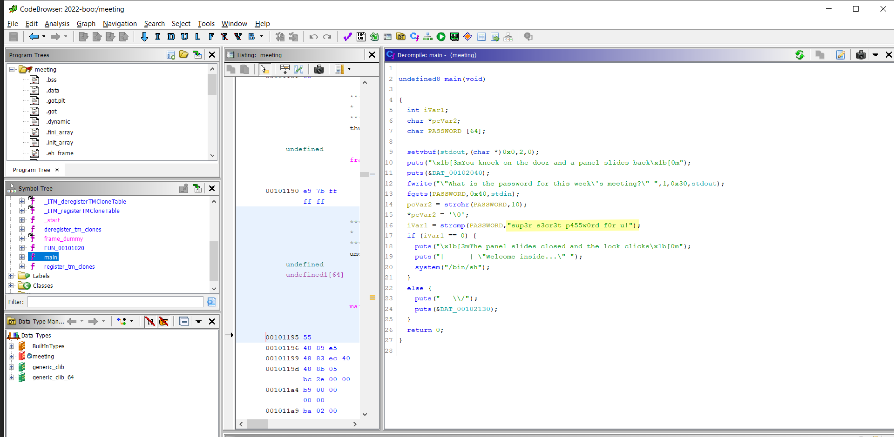

# Cult Meeting

Difficulty:: #easy 

## Introduction
The challenge consist in analize a unix executable file. Find the password stored inside directly in a conditional inside the `main` function and with that obtain a shell and get the flag.

## Target data
- `Spawn Docker`: `68.183.37.61 30067`
- `Files`: `rev_cult_meeting.zip`

## Challenge Description
*After months of research, you're ready to attempt to infiltrate the meeting of a shadowy cult. Unfortunately, it looks like they've changed their password!*

## Enumeration

We are given a single file called  `meeting` 
```shell
magor$ tree rev_cult_meeting
rev_cult_meeting
└── meeting
```


So due it has not extension probably is a binary so first that all I want to identify the file type:

```shell
magor$ file meeting
meeting: ELF 64-bit LSB shared object, x86-64, version 1 (SYSV), dynamically linked, interpreter /lib64/ld-linux-x86-64.so.2, BuildID[sha1]=72d8b06e4ca750d5c24395d3349c3121b9b95283, for GNU/Linux 3.2.0, not stripped
```

Its a executable binary to unix operating systems. and it says `not stripped` wich means that the binary could contain debuggin data, like variables names. So to analize it I open  [Ghidra]() to decompiler to C code. And look for the `main` function and rename some variables to better undertanding. And Identify the explicit password `sup3r_s3cr3t_p455w0rd_f0r_u!` after write it , the program execute the `/bin/sh`.



## Foothold

The challenge was straigthfoward, only you need read the password inside the binary and after use it you can execute shell commands. So I use netcat to connect it to the docker server spawned and read the flag file:

```shell
magor$ nc -n 68.183.37.61 30067
You knock on the door and a panel slides back
|/👁️ 👁️ \|   A hooded figure looks out at you
"What is the password for this week's meeting?" sup3r_s3cr3t_p455w0rd_f0r_u!
sup3r_s3cr3t_p455w0rd_f0r_u!
The panel slides closed and the lock clicks
|      | "Welcome inside..."
/bin/sh: 0: can't access tty; job control turned off
$ id
id
uid=1000(ctf) gid=1000(ctf) groups=1000(ctf)
$ ls
ls
flag.txt  meeting
$ cat flag.txt
cat flag.txt
HTB{xxxxxxxxxxxxxxxxxxxxxxxxxxxxxx}
```