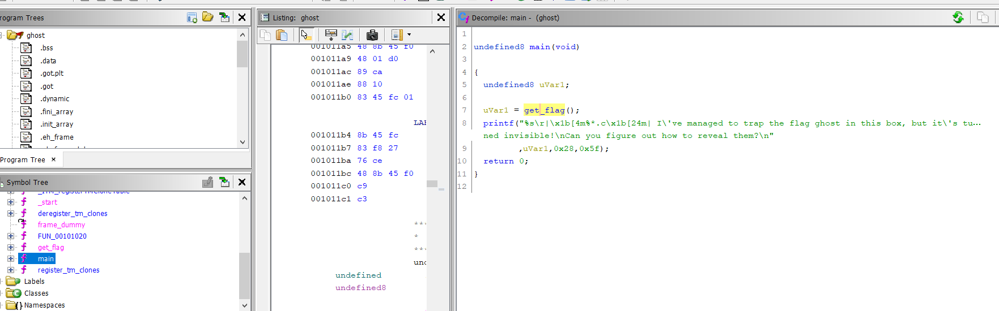
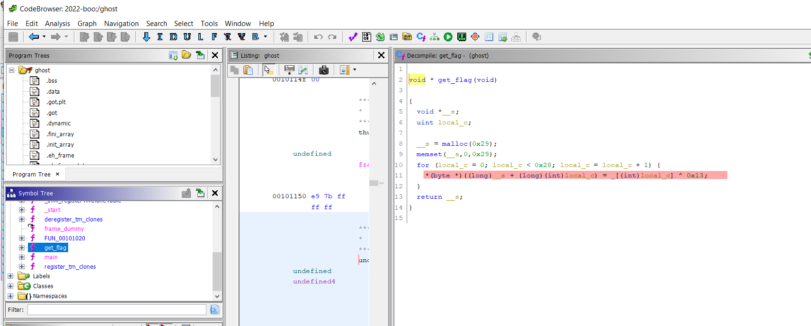
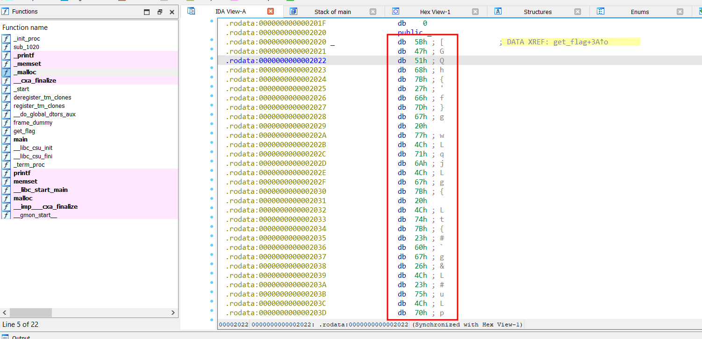
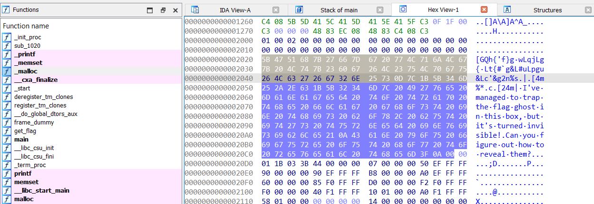

# Ghost Wrangler

Difficulty:: #easy 

## Introduction
This challenge give us a binary unix executable file that performs a xor to decrypt a bunch of data but it not display it so you need to reversing to see what data is stored. 

## Target data
- `File`: `rev_ghost_wrangler.zip`

## Challenge Description
*Who you gonna call?*

## Enumeration
We are given a single file called  `ghost` 
```shell
magor$ tree rev_ghost_wrangler
rev_ghost_wrangler
└── ghost
```

So due it has not extension probably is a binary so first that all I want to identify the file type:

```shell
magor$ file ghost
ghost: ELF 64-bit LSB shared object, x86-64, version 1 (SYSV), dynamically linked, interpreter /lib64/ld-linux-x86-64.so.2, BuildID[sha1]=810d0f9271ec04d80a2eee6ff2afd9367da3c3dd, for GNU/Linux 3.2.0, not stripped
```

Its a executable binary to unix operating systems. and it says `not stripped` wich means that the binary could contain debuggin data, like variables names. So to analize it I open  [Ghidra]() to decompiler to C code. 



And the `main` function only call `get_flag()` function, so i go to that function:


Its so short, only do a for loop with a `xor` this means that here is our flag, but ¿what data are point the `local_c` variable?

So i tried to use the IDA software to open the binary and found some interesting data:


I also use GDB only to confirm that the first bytes in the loop where `0x58`, `0x47`, `0x51` . Then i copy this data from the hex-view in the IDA sofwtare:



```shell
5B 47 51 68 7B 27 66 7D  67 20 77 4C 71 6A 4C 67
7B 20 4C 74 7B 23 60 67  26 4C 23 75 4C 70 67 75
26 4C 63 27 26 67 32 6E
```

## Foothold

I already know that `get_flag()` function use a `xor` with  key `0x13`, so i replicate it in python to get the flag.

```python
data = '''
5B 47 51 68 7B 27 66 7D  67 20 77 4C 71 6A 4C 67
7B 20 4C 74 7B 23 60 67  26 4C 23 75 4C 70 67 75
26 4C 63 27 26 67 32 6E
'''

data = data.replace(' ','').replace('\n','')

data_bytes = bytes.fromhex(data)

flag = ''.join(map(lambda x: chr(x^0x13), data_bytes))

print(flag)
```

```shell
magor$ python solve.py
HTB{xxxxxxxxxxxxxxxxxxxxxxxxxxxxxxxxxxx}
```
