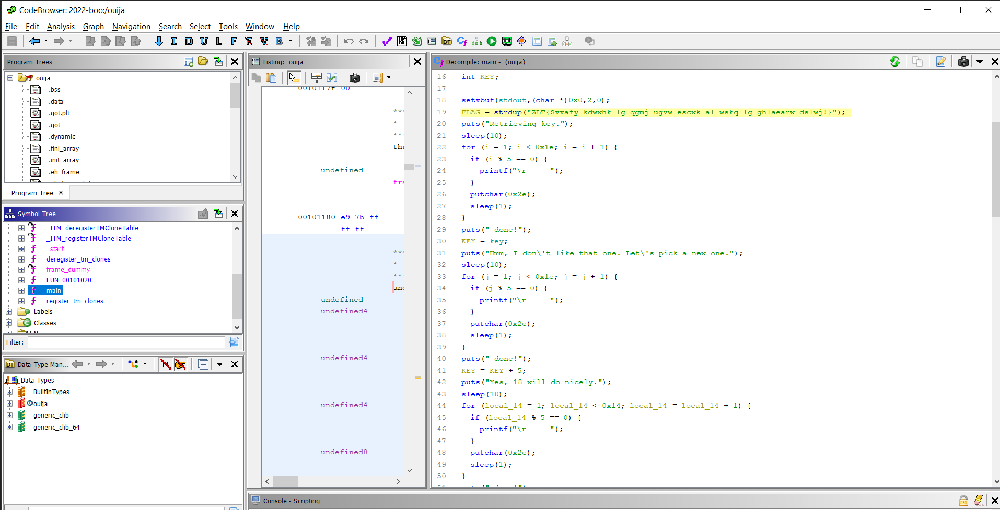
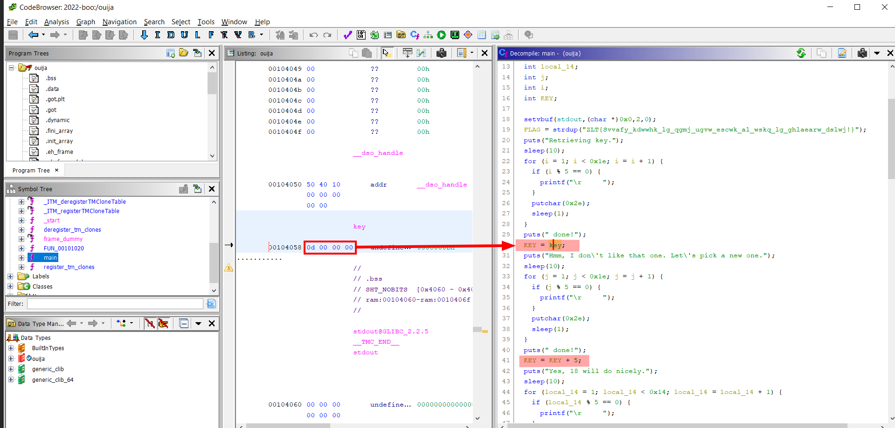

# Ouija

Difficulty:: #easy 

## Introduction
This challenge was weird, its a binary that have a lot of `sleep`  and it will be decrypt the flag so slowly, but you can reverse it and perform the decryption.

## Target data
- `File`: `rev_ouija.zip`

## Challenge Description
*You've made contact with a spirit from beyond the grave! Unfortunately, they speak in an ancient tongue of flags, so you can't understand a word. You've enlisted a medium who can translate it, but they like to take their time...*

## Enumeration

We are given a single file called  `ouija` 
```shell
magor$ tree rev_ouija
rev_ouija
└── ouija
```

So due it has not extension probably is a binary so first that all I want to identify the file type:

```shell
magor$ file ouija
ouija: ELF 64-bit LSB shared object, x86-64, version 1 (SYSV), dynamically linked, interpreter /lib64/ld-linux-x86-64.so.2, BuildID[sha1]=2cace162c306a34dcfc4837d648d047e2ea339fe, for GNU/Linux 3.2.0, not stripped
```

Its a executable binary to unix operating systems. and it says `not stripped` wich means that the binary could contain debuggin data, like variables names. So to analize it I open  [Ghidra]() to decompiler to C code. And look for the `main` function and rename some varibales to make it more readable

The flag is cipher but is directly written in the main function. So now its time to analize what kind of decryption is used

The first that i noted is that there ara a lot of `sleep()` so I ignore all that waiting loops and found  a `key`



Look that the `key` value is `0x0d` and after the add `5` so the `KEY` is equal to `18`

Continue reading the `main` function found the for loop that perform the decryption, i remove the sleep due to its only noisy:

```C
  for (; *FLAG != '\0'; FLAG = FLAG + 1) {
    if ((*FLAG < 'a') || ('z' < *FLAG)) {
      if ((*FLAG < 'A') || ('Z' < *FLAG)) {
        puts("We can leave this one alone.");
        sleep(10);
        for (n = 1; n < 10; n = n + 1) {
          if (n % 5 == 0) {
            printf("\r     ");
          }
          putchar(0x2e);
          sleep(1);
        }
        puts(" done!");
      }
      else {
        puts("This one\'s an uppercase letter!");
        sleep(10);
        for (local_30 = 1; local_30 < 0x14; local_30 = local_30 + 1) {
          if (local_30 % 5 == 0) {
            printf("\r     ");
          }
          putchar(0x2e);
          sleep(1);
        }
        puts(" done!");
        if (*FLAG - KEY < 0x41) {
          puts("Wrapping it round...");
          sleep(10);
          for (local_34 = 1; local_34 < 0x32; local_34 = local_34 + 1) {
            if (local_34 % 5 == 0) {
              printf("\r     ");
            }
            putchar(0x2e);
            sleep(1);
          }
          puts(" done!");
          *FLAG = *FLAG + '\x1a';
        }
        *FLAG = *FLAG - (char)KEY;
      }
    }
    else {
      puts("This one\'s a lowercase letter");
      sleep(10);
      for (local_28 = 1; local_28 < 0x14; local_28 = local_28 + 1) {
        if (local_28 % 5 == 0) {
          printf("\r     ");
        }
        putchar(0x2e);
        sleep(1);
      }
      puts(" done!");
      if (*FLAG - KEY < 0x61) {
        puts("Wrapping it round...");
        sleep(10);
        for (local_2c = 1; local_2c < 0x32; local_2c = local_2c + 1) {
          if (local_2c % 5 == 0) {
            printf("\r     ");
          }
          putchar(0x2e);
          sleep(1);
        }
        puts(" done!");
        *FLAG = *FLAG + '\x1a';
      }
      *FLAG = *FLAG - (char)KEY;
    }
    puts(
        "Okay, let\'s write down this letter! This is a pretty complex operation, you might want to check back later."
        );
    sleep(10);
    for (local_3c = 1; local_3c < 300; local_3c = local_3c + 1) {
      if (local_3c % 5 == 0) {
        printf("\r     ");
      }
      putchar(0x2e);
      sleep(1);
    }
    puts(" done!");
    printf("%c\n",(ulong)(uint)(int)*FLAG);
  }
```

## Foothold

If you only execute the file and let it all the time it eventually print the flag. but I rewrite the for loop with only the useful data in Python:

```python
# solve.py
FLAG = 'ZLT{Svvafy_kdwwhk_lg_qgmj_ugvw_escwk_al_wskq_lg_ghlaearw_dslwj!}'
KEY = 18

new = ''
for char in FLAG:

    char_int = ord(char)
    if char.isupper():
        if (char_int - KEY) < 0x41:
            new += chr(char_int + 8)
        else:
            new += chr(char_int - 18)
    elif char.islower():
        if (char_int - KEY) < 0x61:
            new += chr(char_int + 8)
        else:
            new += chr(char_int - 18)
    else:
        new += char

print(new)
```


```
magor$ python solve.py
HTB{xxxxxxxxxxxxxxxxxxxxxxxxxxxxxxxxxxxxxxxxxxxxxxxxxxxxxxxxxxx}
```

