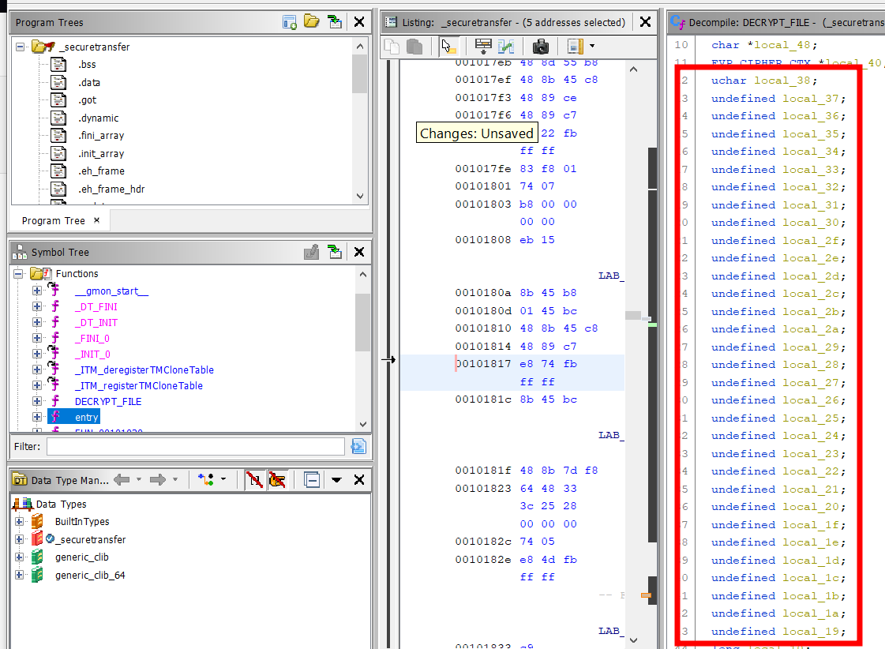

# Secured Transfer

Difficulty::  #medium 

## Introduction
This challenge presents us a binary to send and recieve data with a AES mode CBC encryption, and a pcap file with a capture of data sent. And the goal is decrypt the data found in the capture. I show to ways to decrypt the data, the first one after analize the decript algorithm and implement a copy in a Python script, And the second using the binary to send it the data cipher and let the binary itself decrypt it.

## Target data
- `Source Code`:  `rev_securedtransfer.zip`

## Challenge Description
*Ghosts have been sending messages to each other through the aether, but we can't understand a word of it! Can you understand their riddles?*

## Enumeration

We are given a single  two files, the first one  `securetransfer` seems to be a binary and a capture `pcap`!
```shell
magor$ tree rev_securedtransfer
rev_securedtransfer
├── securetransfer
└── trace.pcap
```

### Capture pcap
First analyse the `pcap` file. Its very short indeed.


When review the conversation flow, there is only one. And it has hex data:


By now i am gonna save the data and continue checking the other file
```
5f558867993dccc99879f7ca39c5e406972f84a3a9dd5d48972421ff375cb18c
```

### securetransfer

Due it has not extension probably is a binary so first that all I want to identify the file type:

```shell
magor$ file securetransfer
securetransfer: ELF 64-bit LSB shared object, x86-64, version 1 (SYSV), dynamically linked, interpreter /lib64/ld-linux-x86-64.so.2, BuildID[sha1]=0457997eda987eb100de85a2954fc8b8fc660a53, for GNU/Linux 3.2.0, stripped
```

Its a executable binary to unix operating systems. So to analize it I open  [Ghidra]() to decompiler to C code. But there are no functions names so i look for the `entry` function:

And see that it calls the ` FUN_00101dce` function, wich i rename by `main`

### main
The main function ask for 2 parameters and also send a help use message.


```
Usage ./securetransfer [<ip> <file>]
```
I rename the functions according to the messages. Both functionalities has relationship with the `pcap` file. At this point we can say that the `SEND_FILE` encrypts the file and send it to a specific input ip address, and the `RECEIVE_FILE` will decrypt the data trasmission.

And we have the capture data transfer, so I am gonna analize the `RECEIVE_FILE` first:

### RECEIVE_FILE
The `RECEIVE_FILE` function perform a seies of validations and eventually call a function that after a brief review i call `DECRYPT_FILE`:


### DECRYPT_FILE
Here there is a very interesting file, i show the decompile before rename data, in this way you can look that the first to note is that there is a `AES` encryption in `CBC` mode. This mode require a key `K` and a initial value called `IV` . So we can ensure that `local_48` is the `IV` (and look that string it says `local_48 = b'someinitialvalue'` ).


> **Note**: Also you could look for the C function to see what is the key and iv in [EVP aes 256 cbc](https://cpp.hotexamples.com/es/examples/-/-/EVP_aes_256_cbc/cpp-evp_aes_256_cbc-function-examples.html):

And `K` is `local_38`  but look that is a pointer, so the 32 bytes variable above `iv` should be the total key) but we can also note that the variables are define in disorder because ghidra label it according to the order in what ther are initializate.


So we need order in the order they were defined:

I copy the data to a  Python list:


And I get  the following list, but it also inclues the `c6 45`, those bytes are the `MOV` instruccion :
```Python
[ 0xc6, 0x45, 0xd0, 0x73, 0xc6, 0x45, 0xd9, 0x65, 0xc6, 0x45, 0xd1, 0x75, 0xc6, 0x45, 0xd2, 0x70, 0xc6, 0x45, 0xe2, 0x66, 0xc6, 0x45, 0xe3, 0x6f, 0xc6, 0x45, 0xe4, 0x72, 0xc6, 0x45, 0xe7, 0x63, 0xc6, 0x45, 0xda, 0x74, 0xc6, 0x45, 0xdb, 0x6b, 0xc6, 0x45, 0xeb, 0x74, 0xc6, 0x45, 0xed, 0x6f, 0xc6, 0x45, 0xd6, 0x65, 0xc6, 0x45, 0xd7, 0x63, 0xc6, 0x45, 0xd5, 0x73, 0xc6, 0x45, 0xe8, 0x72, 0xc6, 0x45, 0xdd, 0x79, 0xc6, 0x45, 0xde, 0x75, 0xc6, 0x45, 0xdf, 0x73, 0xc6, 0x45, 0xec, 0x69, 0xc6, 0x45, 0xe0, 0x65, 0xc6, 0x45, 0xe1, 0x64, 0xc6, 0x45, 0xe5, 0x65, 0xc6, 0x45, 0xe9, 0x79, 0xc6, 0x45, 0xd8, 0x72, 0xc6, 0x45, 0xd4, 0x72, 0xc6, 0x45, 0xea, 0x70, 0xc6, 0x45, 0xef, 0x21, 0xc6, 0x45, 0xee, 0x6e, 0xc6, 0x45, 0xdc, 0x65, 0xc6, 0x45, 0xd3, 0x65, 0xc6, 0x45, 0xe6, 0x6e ]
```

So i replace all `, 0xc6, 0x45, `  by `), (`  (and mannually fix the list ends) and save it in `key_data`:
```python
>>> key_data = [(0xd0, 0x73,), (0xd9, 0x65,), (0xd1, 0x75,), (0xd2, 0x70,), (0xe2, 0x66,), (0xe3, 0x6f,), (0xe4, 0x72,), (0xe7, 0x63,), (0xda, 0x74,), (0xdb, 0x6b,), (0xeb, 0x74,), (0xed, 0x6f,), (0xd6, 0x65,), (0xd7, 0x63,), (0xd5, 0x73,), (0xe8, 0x72,), (0xdd, 0x79,), (0xde, 0x75,), (0xdf, 0x73,), (0xec, 0x69,), (0xe0, 0x65,), (0xe1, 0x64,), (0xe5, 0x65,), (0xe9, 0x79,), (0xd8, 0x72,), (0xd4, 0x72,), (0xea, 0x70,), (0xef, 0x21,), (0xee, 0x6e,), (0xdc, 0x65,), (0xd3, 0x65,), (0xe6, 0x6e) ]
>>>➊key_data.sort(key= lambda x: x[0])
>>>➋key_data
[(208, 115), (209, 117), (210, 112), (211, 101), (212, 114), (213, 115), (214, 101), (215, 99), (216, 114), (217, 101), (218, 116), (219, 107), (220, 101), (221, 121), (222, 117), (223, 115), (224, 101), (225, 100), (226, 102), (227, 111), (228, 114), (229, 101), (230, 110), (231, 99), (232, 114), (233, 121), (234, 112), (235, 116), (236, 105), (237, 111), (238, 110), (239, 33)]
>>> ''.join(➌map(lambda x: ➍ chr(x[1]), key_data))
➎'supersecretkeyusedforencryption!'
```

With the replate i group in pairs. I do this because address and data are interleaved, for example the two first are `0xd0` and `0x73`, so if  you check Ghidra the address `0x001016d5` the `local_38` is the label to the `0xd0` byte and `0x73` is the value that in the decompiled with can see that is the `s` in asscii.
Now I sort the list by the first element of the tuple ➊ . And when I saw the data in decimal value ➋. I note that all are in the printable asscii range. So I map it ➌ , convert to char ➍ and join into a string to see that nice message ➎.

## Foothold

Soo we already know the `K` and `iv`  values, so I write a Python script to decrypt the data with `pycriptodome`  to call the `AES` with the `CBC` mode:

```Python
from Crypto.Cipher import AES

key = b'supersecretkeyusedforencryption!'
iv = b'someinitialvalue'

data = "5f558867993dccc99879f7ca39c5e406972f84a3a9dd5d48972421ff375cb18c"

data_byte = bytes.fromhex(data)

cipher = AES.new(key, AES.MODE_CBC, iv)
decrypted = cipher.decrypt(data_byte)

print(decrypted)
```

```pyhton
magor$ python solve.py
b'HTB{xxxxxxxxxxxxxxxxxxxxxxx}\x04\x04\x04\x04'
```

## Alternative Solution

When I was in the after event i think that there is a approach that could solve the challenge in a easier way (but of course it depends of the person persepective).

After identify with Ghidra that the binary is in listener mode when is executed without parameters, like this:
```shell
magor$ ./securetransfer
Receiving File
```

I can check with `netstat` wich port was use to the listener. in this case is `13337` (or reviewing the decompile code to know it):

```shell
r$ netstat -tlnp
Proto Recv-Q Send-Q Local Address           Foreign Address         State       PID/Program name
tcp        0      0 0.0.0.0:1337            0.0.0.0:*               LISTEN      1749/./securetransf
```

With that data, now only is replicate the trasmision, a easy way for that could be use the Python `socket` built-in module:

```shell
magor$ python
>>> import socket
>>>➊client = socket.socket(socket.AF_INET, socket.SOCK_STREAM)
>>>➋client.connect(('0.0.0.0',1337))
>>>➌cipher = "20000000000000005f558867993dccc99879f7ca39c5e406972f84a3a9dd5d48972421ff375cb18c"
>>>➍to_send = bytearray.fromhex(cipher)
>>>➎client.send(to_send)
40
```

Now lets review each step of the code above. First at ➊ initializate the client socket. Then connect with the host and port  that we figure out with `netstat` ➋. And maybe the mos sensible step ➌ define the cipher data exactly like you see it in the pcap file and to be able to send it we need convert it to bytes ➍. And finanlly send the data ➎. And see the shell where you have the binary active:

```shell
$ ./securetransfer
Receiving File
File Received...
HTB{vryS3CuR3_F1L3_TR4nsf3r}
HTB{xxxxxxxxxxxxxxxxxxxxxxx}
```

>**Note**: If you are not familar with handled sockets maybe you ara wondering what are the `socket.AF_INET` and the`socket.SOCK_STERAM` parameters. :
>- The **Familly address**. For this case is  `IPv4`  and is representeated by the constant `2` with [socket.AF_INET](https://stackoverflow.com/questions/1593946/what-is-af-inet-and-why-do-i-need-it#1594039).
>- The **socket type,** it use the `1` [socket.AF_INET](https://stackoverflow.com/questions/35725732/what-is-the-function-of-sock-stream#35725838)  due to the communication is TCP/IP.
>Also you could check that the decompile code use thouse parameters with `socket(2,1,0);` 
>
>  

>**Note**: To copy the bytes send in the conversation with `wireshark` you have to show the data like `raw` and it will show in hex mode. And look that there are exactly `40 bytes` so you dont have to include the break line that it seems to exist due to the way wireshark render the data.
>

