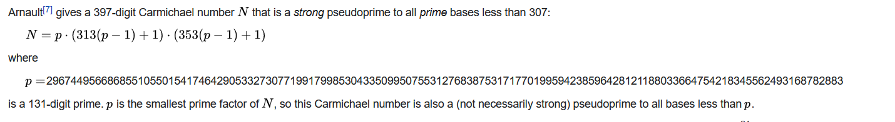

# Fast Charmichael

Difficulty:: #easy 

## Introduction
This challenge give us a server script wich perform a validation of primabilty with a library and with a custom [Miller-Rabin primality test](https://en.wikipedia.org/wiki/Miller%E2%80%93Rabin_primality_test) implementation. The challenge asks for send a number that can trick the Miller-Rabin, that means that the number really is not a prime number. After research I found that is possible generate false positives to that test using a [Carmichael number](https://en.wikipedia.org/wiki/Carmichael_number).

## Target data
- `Spawn Docker`: `142.93.35.129:31152`
- `File`: `crypto_fast_carmichael.zip`

## Challenge Description
*You are walking with your friends in search of sweets and discover a mansion in the distance. All your friends are too scared to approach the building, so you go on alone. As you walk down the street, you see expensive cars and math papers all over the yard. Finally, you reach the door. The doorbell says "Michael Fastcar". You recognize the name immediately because it was on the news the day before. Apparently, Fastcar is a famous math professor who wants to get everything done as quickly as possible. He has even developed his own method to quickly check if a number is a prime. The only way to get candy from him is to pass his challenge.*

## Enumeration

We are given with a python file called  `server.py` wich I can assume is what is running in the docker serever. 

```shell
magor$ tree crypto_fast_carmichael/
crypto_fast_carmichael/
└── server.py
```

### Server.py

First identify that the script initializate a listener to handle the client requests with the `main()` function.

```python
# server.py
# ...SNIP...
def main(s):
  ➊ p = receiveMessage(s, "Give p: ")

    try:
  ➋     p = int(p)
    except:
        sendMessage(s, "Error!")

    if _isPrime(p) ➌ and not isPrime(p)➍:
        sendMessage(s, FLAG)
    else:
        sendMessage(s, "Conditions not satisfied!")

# ...SNIP...
```

It expect that user send a value `p` ➊ that must be parseable to integer ➋ otherwise it fails. And check that the user input number is prime using a custom function to determinate it, and at the same time it isn't be prime ➍ when using a default librery function, in this case it use the `pycryptodome` library (for Python >= 3.8 or `pycrypto` for Python < 3.8 ). When both conditions are met, user will get the flag.

So now analize the `_isprime()` function to see how we can trick it:

```python
# server.py
# ...SNIP...
def _isPrime(p):
 ➊  if p < 1:
        return False
 ➋  if (p.bit_length() <= 600) and (p.bit_length() > 1500):
        return False
 ➌  if not millerRabin(p, 300):
        return False

    return True
# ...SNIP...
```

The first two conditions ➊, and ➋ are straigthfoward, The number should be a big positive number and the last one ➌ requeries check the `millerRabin()` function (another custom function).

So we are bridging the gap,  but the function name seems not be random. So I google it and found the [Miller-Rabin primality test](https://en.wikipedia.org/wiki/Miller%E2%80%93Rabin_primality_test).

```python
# server.py
# ...SNIP...
def millerRabin(n, b):
    basis = generate_basis(300)
    if n == 2 or n == 3:
        return True

    if n % 2 == 0:
        return False

    r, s = 0, n - 1
    while s % 2 == 0:
        r += 1
        s //= 2
    for b in basis:
        x = pow(b, s, n)
        if x == 1 or x == n - 1:
            continue
        for _ in range(r - 1):
            x = pow(x, 2, n)
            if x == n - 1:
                break
        else:
            return False
    return True
# ...SNIP...
```


So assuming that the` millerRabin()` function is well implemented. We need to search a way to [generate a false positive prime number in the rabin miller primality test](https://math.stackexchange.com/questions/1528789/generating-false-positives-to-the-rabin-miller-primality-test#1528801).

> **Note**: At this point first i was trying to check if the `millerRabin` really was well implemented, and try to write equations in an attemp to found a gap. But I can't figure out so I decide to google if is possible generate false positive primes, then i found the link that i mention.


## Foothold

The answers to [generate a false positive prime number in the rabin miller primality test](https://math.stackexchange.com/questions/1528789/generating-false-positives-to-the-rabin-miller-primality-test#1528801) says that a [Carmichael number](https://en.wikipedia.org/wiki/Carmichael_number)can generate a false positive. So I read to see how I can generate a charmicael number and found the equation in the [overview](https://en.wikipedia.org/wiki/Carmichael_number#Overview) show in the image below:


>**Note**: The challenge title is **Fast Carmichael**. They give us that clue, altought I ignore the title so I noticed it when I was written this writeup xD.




So I open the python interpreter to check the equation:
```python
>>> p=296744956686855105501541746429053327307719917998530433509950755312768387531717701995942385964281211880336647542183
45562493168782883
>>> N = p*(313*(p-1)+1)*(353*(p-1)+1)
>>> N
2887148238050771212671429597130393991977609459279722700926516024197432303799152733116328983144639225941977803110929349655578418949441740933805615113979999421542416933972905423711002751042080134966731755152859226962916775325475044445856101949404200039904432116776619949629539250452698719329070373564032273701278453899126120309244841494728976885406024976768122077071687938121709811322297802059565867
```

And try to send it to the server (also could test it locally first, but I have the feeling that it will works). I use [netcat](https://netcat.sourceforge.net/) to connect to the server port and get the flag!.

```shell
$ nc -n 142.93.35.129 31152
Give p: 2887148238050771212671429597130393991977609459279722700926516024197432303799152733116328983144639225941977803110929349655578418949441740933805615113979999421542416933972905423711002751042080134966731755152859226962916775325475044445856101949404200039904432116776619949629539250452698719329070373564032273701278453899126120309244841494728976885406024976768122077071687938121709811322297802059565867
HTB{xxxxxxxxxxxxxxxxxxxxxxxxxxxxxxxxxxxxxxx}
```
