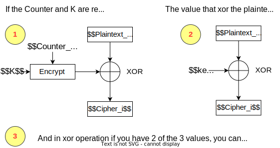

# Whole Lotta Candy

Difficulty:: #easy 

## Introduction
We are given a script that createa listen server wich allow us to encrypt data using AES algorithm with any of the five modes available. It exposes a Plain text attack due to encrypt using the same key in the CTR mode.

## Target data
- `Spawn Docker`: `64.227.41.190:30723` 
- `Source Code`:  `crypto_whole_lotta_candy.zip`

## Challenge Description

*In a parallel universe, "trick-or-treat" is played by different rules. As technologies became more advanced and the demand for security researchers increased, the government decided to incorporate security concepts into every game and tradition. Instead of candy, kids have the choice of selecting a AES mode and encrypting their plaintext. If they somehow manage to find the FLAG, they get candy. Can you solve this basic problem for the toddlers of this universe?*

## Enumeration

We are given with two pythons files, one focus on the listener service `server.py`  with create a menu to encrypt data with differents modes of `AES` encryption and the other focus in the encryption system `encrypt.py` where the AES encryption are defined.

```shell
magor$ tree crypto_whole_lotta_candy/
crypto_whole_lotta_candy/
├── encrypt.py
└── server.py
```

### server.py

To test it locally, create a virtual env to install [pycryptodome](). I already have one that i use to CTF challenges

```shell
magor$ source /ctf/.venv/bin/activate
magor$ python server.py
```

 Ant in other terminal connect it wiht [netcat]() to `0.0.0.0:1337`. And check that the server provide us with 4 options:

```shell
magor$ nc -n 0.0.0.0 1337
Please interact with the server using json data!
Selected mode is CBC.

Options:

1.Encrypt flag
2.Encrypt plaintext
3.Change mode
4.Exit

>
```

> **Note**:  The `server.py` file import : `from secret import FLAG` so to test locally we only have to create a file with name `secret.py` and stored a `FLAG=HTB{f4k3_fl4g_f0r_t35t1ng}`


Now lets check the `main()` function to understand how each option is handled.

```python
# server.py
# ...SNIP...
MODES = ['ECB', 'CBC', 'CFB', 'OFB', 'CTR']
# ...SNIP...
def main(s):
  ➊ mode = random.choice(MODES)
  ➋ enc = Encryptor()
    while True:
        try:
            sendMessage(s,
                        f"Please interact with the server using json data!\n")➌
            sendMessage(s, f"Selected mode is {mode}.\n")
            payload = receiveMessage(
                s,
                "\nOptions:\n\n1.Encrypt flag\n2.Encrypt plaintext\n3.Change mode\n4.Exit\n\n> "
            )
            payload = json.loads(payload)
            option = payload["option"]
            if option == "1":
                ciphertext = enc.encrypt(FLAG, mode).hex()
                response = json.dumps({
                    "response": "encrypted",
                    "ciphertext": ciphertext
                })
                sendMessage(s, "\n" + response + "\n")
            elif option == "2":
                payload = receiveMessage(s, "Enter plaintext: \n")
                payload = json.loads(payload)
                plaintext = payload['plaintext'].encode()
                ciphertext = enc.encrypt(plaintext, mode).hex()
                response = json.dumps({
                    "response": "encrypted",
                    "ciphertext": ciphertext
                })
                sendMessage(s, "\n" + response + "\n")
            elif option == "3":
                response = json.dumps({"modes": MODES})
                sendMessage(
                    s, "These are the supported modes\n" + response + "\n")
                payload = receiveMessage(s, "Expecting modes: \n")
                payload = json.loads(payload)
                mode = random.choice(payload['modes'])➍
            elif option == "4":
                sendMessage(s, "Bye bye\n")
                exit()
        except Exception as e:
            response = json.dumps({"response": "error", "message": str(e)})
            sendMessage(s, "\n" + response + "\n")
            exit()
# ...SNIP...
```

The first thing to note is that we can work with five AES mode and the mode is choose ramdonly when start at ➊, then note that the way to comunicate with the server is using `JSON` structure ➌. And the options in summary allow us to encrypt the `FLAG` or a custom plaintext with the mode encryption that we want. And note that i said that we choose the mode because even though the mode is choose randomly at ➍, we tell the server the options it has. **So its only we send it one option, it will be the only one it can choose**.

So it seems that there is a vulnerability to expliot in the AES encryption. Note that the `enc` variable ➋ is define before enter into the menu loop. So always we encrypt with the same object. Lets review the `encrypt.py` file:

### encrypt.py

This file define a `Encryptor` class:
```python
# encript.py
# ...SNIP...
class Encryptor:

    def __init__(self):
      ➊ self.key = os.urandom(16)

    def ECB(self, pt):
        cipher = AES.new(self.key, AES.MODE_ECB)
        ct = cipher.encrypt(pad(pt, 16))
        return ct

    def CBC(self, pt):
     ➋ iv = os.urandom(16)
        cipher = AES.new(self.key, AES.MODE_CBC, iv)
        ct = cipher.encrypt(pad(pt, 16))
        return ct

    def CFB(self, pt):
        iv = os.urandom(16)
        cipher = AES.new(self.key, AES.MODE_CFB, iv)
        ct = cipher.encrypt(pad(pt, 16))
        return ct

    def OFB(self, pt):
        iv = os.urandom(16)
        cipher = AES.new(self.key, AES.MODE_OFB, iv)
        ct = cipher.encrypt(pad(pt, 16))
        return ct

    def CTR(self, pt):
      ➌ counter = Counter.new(128)
        cipher = AES.new(self.key, AES.MODE_CTR, counter=counter)
        ct = cipher.encrypt(pad(pt, 16))
        return ct
#...SNIP...
```


> **Note**: You can read [the difference in five modes in the AES encryption algotihm](https://www.highgo.ca/2019/08/08/the-difference-in-five-modes-in-the-aes-encryption-algorithm/) to understand how they works.

Look that when the object is initializate it define a random `key` ➊  but we now from the  `server.py` file, that the object is initializate only once. **So we will always encrypt using the same key**. Notice each mode see that the initializate vector `IV`  ➋ in all modes that its require, is random choose at the moment of the encryption (also the `counter` in CTR mode ➌ ).

With the description above in mind, I search for [AES attacks reuse key](https://www.google.com/search?q=AES+attacks+reuse+key) and found a video make for John Hammond about[AES-CTR Cryptography: Reused Key Weakness - HackTheBox Cyber Apocalypse CTF](https://www.youtube.com/watch?v=Gtfr1dBGzHg). And that is the current case. Thanks a lot John Hammond.


## Foothold
When use the AES with the CTR mode you shouldn't use the same key with the same counter to encrypt data. Lets see how it works


In the most basic form the AES CTR mode is a XOR encryption. where the value to encrypt each plaintext block consists of the result of encrypt the *i*-th counter with $k$ . that means if you reuse  $k$ and the $counter$ , you will be encrypt your plaintext with a xor operation with a constant value!. Lets seee the image below




The xor between the `cipher` and the `plaintext` will give us the `key`.
```python
>>> 22^7
17
>>> 17^7
22
>>> 22^17
7
```

So all we have to do  in the server is:
1. Select the AES with the CTR mode.
2. Get the encrypted FLAG in CTR mode.
3. Encrypt junk data like plaintext (like `'A'*200`)
4. Xor the cipher with the plaintext to get the key
5. Xor the key with the cipher flag and get the plaintext flag!

I am gonna implement it using `pwn` library with allow us to handle the conections:
```python
#!/usr/bin/env python3
from pwn import *
import json

if not args.REMOTE:
    p = remote('0.0.0.0', 1337)
else:
    p = remote('159.65.49.148',30891)

# 1. Select the AES with the CTR mode.
p.sendlineafter(b'> ' , b'{"option" : "3"}')
p.sendlineafter(b' \n', b'{"modes": [ "CTR"]}')

# 2. Get the encrypted FLAG in CTR mode.
p.sendlineafter(b'> ',b'{"option" : "1"}')
s = p.recvline()
flag_json = p.recvline()
flag_json = json.loads(flag_json)
flag_enc_hex = flag_json['ciphertext']
print(f'flag: {flag_json}')

# 3. Encrypt junk data like plaintext (like `'A'*200`)
text = b'A'*200
p.sendline(b'{"option" : "2"}')
p.sendlineafter(b'plaintext: \n',f'{{"plaintext" : "{text}"}}'.encode())
p.recvline()
test_json = p.recvline()
test_enc = json.loads(test_json)
cipher_text_hex = test_enc['ciphertext']


# 4. Xor the cipher with the plaintext to get the key
cipher_text = bytes.fromhex(cipher_text_hex)
key  = xor(text, cipher_text)

# 5. Xor the key with the cipher flag and get the plaintext flag!
flag_enc = bytes.fromhex(flag_enc_hex)
flag = xor(key, flag_enc)
print(f'{key=}')
print(f"{flag=}")


p.interactive()
```

```python
magor$ python solve.py REMOTE
[+] Opening connection to 159.65.49.148 on port 30891: Done
flag: {'response': 'encrypted', 'ciphertext': 'da19d1ea3ede77bda3eb1d18084bb15e1acdb468ac78200a0142dc867b5184ec3c1c0fab0d7104b88ef1a3be82ae1cb73e58cdef625d39d6e92296c00d794882'}
flag=b"k2B{xxxxxxxxxxxxxxxxxxxxxxxxxxxxxxxxxxxxxxxxxxxxxxxxxxxxxxxxx}\x02\x02MA\xe6\xe6\xad\xdd\xb0\x0e(8\xf2]\x0e\xad\xff\xfc%\x02\xdc~T%\xf6g'\xe9(\xc0&\x81\xe3\x95'\xd8,OS\xf5\x7f\xf1\xe43\xbe\xece'\xcb=\xcc\xaf\xe5\x93h-\\\x9a\xe9;--\xe9)\x98qB\xf2\x9d\xfa\xc1.)\xf9S\x8b\xe4\xf5\x06\x9fw{\xcej\xb3w\x0b#\xedd\r\xa2\x16\x12{e\xc5\x9e\xd0BA4\xdd\x87\xfa\xca\x95\xa8\xd8m\x83_*@\x132;-n\xa8\xf2OV\xbd\x8c\xa3b\xeedu\x05\xfb\xf8.\x9a\x01\x02g\xf1\xe5N\xc3c\xdd\xc1W"
[*] Switching to interactive mode
Please interact with the server using json data!
Selected mode is CTR.

Options:

1.Encrypt flag
2.Encrypt plaintext
3.Change mode
4.Exit

>
```

> Note that the flag start with `k2B` ,  it seems that something corrupted the first bytes, but we can complet it due to we know that is `HTB`, If i found why this happend i will share it with you.


## Notes

I thought that the property of the xor operation that allow it to xor in any direction is call reversibility but [this question](https://stackoverflow.com/questions/2326561/xor-reversibility-operation-question) made me doubt.


