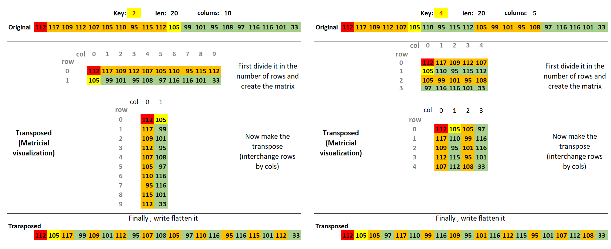
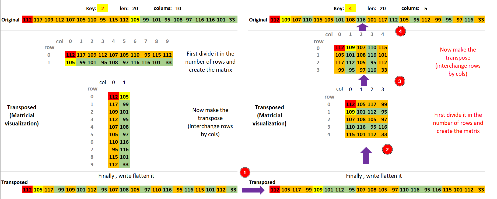

# AHS512

Difficulty:: #medium 

## Introduction

## Target data
- `Spawn Docker`: `159.65.49.148:30986`
- `Source Code`: `crypto_ahs512.zip`

## Challenge Description
*The most famous candy maker in town has developed a secret formula to make sensational and unique candies by just giving the name of the candy. He even added a pinch of randomness to his algorithm to make it even more interesting. As his trusted friend and security enthousiast he has asked you to test it for him. Can you find a bug?*

## Enumeration

We are given with a python file  `server.py` with seems to perform a custom "sha512" because call it "ahs512".

```shell
magor$ tree crypto_ahs512
crypto_ahs512
└── server.py
```

Lets  read the main function:

```python
# server.py
# ...SNIP...
def main(s):
    sendMessage(s, WELCOME)

    original_message = b"pumpkin_spice_latte!"
  ➊ original_digest = ahs512(original_message).hexdigest()
    sendMessage(
        s,
        f"\nFind a message that generate the same hash as this one: {original_digest}\n"
    )

    while True:
        try:
            message = receiveMessage(s, "\nEnter your message: ")
            message = bytes.fromhex(message)

            digest = ahs512(message).hexdigest()

         ➋  if ((original_digest == digest) and (message != original_message)):
                sendMessage(s, f"\n{FLAG}\n")
            else:
                sendMessage(s, "\nConditions not satisfied!\n")

        except KeyboardInterrupt:
            sendMessage(s, "\n\nExiting")
            exit(1)

        except Exception as e:
            sendMessage(s, f"\nAn error occurred while processing data: {e}\n")
# ...SNIP...
```

 It hash the message `b"pumpkin_spice_latte!"`  at ➊ and ask us if we can found another message that generate the same hash. if we found it the server will send us the flag ➋. So there will be a collition in the hash algorithm that we have to figuret out. 

Lets analyse how the `ash512()` class works:

```python
# server.py
# ...SNIP...
class ahs512():

    def __init__(self, message):
        self.message = message
        self.key = self.generateKey()
        

    def generateKey(self):
        while True:
        ➋   key = randint(2, len(self.message) - 1)
        ➌   if len(self.message) % key == 0:
                break

        return key

    def transpose(self, message):
        transposed = [0 for _ in message]
        original = [c for c in message]

        columns = len(message) // self.key
        print(f"Key: {self.key}", f"len: {len(message)}", f"{columns=}")

        for i, char in enumerate(message):
            row = i // columns
            col = i % columns
            print(f"{col=} ; {row=} ; {char=}")
            transposed[col * self.key + row] = char
        
        print("original", original)
        print("Transposed", transposed)
        return bytes(transposed)

    def rotate(self, message):
        return [((b >> 4) | (b << 3)) & 0xff for b in message]

    def hexdigest(self):
        transposed = self.transpose(self.message)
        rotated = self.rotate(transposed)
        print(f"{rotated=}")
        return sha512(bytes(rotated)).hexdigest()
# ...SNIP...
```

When the object is initializate it generate a random key ➊ that will be a int number. The key generation is curious because first  it will be between a very small range ➋ and always must to be a factor of the message len➌, so it reduces a lot the posibilities of the key value.

Now check the `hexdigest()` method, it execute the `transposed()` and the `rotated()` method respectivily, go to analize each of them.

> **Note:** that I add some `prints` to understand quickly how every functions modify the data.

To test it i change the end of the script:

```python
# server.py
# ...SNIP...
# if __name__ == '__main__':
#     socketserver.TCPServer.allow_reuse_address = True
#     server = ReusableTCPServer(("0.0.0.0", 1337), Handler)
#     server.serve_forever()

original_message = b"pumpkin_spice_latte!"
original_digest = ahs512(original_message).hexdigest()
```

Lets check how it works

```shelll
magor$ python server.py
Key: 2 ➊ len: 20 ➋  columns=10
col=0 ; row=0 ; char=112
col=1 ; row=0 ; char=117
col=2 ; row=0 ; char=109
col=3 ; row=0 ; char=112
col=4 ; row=0 ; char=107
col=5 ; row=0 ; char=105
col=6 ; row=0 ; char=110
col=7 ; row=0 ; char=95
col=8 ; row=0 ; char=115
col=9 ; row=0 ; char=112
col=0 ; row=1 ; char=105
col=1 ; row=1 ; char=99
col=2 ; row=1 ; char=101
col=3 ; row=1 ; char=95
col=4 ; row=1 ; char=108
col=5 ; row=1 ; char=97
col=6 ; row=1 ; char=116
col=7 ; row=1 ; char=116
col=8 ; row=1 ; char=101
col=9 ; row=1 ; char=33
➌ original [112, 117, 109, 112, 107, 105, 110, 95, 115, 112, 105, 99, 101, 95, 108, 97, 116, 116, 101, 33]
➍ Transposed [112, 105, 117, 99, 109, 101, 112, 95, 107, 108, 105, 97, 110, 116, 95, 116, 115, 101, 112, 33]
rotated=[135, 78, 175, 30, 110, 46, 135, 253, 94, 102, 78, 14, 118, 167, 253, 167, 159, 46, 135, 10]
```

First note that the message `len`  ➋  is `20` so the key only could be `[2,4,5,10]` and in this case it ramdoly choose `2` ➊. Now look the original message ➌ and compare it with the trasnposed ➍. Look that only performs a reorder. I also print each iteration with the `col` and `row` value since `traspose` usually are asociate with matrix, to re create the matrix and analize. so let see the image below:



The first thing to note is that **`key` is analogue to the number of rows the matrix have** , so you can image that the message will be converted into a matrix divide the message by the number of rows (key) . After that it performs a transpose operation to a matrix. its means it interchange the rows and columns. And finally it flatten it again to represente it in a single vector (list in this case)

This would work to all posibilities of rows `[2,4,6,8,10,12,14,16,18]` . So now that the transposed is clearly ( i expect it xD). Now review the rotate function

```python
    def rotate(self, message):
        return [((b >> 4) | (b << 3)) & 0xff for b in message]
```
It performs a logical operation, that make me think that if it can give the same result under the same `b` maybe could find a way to obtein the same result.

## Foothoold
My first attemp thinking that in a CTF you have to solve quickly the challenge, was ignore the rotated and think in the transpose function.

Transpose are reversible function, so i think that property woulb be helpufl, to test it I copy the function in a `solve.py` file and replace the `self` to a input key (to control the rows)

```python
# solve.py
original = b'pumpkin_spice_latte!'

def transpose(key, message):
    transposed = [0 for _ in message]
    original = [c for c in message]

    columns = len(message) // key

    for i, char in enumerate(message):
        row = i // columns
        col = i % columns
        print(f"{col=} ; {row=} ; {char=}")
        transposed[col * key + row] = char
    
    return bytes(transposed)
```

Now I test it in python interpreter:
```shell
magor$ python -i solve.py
>>> original
b'pumpkin_spice_latte!'
>>>➊transposed = transpose(2, original)
original [112, 117, 109, 112, 107, 105, 110, 95, 115, 112, 105, 99, 101, 95, 108, 97, 116, 116, 101, 33]
➋Transposed [112, 105, 117, 99, 109, 101, 112, 95, 107, 108, 105, 97, 110, 116, 95, 116, 115, 101, 112, 33]
>>> transposed
b'piucmep_kliant_tsep!'
>>>➌transpose(10, transposed)
original [112, 105, 117, 99, 109, 101, 112, 95, 107, 108, 105, 97, 110, 116, 95, 116, 115, 101, 112, 33]
Transposed [112, 117, 109, 112, 107, 105, 110, 95, 115, 112, 105, 99, 101, 95, 108, 97, 116, 116, 101, 33]
b'pumpkin_spice_latte!'
```

Look at ➊ with a `key=2` make the transpose and get the same transpose ➋ as the imagen above. Now if i want to reverse it i have to consider the number of rows the trasnpose has. No longer have 2 rows , now have 10 rows. Thas is the reason used a `key=10` ➌ to the trasnposed and get the original.


Well know what i want is to make the transpose in a way that get the "`fake_original`" (Another message that will be return the same hash) test that i have to pass in a `key=4` to obtain the same transpose as if a use the original `b'pumpkin_spice_latte!'` with a `key=2`. This can be easy done in the image below:



> Note: I made the example with a original `key=2` and reversed with a `key=5` but i could reverse it with a `key=2` instead of `key=5`. This works because This is clear when notice that if I transpose with `key=2` and i want return the data to the original message i have to use `key=10`. Look at the image above, if I want to go from top to bottom in the right look that i have to use `key=2` because there are 2 rows. but if i want to go from bottom to top the matrix has 10 rows, so `key=10`)

And to do it in Python, is do it in the same way like when test the transpose revesibility, but now with 5 rows `key=5`
```shell
magor$ python -i solve.py
>>>➊transposed = b'piucmep_kliant_tsep!'
>>>➋fake_original = transpose(5, transposed)
original [112, 105, 117, 99, 109, 101, 112, 95, 107, 108, 105, 97, 110, 116, 95, 116, 115, 101, 112, 33]
Transposed [112, 109, 107, 110, 115, 105, 101, 108, 116, 101, 117, 112, 105, 95, 112, 99, 95, 97, 116, 33]
>>>➌fake_original
b'pmknsielteupi_pc_at!'
>>>➍transpose(4, fake_original)
original [112, 109, 107, 110, 115, 105, 101, 108, 116, 101, 117, 112, 105, 95, 112, 99, 95, 97, 116, 33]
Transposed [112, 105, 117, 99, 109, 101, 112, 95, 107, 108, 105, 97, 110, 116, 95, 116, 115, 101, 112, 33]
b'piucmep_kliant_tsep!' ➎
```

Define at ➊ the transposed that i get when transpose the original with `key=2`. Now transpose again but with 5 rows `key=5` ➋. And see the `fake_original` at ➌. **Now if use the fake_original with a `key=4` ➍  it give us the same transpose ➎ that when I use the `original` with `key=2`**

And the hex representation of the `fake_originial` will be:
```python
>>> fake_original = b'pmknsielteupi_pc_at!'
>>> fake_original.hex()
'706d6b6e7369656c74657570695f70635f617421'
```


But I dont know the key that use the server because it does not return to me that information. So I have two options:

1. Connect it with netcat and send it `706d6b6e7369656c74657570695f70635f617421` the `fake_original` and expect that the original was hashing with a `key=2` and the `fake_oriignal` was hashing with a `key=4`. if fails at the first attemp, close the connection, and try connecting again.
2. Use pwntools to get the hash representation of the `original` and check with key was used (only there are four options  `2,4,5,10`), and after that make the transpose like the example above to get the `fake_original` with another key different that the used to the `original`.

In the challenge i choose the first option xD, and luckly in the 5 attemp i match the conditions and get the flag. 

> **Note:** There is a probability of 1/16 that i got the conditions i want, that means that if a try 16 times it would be probably that at least one attemp was correct.

But know that I take the time to write this writeup I wanna do it with `pwntools` as well


```python
# solve.py
#!/usr/bin/env python3
from pwn import *
from hashlib import sha512


original = b'pumpkin_spice_latte!'
key_options = (2,4,5,10)
def transpose(key, message): ➊
    transposed = [0 for _ in message]

    columns = len(message) // key

    for i, char in enumerate(message):
        row = i // columns
        col = i % columns
        transposed[col * key + row] = char
    
    return bytes(transposed)

def rotate(message):
    return [((b >> 4) | (b << 3)) & 0xff for b in message]

def hexdigest(key, message): ➋
    transposed = transpose(key, message)
    rotated = rotate(transposed)
    return sha512(bytes(rotated)).hexdigest()


if not args.REMOTE:
    p = remote('0.0.0.0', 1337)
else:
    p = remote('159.65.49.148',30891)


banner = p.recvuntil(b'message: ') ➌

original_hash = banner.split(b'this one: ')[-1].split(b'\n')[0] ➍
print(f'{original_hash=}')


for i, key in enumerate(key_options) : ➎
    
    if hexdigest(key, original).encode() == original_hash:
        key_original = key➏
        break

print(f'{key_original=}')

transposed_original = transpose(key_original, original) ➐
fake_original = transpose(key_original,transposed_original).hex().encode()➑

print(f"{fake_original=}")

counter = 0
while True:➒
    p.sendline(fake_original)

    res = p.recvuntil(b'message: ')
    counter +=1

    if not b'Conditions not satisfied!' in res:
        print(f"Number attemps: {counter}")
        print(res)
        break
```

First I copy the functions in the class `ash512` and modify it to use a specific key unput instead one generate randomly ➊ and ➋.  I recieve all server banner data ➌ and split it to get only the hex hash value ➍. After that I create the `hexdigest` with the 4 posibles keys at ➎ until i find the key used to hash the original message ➏. Then made the transpose two times at ➐ and ➑ with the `key_original` . Finnaly ➒ start send the two times transposed message until the server use the key that match with the key i used.

```shell
magor$ python -i solve_pwn.py
...SNIP...
original_hash=b'f4b66bb52094988e5f69c75e2cbd39d97ab4fbd3a2ec85a411e20452b4ca4e4e11d8b3ac8c9ca4d0589cbc666b9e2b848a1e6b65b18ccf87dc0b232569cf987c'
key_original=2
fake_original=b'70696961756e63746d5f657470735f656b706c21'
Number attemps: 3
b"\nHTB{xxxxxxxxxxxxxxxxxxxxxxxxxxxxxxxxxx}\n\nEnter your message: "
```
