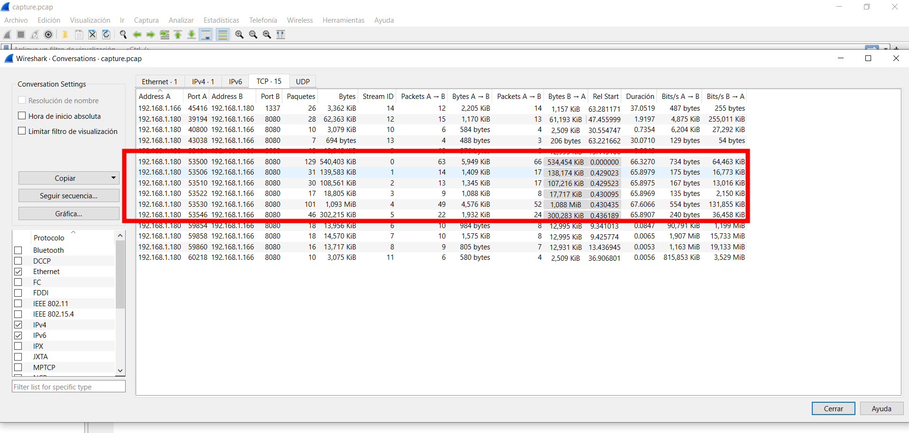

# Wrong Spooky Season

Difficulty:: #easy 

## Introduction
The challenges give us a pcap file where are the traces of an attacker that performs a RCE to a web page that is server with Java. The flag is placed at the end of the conversation.

## Target data
- `File`: `forensics_wrong_spooky_season.zip`

## Challenge Description
*"I told them it was too soon and in the wrong season to deploy such a website, but they assured me that theming it properly would be enough to stop the ghosts from haunting us. I was wrong." Now there is an internal breach in the `Spooky Network` and you need to find out what happened. Analyze the the network traffic and find how the scary ghosts got in and what they did.*

## Enumeration

The zip only contain a `capture.pcap` file 

```shell
magor$ tree forensics_wrong_spooky_season
forensics_wrong_spooky_season
└── capture.pcap
```

So I use [Wireshark](https://www.wireshark.org/) to analyse it. Go to the conversations and see the flow.



All the traffic is a RCE injection that an attacker do to a java web app, first with a webshell and then create a reverse shell. And at the end there is a base64 text:


When i decode it I find the flag:
```shell
$ echo "==gC9FSI5tGMwA3cfRjd0o2Xz0GNjNjYfR3c1p2Xn5WMyBXNfRjd0o2eCRFS" | rev | base64 -d                          
HTB{xxxxxxxxxxxxxxxxxxxxxxxxxxxxxxxxxxxxx} 
```

> **Note** : I use piplines with `rev` command because of the  startin chars `==`, in a base64 alwasy are at the strings end. And you can check that the command in the conversation capturo also use `rev`.

