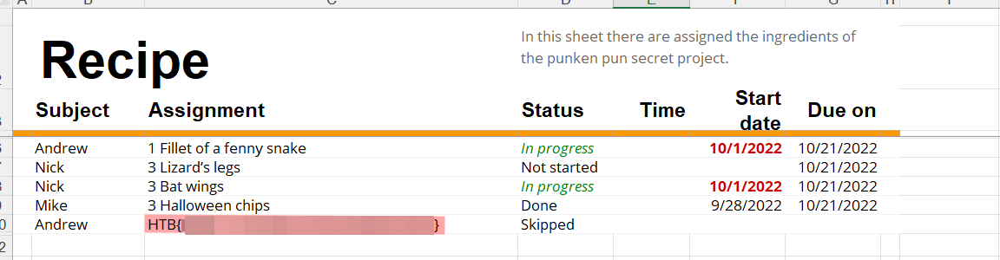

# Trick or Breach

Difficulty:: #easy

## Introduction
This challenge give us a capture in a `pcap` file that contains a trace of a excel file that was exfiltrated by DNScat. So when concatenate all bytes founds in the subdomain names and save it like a xlsx file. the excel file is recoverd.

## Target data
- `File`: `forensics_trick_or_breach.zip`

## Challenge Description
*Our company has been working on a secret project for almost a year. None knows about the subject, although rumor is that it is about an old Halloween legend where an old witch in the woods invented a potion to bring pumpkins to life, but in a more up-to-date approach. Unfortunately, we learned that malicious actors accessed our network in a massive cyber attack. Our security team found that the hack had occurred when a group of children came into the office's security external room for trick or treat. One of the children was found to be a paid actor and managed to insert a USB into one of the security personnel's computers, which allowed the hackers to gain access to the company's systems. We only have a network capture during the time of the incident. Can you find out if they stole the secret project?*

## Enumeration
The zip only contain a `capture.pcap` file 

```shell
magor$ tree forensics_trick_or_breach
forensics_trick_or_breach
└── capture.pcap
```

So I use [Wireshark]() to analyse it. Go to the conversations and see the flow.

There is a pattern interesting in the conversation. First note that is the `53 UDP` port its means DNS service, look that all packets have the same size, the content is a hostname and the only change is that every packet have a different subdomain that is a hexadecimal with the same size `52 bytes`


So I search [forensics analysis pcap DNS](https://duckduckgo.com/?t=ffab&q=forensics+analysis+pcap+DNS) I found [DNSCat pcap analysis](https://book.hacktricks.xyz/generic-methodologies-and-resources/basic-forensic-methodology/pcap-inspection/dnscat-exfiltration). That is amazing, this is a way in wich data like files can be exfiltrated by DNScat. The data is split and sent into the subdomain name.

At this point, I start to understand how can I handle the pcap file with Python to start to join all bytes and identify what type of data I am working. I found a very useful resource about it with the [CTF-writeups BsidesSF 2017 - Dnscap (forensics, 500 pts written by jrmdev)](https://github.com/jrmdev/ctf-writeups/tree/master/bsidessf-2017/dnscap) 


It use [scapy](https://pypi.org/project/scapy/) module , i am new using it so I start exploring it with the guide of the examples found in the links above.

```Python
>>> from scapy.all import rdpcap, DNSQR, DNSRR
>>>➊rd = rdpcap('capture.pcap')
>>> rd
<capture.pcap: TCP:0 UDP:616 ICMP:0 Other:0>
>>>➋len(rd)
616
>>>➌rd[0]
<Ether  dst=e8:1b:69:5b:0f:60 src=64:bc:58:93:fa:2b type=IPv4 |<IP  version=4 ihl=5 tos=0x0 len=112 id=57828 flags= frag=0 ttl=128 proto=udp chksum=0x5672 src=192.168.1.10 dst=147.182.172.189 |<UDP  sport=64798 dport=domain len=92 chksum=0x737a |<DNS  id=42143 qr=0 opcode=QUERY aa=0 tc=0 rd=0 ra=0 z=0 ad=0 cd=0 rcode=ok qdcount=1 ancount=0 nscount=0 arcount=0 qd=<DNSQR  ➍ qname='504b0304140008080800a52c47550000000000000000000000.pumpkincorp.com.' qtype=A qclass=IN |> an=None ns=None ar=None |>>>>
>>>➎rd[1]
<Ether  dst=64:bc:58:93:fa:2b src=e8:1b:69:5b:0f:60 type=IPv4 |<IP  version=4 ihl=5 tos=0x0 len=128 id=65381 flags=DF frag=0 ttl=53 proto=udp chksum=0x43e1 src=147.182.172.189 dst=192.168.1.10 |<UDP  sport=domain dport=64798 len=108 chksum=0xed25 |<DNS  id=42143 qr=1 opcode=QUERY aa=1 tc=0 rd=0 ra=1 z=0 ad=0 cd=0 rcode=ok qdcount=1 ancount=1 nscount=0 arcount=0 qd=<DNSQR  ➏ qname='504b0304140008080800a52c47550000000000000000000000.pumpkincorp.com.' qtype=A qclass=IN |> an=<DNSRR ➐ rrname='504b0304140008080800a52c47550000000000000000000000.pumpkincorp.com.' type=A rclass=IN ttl=300 rdlen=None rdata=147.182.172.189 |> ns=None ar=None |>>>>
>>>➑rd[0][DNSQR].qname
b'504b0304140008080800a52c47550000000000000000000000.pumpkincorp.com.'
```

I open the capture file at ➊, and when i check the len at ➋ I verify that is excatly the packets size that wireshark is show me. Then I want to check the structure of each packet, at ➌ I check the first packet an notice the ➍ `DNSQR` with the `name` that have the subdomain `504b0304140008080800a52c47550000000000000000000000` and  when compare it with the second packet at ➎ I can see that also have the ➏ `DNSQR` but also ➐  `DNSRR` with the same subdomain so it has the same structure "send, response" that the wireshark. And it explains why in the examples they filter by `DNSQR` and ignoring the `DNSRR` because it will repeat the data. Now I check that I can get the value i want from `rd`  like at ➑.


## Foothold

With that review, now I can start by filter all subdomains, convert it to bytes and concatenate to see hat kind of data could be:

```python
# convert.py
from scapy.all import rdpcap, DNSQR, DNSRR
out = b''

l_h = []
rd = rdpcap('capture.pcap')
for i, p in enumerate(rd):

    # Look at queries only
    if p.haslayer(DNSQR) and not p.haslayer(DNSRR):
        
        qry = p[DNSQR].qname.replace(b'.pumpkincorp.com.', b'').decode()
        qry = b''.join( bytes.fromhex(qry[i:i+2]) for i in range(0, len(qry), 2))
        
        print(qry)
```

```shell
magor$ python -i convert.py
b'PK\x03\x04\x14\x00\x08\x08\x08\x00\xa5,GU\x00\x00\x00\x00\x00\x00\x00\x00\x00\x00\x00'
b'\x00\x18\x00\x00\x00xl/drawings/drawing1'
b'.xml\x9d\xd0]n\xc20\x0c\x07\xf0\x13\xec\x0eU\xdeiZ\x18\x13C\x14^'
b'\xd0N0\x0e\xe0%n\x1b\x91\x8f\xca\x0e\xa3\xdc~\xd1J6i{\x01\x1em\xcb?'
b'\xf9\xef\xcdnt\xb6\xf8Db\x13|#\xea\xb2\x12\x05z\x15\xb4\xf1]#\x0e\xefo'
b'\xb3\x95(8\x82\xd7`\x83\xc7F\\\x90\xc5n\xfb\xb4\x195\xad\xcf\xbc\xa7"\xed{'
b'^\xa7\xb2\x11}\x8c\xc3ZJV=:\xe02\x0c\xe8\xd3\xb4\r\xe4 \xa6\x92:\xa9'
b'\t\xceIvV\xce\xab\xeaE\xf2@\x08\x9a{\xc4\xb8\x9f&\xe2\xea\xc1\x03\x9a\x03\xe3'
b'\xf3\xfeM\xd7\x84\xb65\n\xf7A\x9d\x1c\xfa8!\x84\x16b\xfa\x05\xf7f\xe0\xac\xa9'
b'\x07\xaeQ=P\xfc\x01\xc6\x7f\x823\x8a\x02\x876\x96*\xb8\xeb)\xd9HB\xfd<'
b'\t8\xfe\x1a\xf5\xdd\xc8R\xbe\xca\xd5_\xc8\xdd\x14\xc7\x01\x1dO\xc3,\xb9Cz\xc8'
b'\x87\xb1&^\xbe\x93eFw\xee\x81\xb7h\x03\x1d\x81\xcb\xc8\xb88\xf8\xe3\xdd\xb1*'
b'\xc96\xb5(+l\xb1^\xde\xad\xcc\xb3"\xb7_PK\x07\x08\x07bi\x83\x05\x01'
b'\x00\x00\x07\x03\x00\x00PK\x03\x04\x14\x00\x08\x08\x08\x00\xa5,GU\x00\x00\x00\x00\x00'
b'\x00\x00\x00\x00\x00\x00\x00\x18\x00\x00\x00xl/drawings/dr'
b'awing2.xml\x9d\xd0]n\xc20\x0c\x07\xf0\x13\xec\x0eU\xdei'
# ...SNIP:..
```

The fisrt bytes have the file signature `PK\x03\x04` , looking in [List of file signatures](https://en.wikipedia.org/wiki/List_of_file_signatures) I found that could be any of the files below but when a read a few more data bytes, I see a lot of `.xml` extensios, soo I suspect is a excel file:


So I change the Python script to save it like a `xlsx` file :

```Python
from scapy.all import rdpcap, DNSQR, DNSRR
out = b''

l_h = []
rd = rdpcap('capture.pcap')
for i, p in enumerate(rd):

    # Look at queries only
    if p.haslayer(DNSQR) and not p.haslayer(DNSRR):
        
        qry = p[DNSQR].qname.replace(b'.pumpkincorp.com.', b'').decode()
        qry = b''.join( bytes.fromhex(qry[i:i+2]) for i in range(0, len(qry), 2))
    

        out +=qry

open('flag.xlsx', 'wb').write(out)  
```

```shell
magor$ python convert.py
```

Open file with excel and fount a recipe!:
