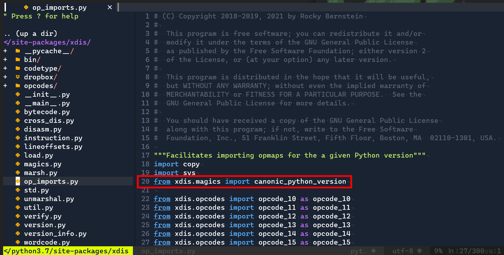

# POOF

Difficulty:: #easy 

## Introduction
This is a very nice challenge, it involves to do a forensics analysis to a ransomware. They give us the capture with the trace where the ransomware was downloaded so we can export the malicious binary. Also provie us a memory dump capture to analyse the process, and give us a nugde with the os profile to analize the memory dump data. And something that I thanks a lot to the HackTheBox team. They made the challenge in a way that we have to answer a series of questions, so thery were guiding people like me that perform this kink of analysis for first time.

## Target data
- `Spawn Docker`: `161.35.164.157:30027` 
- `File`:  [http://xxx.xxx.xxx.xxx/forensics_poof.zip](http://138.68.188.84/forensics_poof.zip)

## Challenge Description
In my company, we are developing a new python game for Halloween. I'm the leader of this project; thus, I want it to be unique. So I researched the most cutting-edge python libraries for game development until I stumbled upon a private game-dev discord server. One member suggested I try a new python library that provides enhanced game development capabilities. I was excited about it until I tried it. Quite simply, all my files are encrypted now. Thankfully I manage to capture the memory and the network traffic of my Linux server during the incident. Can you analyze it and help me recover my files? To get the flag, connect to the docker service and answer the questions.
==WARNING! Do not try to run the malware on your host. It may harm your computer! ==

## Enumeration

When the data size is relative big they enabled a service to download it. The zip contains the following files:

```shell
magor$unzip -l forensics_poof.zip 
Archive:  forensics_poof.zip
  Length      Date    Time    Name
---------  ---------- -----   ----
  2567089  2022-10-20 05:12   candy_dungeon.pdf.boo
1096901984  2022-10-20 12:11   mem.dmp
  7839830  2022-10-20 05:25   poof_capture.pcap
  1126698  2022-10-20 06:04   Ubuntu_4.15.0-184-generic_profile.zip
---------                     -------
1108435601                     4 files
```


But the also give us a `spam docker` so I wanna check it before review each file and i found that its a guide to analize the data:

```shell
magor$ nc -n 161.35.164.157 30027

+-----------+---------------------------------------------------------+
|   Title   |                       Description                       |
+-----------+---------------------------------------------------------+
| Downgrade |          During recent auditing, we noticed that        |
|           |     network authentication is not forced upon remote    |
|           |       connections to our Windows 2012 server. That      |
|           |           led us to investigate our system for          |
|           |  suspicious logins further. Provided the server's event |
|           |       logs, can you find any suspicious successful      |
|           |                          login?                         |
+-----------+---------------------------------------------------------+

Which is the malicious URL that the ransomware was downloaded from? (for example: http://maliciousdomain/example/file.extension)
> 
```

It seems that with each question it will give us the path to follow to do the forensics analysis. So due to the first question is asking us for the URL that was used to download the ransomware. The first file that take my attention is the capture file `poof_capture.pcap`.

### 1.  Malicious URL

I analyse [Wireshark]() to analyse the capture file. Then I go to the conversation flow to identify only one sequence in the TCP flow:


And when open it found a GET request to  the endpoint `/packages/a5/61/caf3af6d893b5cb8eae9a90a3054f370a92130863450e3299d742c7a65329d94/pygaming-dev-13.37.tar.gz` in the host `files.pypi-install.com` , so the URL will be:
```
http://files.pypi-install.com/packages/a5/61/caf3af6d893b5cb8eae9a90a3054f370a92130863450e3299d742c7a65329d94/pygaming-dev-13.37.tar.gz
```

So I write that URL in the server docker spawend:

```shell
magor$ nc -n 161.35.164.157 30027

+-----------+---------------------------------------------------------+
|   Title   |                       Description                       |
+-----------+---------------------------------------------------------+
| Downgrade |          During recent auditing, we noticed that        |
|           |     network authentication is not forced upon remote    |
|           |       connections to our Windows 2012 server. That      |
|           |           led us to investigate our system for          |
|           |  suspicious logins further. Provided the server's event |
|           |       logs, can you find any suspicious successful      |
|           |                          login?                         |
+-----------+---------------------------------------------------------+

Which is the malicious URL that the ransomware was downloaded from? (for example: http://maliciousdomain/example/file.extension)
> http://files.pypi-install.com/packages/a5/61/caf3af6d893b5cb8eae9a90a3054f370a92130863450e3299d742c7a65329d94/pygaming-dev-13.37.tar.gz
[+] Correct!

What is the name of the malicious process? (for example: malicious)

> 
```

Now the second question ask us for the name of the malicious process
## 2 Malicious process

At this point I could do two things the first one is export the malicious zip from wireshark and check the executable name, thats probably the name of the process that they ask us. And the second one could be review the `mem.dmp` wich is a capture of the process that were running when the capture was taken. So I am going to follow both paths and verify that i get the same:


### Export malicious zip file
I go to *Export Objetcs>HTTP* and save the `pygaming-dev-13.37.tar.gz` file:


After save it i use `tar` to decompress it and found a single `configure` executable file
```shell
magor$ tar xvzf pygaming-dev-13.37.tar.gz
magor$ tree pygaming-dev-13.37
pygaming-dev-13.37
└── configure

0 directories, 1 file
```
So its likely that the malicious process name will be `configure` but first now go to analyse the `mem.dmp` file

>**Warning**: We have to be so carefoul, if we execute the binary . It really encrypt our data. The challenge descripion warns us. But Somepeople during the event didn't read the warning, and the had to change the zip file to do it harmless XD.


### Memory dump file
I found [this writeup Compromised](https://ctftime.org/writeup/29392)  to figure out how analyse the file. Like check the linux version:

```shell
magor$strings mem.dmp|egrep '^Linux.*[0-9.]{3,}.*SMP'
Linux version 4.15.0-184-generic (buildd@lcy02-amd64-006) (gcc version 7.5.0 (Ubuntu 7.5.0-3ubuntu1~18.04)) #194-Ubuntu SMP Thu Jun 2 18:54:48 UTC 2022 (Ubuntu 4.15.0-184.194-generic 4.15.18)
Linux version 4.15.0-184-generic (buildd@lcy02-amd64-006) (gcc version 7.5.0 (Ubuntu 7.5.0-3ubuntu1~18.04)) #194-Ubuntu SMP Thu Jun 2 18:54:48 UTC 2022 (Ubuntu 4.15.0-184.194-generic 4.15.18)
```

I [install volatily](https://github.com/volatilityfoundation/volatility/wiki/Installation ):(in wsl of vm because in parrot vm cant install python2)

```shell
$ git clone https://github.com/volatilityfoundation/volatility.git
$ sudo python2 setup.py install
running install_egg_info
Writing /usr/local/lib/python2.7/dist-packages/volatility-2.6.1.egg-info
```

So I know that the files will be stored into `//usr/local/lib/python2.7/dist-packages/volatility/`

And now try to identify the `Profile` but it couldn't identify it:

```shell
magor$ python2 /usr/local/bin/vol.py -f mem.dmp imageinfo
Volatility Foundation Volatility Framework 2.5
INFO    : volatility.debug    : Determining profile based on KDBG search...
          Suggested Profile(s) : No suggestion (Instantiated with no profile)
                     AS Layer1 : OSXPmemELF (Unnamed AS)
                     AS Layer2 : FileAddressSpace (/home/kil/Documents/ctf/2022-hackerboo/5-forensics/poof/mem.dmp)
                      PAE type : No PAE

```

And after read the writeup that i used like guide it says that if the `imageinfo` cant determinate the `Profile` is probably because we need to build a specific profile for this dump. But they alreay did it for us, check that in the files we got there is a `Ubuntu_4.15.0-184-generic_profile.zip` . It's likely that this is the profile we need.

To add a profile i follow the steps in [volatility profiles](https://cyberfibers.com/2014/05/volatility-profiles/):

```shell
magor$ sudo cp Ubuntu_4.15.0-184-generic_profile.zip /usr/local/lib/python2.7/dist-packages/volatility/plugins/overlays/linux/
```

And now I can verify that vol reconize the new profile:
```shell
magor$ python2 /usr/local/bin/vol.py --info | grep Linux
Volatility Foundation Volatility Framework 2.6.1
LinuxUbuntu_4_15_0-184-generic_profilex64 - A Profile for Linux Ubuntu_4.15.0-184-generic_profile x64
linux_aslr_shift           - Automatically detect the Linux ASLR shift
linux_banner               - Prints the Linux banner information
linux_yarascan             - A shell in the Linux memory image
LinuxAMD64PagedMemory          - Linux-specific AMD 64-bit address space.
```

Also can be checked with plugins info:
 
```shell
magor$ sudo python2 /usr/local/bin/vol.py --plugins=/usr/local/lib/python2.7/dist-packages/volatility/plugins --info

...SNIP...

Profiles
--------
LinuxUbuntu_4_15_0-184-generic_profilex64 - A Profile for Linux Ubuntu_4.15.0-184-generic_profile x64

...SNIP...
```

Now check the process!:

```shell
magor$ sudo python2 /usr/local/bin/vol.py --plugins=/usr/local/lib/python2.7/dist-packages/volatility/plugins --profile=LinuxUbuntu_4_15_0-184-generic_profilex64 -f mem.dmp linux_psaux

...SNIP...
857    0      0      /usr/sbin/atd -f
864    0      0      /usr/sbin/cron -f
873    0      0      /usr/bin/python3 /usr/share/unattended-upgrades/unattended-upgrade-shutdown --wait-for-signal
874    0      0      /usr/lib/policykit-1/polkitd --no-debug
890    0      0      /sbin/agetty -o -p -- \u --noclear tty1 linux
891    0      0      /usr/sbin/sshd -D
1171   0      0      sshd: developer [priv
1182   1000   1000   /lib/systemd/systemd --user
1184   1000   1000   (sd-pam)
1311   1000   1000   sshd: developer@pts/0
1312   1000   1000   -bash
1340   1000   1000   ./configure
1341   1000   1000   ./configure
```

And verify that the maliciouse process is `configure` . The same name of the binary in the zip downloaded in the pcap file.

```shell
magor$ nc 161.35.164.157 30027

+-----------+---------------------------------------------------------+
|   Title   |                       Description                       |
+-----------+---------------------------------------------------------+
| Downgrade |          During recent auditing, we noticed that        |
|           |     network authentication is not forced upon remote    |
|           |       connections to our Windows 2012 server. That      |
|           |           led us to investigate our system for          |
|           |  suspicious logins further. Provided the server's event |
|           |       logs, can you find any suspicious successful      |
|           |                          login?                         |
+-----------+---------------------------------------------------------+

Which is the malicious URL that the ransomware was downloaded from? (for example: http://maliciousdomain/example/file.extension)
> http://files.pypi-install.com/packages/a5/61/caf3af6d893b5cb8eae9a90a3054f370a92130863450e3299d742c7a65329d94/pygaming-dev-13.37.tar.gz
[+] Correct!

What is the name of the malicious process? (for example: malicious)

> configure
[+] Correct!
Provide the md5sum of the ransomware file.
>
```

Then it give us a new question, that ask for the ramsonware signature.

### 3. Ransomware signature

To get the `md5sum` :

```
magor$ md5sum configure
7c2ff873ce6b022663a1f133383194cc  configure
```

```shell
magor$ nc 161.35.164.157 30027

+-----------+---------------------------------------------------------+
|   Title   |                       Description                       |
+-----------+---------------------------------------------------------+
| Downgrade |          During recent auditing, we noticed that        |
|           |     network authentication is not forced upon remote    |
|           |       connections to our Windows 2012 server. That      |
|           |           led us to investigate our system for          |
|           |  suspicious logins further. Provided the server's event |
|           |       logs, can you find any suspicious successful      |
|           |                          login?                         |
+-----------+---------------------------------------------------------+

Which is the malicious URL that the ransomware was downloaded from? (for example: http://maliciousdomain/example/file.extension)
> http://files.pypi-install.com/packages/a5/61/caf3af6d893b5cb8eae9a90a3054f370a92130863450e3299d742c7a65329d94/pygaming-dev-13.37.tar.gz
[+] Correct!

What is the name of the malicious process? (for example: malicious)

> configure
[+] Correct!
Provide the md5sum of the ransomware file.
> 7c2ff873ce6b022663a1f133383194cc
[+] Correct!

Which programming language was used to develop the ransomware? (for example: nim)
>
```

And now it ask for the program language used to develop the ramsonware. 

### 4. Ransomware programming language

I guess that is that was a packet for python should be written in python.  But to confirm i can check the `strings` and look that at the end there are mulitples `python3` sections

```shell
magor$ blibpython3.6m.so.1.0
blibreadline.so.7
blibssl.so.1.1
blibtinfo.so.5
blibz.so.1
xbase_library.zip
zPYZ-00.pyz
2libpython3.6m.so.1.0
.shstrtab
.interp
.note.gnu.build-id
.note.ABI-tag
.gnu.hash
.dynsym
.dynstr
.gnu.version
.gnu.version_r
.rela.dyn
.rela.plt
.init
.text
.fini
.rodata
.eh_frame_hdr
.eh_frame
.init_array
.fini_array
.dynamic
.got
.got.plt
.data
.bss
.comment
pydata
```

```shell
magor$ nc 161.35.164.157 30027

+-----------+---------------------------------------------------------+
|   Title   |                       Description                       |
+-----------+---------------------------------------------------------+
| Downgrade |          During recent auditing, we noticed that        |
|           |     network authentication is not forced upon remote    |
|           |       connections to our Windows 2012 server. That      |
|           |           led us to investigate our system for          |
|           |  suspicious logins further. Provided the server's event |
|           |       logs, can you find any suspicious successful      |
|           |                          login?                         |
+-----------+---------------------------------------------------------+

Which is the malicious URL that the ransomware was downloaded from? (for example: http://maliciousdomain/example/file.extension)
> http://files.pypi-install.com/packages/a5/61/caf3af6d893b5cb8eae9a90a3054f370a92130863450e3299d742c7a65329d94/pygaming-dev-13.37.tar.gz
[+] Correct!

What is the name of the malicious process? (for example: malicious)

> configure
[+] Correct!
Provide the md5sum of the ransomware file.
> 7c2ff873ce6b022663a1f133383194cc
[+] Correct!

Which programming language was used to develop the ransomware? (for example: nim)

> python
[+] Correct!

After decompiling the ransomware, what is the name of the function used for encryption? (for example: encryption)
>
```

Now the ask interesting things! We have to decompile it!

### 5 Decompile it!

I search how decompile python binaries and found [decompile python biinary](https://book.hacktricks.xyz/generic-methodologies-and-resources/basic-forensic-methodology/specific-software-file-type-tricks/.pyc)

I have to install pyinstaller to use `pyi-archive_viewer` when i execute it open a TIL like we

```shell
magor$ pyi-archive_viewer configure
 pos, length, uncompressed, iscompressed, type, name
[(0, 224, 293, 1, 'm', 'struct'),
 (224, 1025, 1706, 1, 'm', 'pyimod01_os_path'),
 (1249, 4025, 8765, 1, 'm', 'pyimod02_archive'),
 (5274, 7386, 17758, 1, 'm', 'pyimod03_importers'),
 (12660, 1455, 3638, 1, 'm', 'pyimod04_ctypes'),
 (14115, 825, 1364, 1, 's', 'pyiboot01_bootstrap'),
 (14940, 512, 797, 1, 's', 'pyi_rth_subprocess'),
 (15452, 701, 1065, 1, 's', 'pyi_rth_pkgutil'),
 (16153, 438, 660, 1, 's', 'pyi_rth_inspect'),
 (16591, 1767, 2974, 1, 's', 'configure'),
 (18358, 5322, 13768, 1, 'b', 'Crypto/Cipher/_ARC4.abi3.so'),
 (23680, 8686, 26784, 1, 'b', 'Crypto/Cipher/_Salsa20.abi3.so'),
 (32366, 9238, 28224, 1, 'b', 'Crypto/Cipher/_chacha20.abi3.so'),
 (41604, 8793, 28096, 1, 'b', 'Crypto/Cipher/_pkcs1_decode.abi3.so'),
 (50397, 27171, 66256, 1, 'b', 'Crypto/Cipher/_raw_aes.abi3.so'),
 (77568, 25188, 101136, 1, 'b', 'Crypto/Cipher/_raw_aesni.abi3.so'),
 (102756, 14942, 43776, 1, 'b', 'Crypto/Cipher/_raw_arc2.abi3.so'),
 (117698, 20616, 69976, 1, 'b', 'Crypto/Cipher/_raw_blowfish.abi3.so'),
 (138314, 20698, 42976, 1, 'b', 'Crypto/Cipher/_raw_cast.abi3.so'),
 (159012, 6623, 20736, 1, 'b', 'Crypto/Cipher/_raw_cbc.abi3.so'),
 (165635, 8565, 25440, 1, 'b', 'Crypto/Cipher/_raw_cfb.abi3.so'),
 (174200, 9810, 28600, 1, 'b', 'Crypto/Cipher/_raw_ctr.abi3.so'),
 (184010, 24275, 75672, 1, 'b', 'Crypto/Cipher/_raw_des.abi3.so'),
 (208285, 24635, 76480, 1, 'b', 'Crypto/Cipher/_raw_des3.abi3.so'),
 (232920, 4079, 12440, 1, 'b', 'Crypto/Cipher/_raw_ecb.abi3.so'),
 (236999, 36990, 166264, 1, 'b', 'Crypto/Cipher/_raw_eksblowfish.abi3.so'),
 (273989, 13441, 37344, 1, 'b', 'Crypto/Cipher/_raw_ocb.abi3.so'),
 (287430, 5717, 15368, 1, 'b', 'Crypto/Cipher/_raw_ofb.abi3.so'),
 (293147, 8547, 21888, 1, 'b', 'Crypto/Hash/_BLAKE2b.abi3.so'),
 (301694, 8196, 21712, 1, 'b', 'Crypto/Hash/_BLAKE2s.abi3.so'),
 (309890, 6887, 20128, 1, 'b', 'Crypto/Hash/_MD2.abi3.so'),
 (316777, 8414, 25576, 1, 'b', 'Crypto/Hash/_MD4.abi3.so'),
 (325191, 12006, 31704, 1, 'b', 'Crypto/Hash/_MD5.abi3.so'),
 (337197, 15739, 55608, 1, 'b', 'Crypto/Hash/_RIPEMD160.abi3.so'),
 (352936, 20926, 74416, 1, 'b', 'Crypto/Hash/_SHA1.abi3.so'),
 (373862, 15611, 43792, 1, 'b', 'Crypto/Hash/_SHA224.abi3.so'),
 (389473, 15650, 43872, 1, 'b', 'Crypto/Hash/_SHA256.abi3.so'),
 (405123, 17150, 50520, 1, 'b', 'Crypto/Hash/_SHA384.abi3.so'),
 (422273, 17398, 50624, 1, 'b', 'Crypto/Hash/_SHA512.abi3.so'),
 (439671, 15059, 50160, 1, 'b', 'Crypto/Hash/_ghash_clmul.abi3.so'),
 (454730, 7229, 17432, 1, 'b', 'Crypto/Hash/_ghash_portable.abi3.so'),
 (461959, 12626, 35064, 1, 'b', 'Crypto/Hash/_keccak.abi3.so'),
 (474585, 10760, 33360, 1, 'b', 'Crypto/Hash/_poly1305.abi3.so'),
 (485345, 87340, 294464, 1, 'b', 'Crypto/Math/_modexp.abi3.so'),
 (572685, 7963, 25024, 1, 'b', 'Crypto/Protocol/_scrypt.abi3.so'),
 (580648, 725102, 1068008, 1, 'b', 'Crypto/PublicKey/_ec_ws.abi3.so'),
 (1305750, 150030, 578280, 1, 'b', 'Crypto/PublicKey/_ed25519.abi3.so'),
 (1455780, 98033, 329424, 1, 'b', 'Crypto/PublicKey/_ed448.abi3.so'),
 (1553813, 33398, 124632, 1, 'b', 'Crypto/PublicKey/_x25519.abi3.so'),
 (1587211, 4109, 12776, 1, 'b', 'Crypto/Util/_cpuid_c.abi3.so'),
 (1591320, 4835, 14960, 1, 'b', 'Crypto/Util/_strxor.abi3.so'),
 (1596155,
  8250,
  22040,
  1,
  'b',
  'lib-dynload/_bz2.cpython-36m-x86_64-linux-gnu.so'),
 (1604405,
  102471,
  149808,
  1,
  'b',
  'lib-dynload/_codecs_cn.cpython-36m-x86_64-linux-gnu.so'),
 (1706876,
  35791,
  158032,
  1,
  'b',
  'lib-dynload/_codecs_hk.cpython-36m-x86_64-linux-gnu.so'),
 (1742667,
  9817,
  26928,
  1,
  'b',
  'lib-dynload/_codecs_iso2022.cpython-36m-x86_64-linux-gnu.so'),
 (1752484,
  97280,
  272688,
  1,
  'b',
  'lib-dynload/_codecs_jp.cpython-36m-x86_64-linux-gnu.so'),
 (1849764,
  78895,
  137520,
  1,
  'b',
  'lib-dynload/_codecs_kr.cpython-36m-x86_64-linux-gnu.so'),
 (1928659,
  63575,
  112944,
  1,
  'b',
  'lib-dynload/_codecs_tw.cpython-36m-x86_64-linux-gnu.so'),
 (1992234,
  51717,
  126816,
  1,
  'b',
  'lib-dynload/_ctypes.cpython-36m-x86_64-linux-gnu.so'),
 (2043951,
  10713,
  29752,
  1,
  'b',
  'lib-dynload/_hashlib.cpython-36m-x86_64-linux-gnu.so'),
 (2054664,
  13756,
  33592,
  1,
  'b',
  'lib-dynload/_lzma.cpython-36m-x86_64-linux-gnu.so'),
 (2068420,
  24229,
  56600,
  1,
  'b',
  'lib-dynload/_multibytecodec.cpython-36m-x86_64-linux-gnu.so'),
 (2092649,
  2042,
  6280,
  1,
  'b',
  'lib-dynload/_opcode.cpython-36m-x86_64-linux-gnu.so'),
 (2094691,
  44305,
  120088,
  1,
  'b',
  'lib-dynload/_ssl.cpython-36m-x86_64-linux-gnu.so'),
 (2138996,
  11321,
  31752,
  1,
  'b',
  'lib-dynload/readline.cpython-36m-x86_64-linux-gnu.so'),
 (2150317,
  4689,
  15368,
  1,
  'b',
  'lib-dynload/resource.cpython-36m-x86_64-linux-gnu.so'),
 (2155006,
  8305,
  24968,
  1,
  'b',
  'lib-dynload/termios.cpython-36m-x86_64-linux-gnu.so'),
 (2163311, 30120, 66728, 1, 'b', 'libbz2.so.1.0'),
 (2193431, 1298736, 2917216, 1, 'b', 'libcrypto.so.1.1'),
 (3492167, 71737, 202880, 1, 'b', 'libexpat.so.1'),
 (3563904, 15792, 31032, 1, 'b', 'libffi.so.6'),
 (3579696, 79754, 153912, 1, 'b', 'liblzma.so.5'),
 (3659450, 1823469, 4683728, 1, 'b', 'libpython3.6m.so.1.0'),
 (5482919, 126584, 294632, 1, 'b', 'libreadline.so.7'),
 (5609503, 230994, 577312, 1, 'b', 'libssl.so.1.1'),
 (5840497, 64264, 170784, 1, 'b', 'libtinfo.so.5'),
 (5904761, 60084, 116960, 1, 'b', 'libz.so.1'),
 (5964845, 208242, 786938, 1, 'x', 'base_library.zip'),
 (6173087, 1270801, 1270801, 0, 'z', 'PYZ-00.pyz')]
? X configure
to filename? ./configure.pyc
?
```

Now I use `uncompyle6` to decompile it to a python file
```shell
magor$ uncompyle6 configure.pyc > configure.py
```

It doesn't return a error message but when i want to check the Python file with the followin error:
```shell
magor$ cat configure.py
Unknown magic number 227 in configure.pyc
```

In the same [decompile python biinary](https://book.hacktricks.xyz/generic-methodologies-and-resources/basic-forensic-methodology/specific-software-file-type-tricks/.pyc)  says how to solved it. They remove the first magic bytes so we only need to add it to the binary.

When I check the first bytes with `hexdump` and compare it with the example in hacktricks guide i confirm that the first 16 bytes were removed:
```shell
magor$ hexdump configure.pyc | head
0000000 00e3 0000 0000 0000 0000 0000 0400 0000
0000010 4000 0000 7300 009a 0000 0064 0164 006c
0000020 016d 015a 0001 0064 0264 026c 025a 0064
0000030 0264 036c 035a 0064 0264 046c 045a 0064
0000040 0264 056c 055a 0665 0765 0264 0364 039c
0000050 0464 0564 0484 085a 0665 0264 0664 029c
0000060 0764 0864 0484 095a 0665 0964 019c 0a64
0000070 0b64 0484 0a5a 0264 0964 019c 0c64 0d64
0000080 0484 0b5a 0665 0c65 0e64 029c 0f64 1064
0000090 0484 0d5a 0264 0964 019c 1164 1264 0484
```

The hacktrikcs guide alos says how to get the magic bytes:

>**Magic numbers vary with the python version**, to get the magic number of **python 3.8** you will need to **open a python 3.8** terminal and execute:
```shell
>> import imp
>> imp.get_magic().hex()
'550d0d0a'
```

To [preprend bytes to a binary ](https://superuser.com/questions/233104/how-to-prepend-8-bytes-of-data-to-a-binary-file-in-linux) you can use `printf` and pipe it with `cat`:

```shell
magor$ printf "\x55\x0d\x0d\x0a\x00\x00\x00\x00\x00\x00\x00\x00\x00\x00\x00\x00" | cat - configure.pyc > configure_new.pyc
magor$ hexdump configure_new.pyc | head
0000000 0d55 0a0d 0000 0000 0000 0000 0000 0000
0000010 00e3 0000 0000 0000 0000 0000 0400 0000
0000020 4000 0000 7300 009a 0000 0064 0164 006c
0000030 016d 015a 0001 0064 0264 026c 025a 0064
0000040 0264 036c 035a 0064 0264 046c 045a 0064
0000050 0264 056c 055a 0665 0765 0264 0364 039c
0000060 0464 0564 0484 085a 0665 0264 0664 029c
0000070 0764 0864 0484 095a 0665 0964 019c 0a64
0000080 0b64 0484 0a5a 0264 0964 019c 0c64 0d64
0000090 0484 0b5a 0665 0c65 0e64 029c 0f64 1064
```

And try again the `uncompyle6` but this time it fails:
```shell
magor$ uncompyle6 configure_new.pyc > configure_new.py
Traceback (most recent call last):
  File "/mnt/d/miguel/estudiar/HTB/ctf/.venv/lib/python3.8/site-packages/xdis/load.py", line 300, in load_module_from_file_object
    co = marshal.loads(bytecode)
ValueError: bad marshal data (unknown type code
```

I found similiar issue in a [writeup of 0xdf](https://0xdf.gitlab.io/2022/02/07/funware-cactuscon-2022-ctf.html) it seems that is a [version issue](https://linuxize.com/post/how-to-install-python-3-7-on-ubuntu-18-04/)
So I do the same that in the `0xdf`  and install a previous python version

>**Note**: I only note this when i was working on this writeup, At this point we know what python version was used! remember when we execute `strings compile`. There says `python3.6`! but well it also works with `python3.7` but it useful to note this kind of things.

Now install `python3.7`
```
magor$ sudo apt update
magor$ sudo apt install software-properties-common
magor$ sudo add-apt-repository ppa:deadsnakes/ppa
Press [ENTER] to continue or Ctrl-c to cancel adding it.

magor$ sudo apt install python3.7

magor$ sudo apt install python3.7-venv
```

```
magor$ python3.7 -mvenv venv
magor$ source venv/bin/activate
(venv)magor$ pip install uncompyle6 
(venv)magor$ pip install pyinstaller
```

And do it all again starting on the `pyi-archive_viewer` execution:
```shell
(venv)magor$ pyi-archive_viewer configure
 (5609503, 230994, 577312, 1, 'b', 'libssl.so.1.1'),
 (5840497, 64264, 170784, 1, 'b', 'libtinfo.so.5'),
 (5904761, 60084, 116960, 1, 'b', 'libz.so.1'),
 (5964845, 208242, 786938, 1, 'x', 'base_library.zip'),
 (6173087, 1270801, 1270801, 0, 'z', 'PYZ-00.pyz')]
? X configure
to filename? ./configure_37.pyc
? ^C
```

Get the magic byts to the 3.7.15 version:
```shell
(venv)magor$ python
Python 3.7.15 (default, Oct 12 2022, 19:14:38)
[GCC 9.4.0] on linux
Type "help", "copyright", "credits" or "license" for more information.
>>> import imp
__main__:1: DeprecationWarning: the imp module is deprecated in favour of importlib; see the module's documentation for alternative uses
>>> imp.get_magic().hex()
'420d0d0a'
>>>
```

And prepepend it to the bynary
```shell
(venv)magor$ printf "\x42\x0d\x0d\x0a\x00\x00\x00\x00\x00\x00\x00\x00\x00\x00\x00\x00" | cat - configure_37.pyc > configure_new_37.pyc
hexdump configure_new_37.pyc | head
0000000 0d42 0a0d 0000 0000 0000 0000 0000 0000
0000010 00e3 0000 0000 0000 0000 0000 0400 0000
0000020 4000 0000 7300 009a 0000 0064 0164 006c
0000030 016d 015a 0001 0064 0264 026c 025a 0064
0000040 0264 036c 035a 0064 0264 046c 045a 0064
0000050 0264 056c 055a 0665 0765 0264 0364 039c
0000060 0464 0564 0484 085a 0665 0264 0664 029c
0000070 0764 0864 0484 095a 0665 0964 019c 0a64
0000080 0b64 0484 0a5a 0264 0964 019c 0c64 0d64
0000090 0484 0b5a 0665 0c65 0e64 029c 0f64 1064
```

And `uncompyle6` it but it fails:
```shell
(venv)magor$ uncompyle6 configure_new_37.pyc  > configure_37.py
Traceback (most recent call last):

...SNIP...

forensics/forencics_poof/venv/lib/python3.7/site-packages/xdis/op_imports.py", line 185, in get_opcode_module
    return op_imports[canonic_python_version[vers_str]]
KeyError: '3.7.15'
```

I google it [uncompyle KeyError: '3.7.15'](https://www.google.com/search?client=firefox-b-d&q=uncompyle6+turn+op_imports%5Bcanonic_python_version%5Bvers_str%5D%5DKeyError%3A+%273.7.15%27) and found a [issue thread](https://github.com/rocky/python-xdis/issues/52)  about it. And they say that is very easy to fix it:


So I have to modify the `uncompyle6` packaget installen in the virtual env. So I open it with `nvim`:

```shell
(venv)magor$ cd venv_test/lib/python3.7/site-packages/xdis
(venv)magor$ nvim op_imports.py
```

And due to the error says : `return op_imports[canonic_python_version[vers_str]] KeyError: '3.7.15'` We can deduce that `canonic_python_version` is a dictinory and I am gonna look for where is initializate. And I found that is imported in the line 20:


So, now i go to the `magic.py` file from where the dictionary is imported. And found the function `add_canonic_versions()` wich is the one who add data to the `canonic_python_version` variable:


So I start to search where is called the `add_canonic_vesrion()` and found where the `3.7` version is added:


So i simply add the `3.7.15` like this:


Save it, try to use `uncompyle6` again, and confirms that it works!:
```shell
(venv)magor$ uncompyle6 configure_new_37.pyc  > configure_37.py
(venv)magor$ head configure_37.py
# uncompyle6 version 3.8.0
# Python bytecode 3.7.0 (3394)
# Decompiled from: Python 3.7.15 (default, Oct 12 2022, 19:14:38)
# [GCC 9.4.0]
# Embedded file name: configure.py
from Crypto.Cipher import AES
import random, string, time, os

def Pkrr1fe0qmDD9nKx(filename: str, data: bytes) -> None:
    open(filename, 'wb').write(data)
```

So I analyse the python file and identify the function that perform the encryption. The malware creators use a AES encryption with CFB mode:
```python
# configure_37.py
def mv18jiVh6TJI9lzY(filename: str) -> None:
    data = open(filename, 'rb').read()
    key = 'vN0nb7ZshjAWiCzv'
    iv = b'ffTC776Wt59Qawe1'
    cipher = AES.new(key.encode('utf-8'), AES.MODE_CFB, iv)
    ct = cipher.encrypt(data)
    Pkrr1fe0qmDD9nKx(filename, ct)
```


```shell
magor$ nc 161.35.164.157 30027

+-----------+---------------------------------------------------------+
|   Title   |                       Description                       |
+-----------+---------------------------------------------------------+
| Downgrade |          During recent auditing, we noticed that        |
|           |     network authentication is not forced upon remote    |
|           |       connections to our Windows 2012 server. That      |
|           |           led us to investigate our system for          |
|           |  suspicious logins further. Provided the server's event |
|           |       logs, can you find any suspicious successful      |
|           |                          login?                         |
+-----------+---------------------------------------------------------+

Which is the malicious URL that the ransomware was downloaded from? (for example: http://maliciousdomain/example/file.extension)
> http://files.pypi-install.com/packages/a5/61/caf3af6d893b5cb8eae9a90a3054f370a92130863450e3299d742c7a65329d94/pygaming-dev-13.37.tar.gz
[+] Correct!

What is the name of the malicious process? (for example: malicious)
> configure
[+] Correct!

Provide the md5sum of the ransomware file.
> 7c2ff873ce6b022663a1f133383194cc
[+] Correct!

Which programming language was used to develop the ransomware? (for example: nim)
> python
[+] Correct!

After decompiling the ransomware, what is the name of the function used for encryption? (for example: encryption)
> mv18jiVh6TJI9lzY
[+] Correct!

Decrypt the given file, and provide its md5sum.
>
```

And there is another question!, they ask us for  decrypt the file that the give us at the beggining `candy_dungeon.pdf.boo` and to prove that we could do it, send the md5 file signature.

### 6. Decryption

The AES encryption is a Simmetric key encryption. Thats means that with the same key `vN0nb7ZshjAWiCzv` and the initial value `ffTC776Wt59Qawe1` found in the decompyle encryption we can decrypt the chipher file. To do this I write the following Python script

```python
# decrypt.py
from Crypto.Cipher import AES


key = 'vN0nb7ZshjAWiCzv'
iv = b'ffTC776Wt59Qawe1'

data = open('candy_dungeon.pdf.boo', 'rb').read()

cipher = AES.new(key.encode('utf-8'), AES.MODE_CFB, iv)

decrypted = cipher.decrypt(data)


open('candy_dungeon.pdf', 'wb').write(decrypted)
```

>**Note**: I have to install the `pycryptodome` library (for Python >= 3.8 or `pycrypto` for Python < 3.8 ). 

```shell
magor$ python decrypt.py
```

Open the file is a game xD:


And calculate the file signature:

```shell
magor$ md5sum candy_dungeon.pdf
3bc9f072f5a7ed4620f57e6aa8d7e1a1  candy_dungeon.pdf
```

And this was the end! they give us the flag:
```shell
magor$ nc 161.35.164.157 30027

+-----------+---------------------------------------------------------+
|   Title   |                       Description                       |
+-----------+---------------------------------------------------------+
| Downgrade |          During recent auditing, we noticed that        |
|           |     network authentication is not forced upon remote    |
|           |       connections to our Windows 2012 server. That      |
|           |           led us to investigate our system for          |
|           |  suspicious logins further. Provided the server's event |
|           |       logs, can you find any suspicious successful      |
|           |                          login?                         |
+-----------+---------------------------------------------------------+

Which is the malicious URL that the ransomware was downloaded from? (for example: http://maliciousdomain/example/file.extension)
> http://files.pypi-install.com/packages/a5/61/caf3af6d893b5cb8eae9a90a3054f370a92130863450e3299d742c7a65329d94/pygaming-dev-13.37.tar.gz
[+] Correct!

What is the name of the malicious process? (for example: malicious)
> configure
[+] Correct!

Provide the md5sum of the ransomware file.
> 7c2ff873ce6b022663a1f133383194cc
[+] Correct!

Which programming language was used to develop the ransomware? (for example: nim)
> python
[+] Correct!

After decompiling the ransomware, what is the name of the function used for encryption? (for example: encryption)
> mv18jiVh6TJI9lzY
[+] Correct!

Decrypt the given file, and provide its md5sum.
> 3bc9f072f5a7ed4620f57e6aa8d7e1a1
[+] Correct!

[+] Here is the flag: HTB{xxxxxxxxxxxxxxxxxxxxxxxxxxxxxxxxxxxxxxxxxxxxxx}
```


## References

- [CTF writeup Compromised](https://ctftime.org/writeup/29392)
- [Analysing Volatility Memory Dump](https://www.golinuxcloud.com/analyzing-volatility-memory-dump/)
- [Volatility](https://github.com/volatilityfoundation/volatility)
- [Volatility profiles](https://cyberfibers.com/2014/05/volatility-profiles/)
- [KeyError: '3.7.5' when importing uncompyle6](https://github.com/rocky/python-xdis/issues/52)
- [LSE blog ebCTF 2013: FOR100](https://blog.lse.epita.fr//2013/08/05/ebctf-2013-for100.html)
- [Asisctf 2013: memdump by spq](https://stratum0.org/blog/posts/2013/09/27/asisctf-2013-memdump/)
- [Decompile compiled python binaries (exe, elf) - Retreive from .pyc](https://book.hacktricks.xyz/generic-methodologies-and-resources/basic-forensic-methodology/specific-software-file-type-tricks/.pyc)


