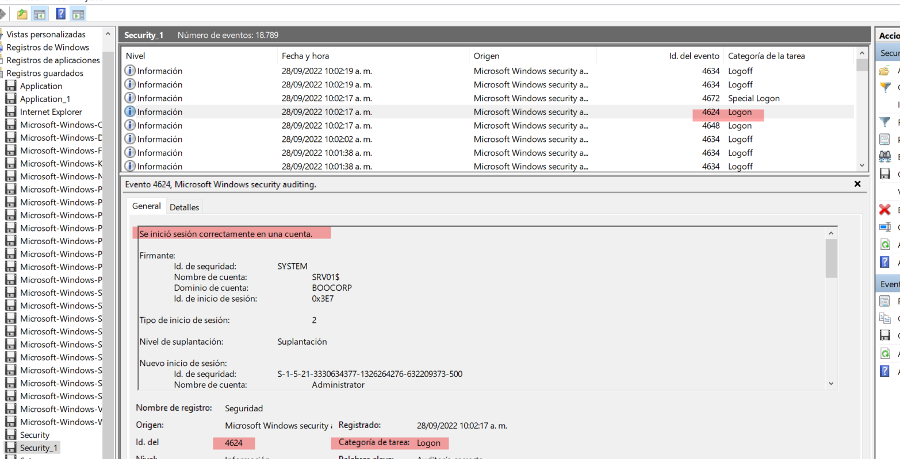
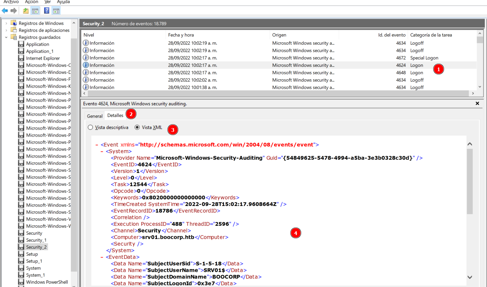

# Downgrade

Difficulty:: #medium 

## Introduction
This challenge give us the logs envents of a windows machine. And ask us for indentify a suspicious login attemp. They made the challenge in a way that we have to answer a series of questions, so thery were guiding people that perform this kind of analysis for first time.

## Target data
- `Spawn Docker`: `161.35.172.25:30469`
- `File`:  `forensics_downgrade.zip`

## Challenge Description
*During recent auditing, we noticed that network authentication is not forced upon remote connections to our Windows 2012 server. That led us to investigate our system for suspicious logins further. Provided the server's event logs, can you find any suspicious successful login?*

## Enumeration

The zip only contain a `Logs` directory that stored a buch of `evtx` files:

```shell
magor$ tree forensics_downgrade/
forensics_downgrade/
└── Logs
    ├── Application.evtx
    ├── HardwareEvents.evtx
    ├── Internet Explorer.evtx
    ├── Key Management Service.evtx
    ├── ...SNIP...
    ├── Microsoft-Windows-WindowsUpdateClient%4Operational.evtx
    ├── Microsoft-Windows-Winlogon%4Operational.evtx
    ├── OpenSSH%4Admin.evtx
    ├── OpenSSH%4Operational.evtx
    ├── Security.evtx
    ├── Setup.evtx
    ├── System.evtx
    ├── Windows PowerShell.evtx
    └── WitnessClientAdmin.evtx

1 directory, 113 files
```


But the also they give us a `spam docker` so I wanna check it before review each file. I found that its a guide to analize the data.

### 1. Logon and logoff events

```shell
$ nc -n 161.35.172.25 30469

+-----------+---------------------------------------------------------+
|   Title   |                       Description                       |
+-----------+---------------------------------------------------------+
| Downgrade |         During recent auditing, we noticed that         |
|           |     network authentication is not forced upon remote    |
|           |       connections to our Windows 2012 server. That      |
|           |           led us to investigate our system for          |
|           |  suspicious logins further. Provided the server's event |
|           |       logs, can you find any suspicious successful      |
|           |                          login?                         |
+-----------+---------------------------------------------------------+

Which event log contains information about logon and logoff events? (for example: Setup)
> 
```

It seems that with each question it will give us the path to follow to do the forensics analysis. So due to the first question is asking us for the file that stored the logon and logoff events. I search by ["evtx" to logon and logoff events](https://www.google.com/search?q=%22evtx%22+to+logon+and+logoff+events) and found [Query exported evtx files for logon/logoff by user](https://community.spiceworks.com/topic/2176344-query-exported-evtx-files-for-logon-logoff-by-user) it says that is `security.evtx`

```shell
$ nc -n 161.35.172.25 30469

+-----------+---------------------------------------------------------+
|   Title   |                       Description                       |
+-----------+---------------------------------------------------------+
| Downgrade |         During recent auditing, we noticed that         |
|           |     network authentication is not forced upon remote    |
|           |       connections to our Windows 2012 server. That      |
|           |           led us to investigate our system for          |
|           |  suspicious logins further. Provided the server's event |
|           |       logs, can you find any suspicious successful      |
|           |                          login?                         |
+-----------+---------------------------------------------------------+

Which event log contains information about logon and logoff events? (for example: Setup)
> security
[+] Correct!

What is the event id for logs for a successful logon to a local computer? (for example: 1337)
>
```

Now they ask for the **id that stored the successful logon events to a local computer**. So now that I already know that that information is stored inside `security.evtx` I am going to review it.

### 2. Successfuel Logon id.


I have been tasked with finding all of the logon/logoff times for a particular set of users and have been given all of the security.evtx files from the domain controller for the past year


I open the `Security.evtx` file. By default windows use the [Events Viewer](https://learn.microsoft.com/en-us/shows/inside/event-viewer). The logs structure is in a series of records presented in a table. Looking at the columns names you can identify `Event Id` and the `task category` I sort by `Task category` rigth clicking the column name. And found `Logon` category. But there are multiples `ids` that belong to the `Logon` category so I read the general description to identify one that says `Login successfully` and check that the `event id` is the `4624`. See the imagen below:



```shell
$ nc -n 161.35.172.25 30469

+-----------+---------------------------------------------------------+
|   Title   |                       Description                       |
+-----------+---------------------------------------------------------+
| Downgrade |         During recent auditing, we noticed that         |
|           |     network authentication is not forced upon remote    |
|           |       connections to our Windows 2012 server. That      |
|           |           led us to investigate our system for          |
|           |  suspicious logins further. Provided the server's event |
|           |       logs, can you find any suspicious successful      |
|           |                          login?                         |
+-----------+---------------------------------------------------------+

Which event log contains information about logon and logoff events? (for example: Setup)
> security
[+] Correct!

What is the event id for logs for a successful logon to a local computer? (for example: 1337)
> 4624
[+] Correct!

Which is the default Active Directory authentication protocol? (for example: http)
>
```

Now it ask us for the default Active Directory authentication protocol.

### 3. Eefault Active Directory authentication protocol

I research about the Active Directory authentication protocol and found that to
[Check Primary Authentication Protocol for Active Directory](https://serverfault.com/questions/682027/check-primary-authentication-protocol-for-active-directory-ntlm-or-kerberos) we can look for the `AuthenticationPackageName` parameter in the `Logon` logs.

We can [Parsing Windows event log files (.evtx) using Python](https://www.alishaaneja.com/evtx/) using `evtx_dump.py`. So i parse the `Security.evtx` file and with`grep` i filter only lines  with `AuthenticationPackageName`.

```shell
magor$ evtx_dump.py Security.evtx | grep "AuthenticationPackageName"

<Data Name="AuthenticationPackageName">Negotiate</Data>
<Data Name="AuthenticationPackageName">Negotiate</Data>
<Data Name="AuthenticationPackageName">Negotiate</Data>
<Data Name="AuthenticationPackageName">Negotiate</Data>
<Data Name="AuthenticationPackageName">Negotiate</Data>
<Data Name="AuthenticationPackageName">Negotiate</Data>
```

I notice that almost all says `Negotiate`. Reading the [Microsoft Negotiate docs](https://learn.microsoft.com/en-us/windows/win32/secauthn/microsoft-negotiate) It means that the first attemp will be use the `kerberos` protocol and if it fails then will trywith `ntlm` protocol. So the default is `kerberos`:

```shell
magor$ nc -n 161.35.172.25 30469

+-----------+---------------------------------------------------------+
|   Title   |                       Description                       |
+-----------+---------------------------------------------------------+
| Downgrade |         During recent auditing, we noticed that         |
|           |     network authentication is not forced upon remote    |
|           |       connections to our Windows 2012 server. That      |
|           |           led us to investigate our system for          |
|           |  suspicious logins further. Provided the server's event |
|           |       logs, can you find any suspicious successful      |
|           |                          login?                         |
+-----------+---------------------------------------------------------+

Which event log contains information about logon and logoff events? (for example: Setup)
> security
[+] Correct!

What is the event id for logs for a successful logon to a local computer? (for example: 1337)
> 4624
[+] Correct!

Which is the default Active Directory authentication protocol? (for example: http)
> kerberos
[+] Correct!

Looking at all the logon events, what is the AuthPackage that stands out as different from all the rest? (for example: http)
>
```

The next question is ask us for a  `AuthPackage` that seems suspicious

### 4.  Suspicious AuthPackage

I filter again the `Security.evtx` file but since the ask to found a authpacket different form all the rest, I am gonna sort them and use `uniq` to get  count and get only unique case.
```shell
magor$ evtx_dump.py Security.evtx | grep "AuthenticationPackageName" | sort | uniq -c
      9 <Data Name="AuthenticationPackageName">-</Data>
     16 <Data Name="AuthenticationPackageName">Kerberos</Data>
     27 <Data Name="AuthenticationPackageName">NTLM</Data>
   1909 <Data Name="AuthenticationPackageName">Negotiate</Data>
```

And look that  there are a few of `-` , `Kerberos` and `ntlm` (to be honest i try the three of them xD) and the `ntlm` was the correct.

```shell
magor$ nc -n 161.35.172.25 30469

+-----------+---------------------------------------------------------+
|   Title   |                       Description                       |
+-----------+---------------------------------------------------------+
| Downgrade |         During recent auditing, we noticed that         |
|           |     network authentication is not forced upon remote    |
|           |       connections to our Windows 2012 server. That      |
|           |           led us to investigate our system for          |
|           |  suspicious logins further. Provided the server's event |
|           |       logs, can you find any suspicious successful      |
|           |                          login?                         |
+-----------+---------------------------------------------------------+

Which event log contains information about logon and logoff events? (for example: Setup)
> security
[+] Correct!

What is the event id for logs for a successful logon to a local computer? (for example: 1337)
> 4624
[+] Correct!

Which is the default Active Directory authentication protocol? (for example: http)
> kerberos
[+] Correct!

Looking at all the logon events, what is the AuthPackage that stands out as different from all the rest? (for example: http)
> ntlm
[+] Correct!

What is the timestamp of the suspicious login (yyyy-MM-ddTHH:mm:ss) UTC? (for example, 2021-10-10T08:23:12)
>
```
Now the ask us for reduce more the breach to identify the suspicious login connection. to identify the timestamp.

### 5. Timestamp suspicious login

Well they guide us to look for the `ntlm` login connections. So now I to filter it I am gonna check how the log event is structure:

I copy the `xml` event from the events viewer:


```xml
- <Event xmlns="http://schemas.microsoft.com/win/2004/08/events/event">
- <System>
  <Provider Name="Microsoft-Windows-Security-Auditing" Guid="{54849625-5478-4994-a5ba-3e3b0328c30d}" /> 
  <EventID>4624</EventID> 
  <Version>1</Version> 
  <Level>0</Level> 
  <Task>12544</Task> 
  <Opcode>0</Opcode> 
  <Keywords>0x8020000000000000</Keywords> 
  <TimeCreated SystemTime="2022-09-28T15:02:17.9608664Z" /> 
  <EventRecordID>18786</EventRecordID> 
  <Correlation /> 
  <Execution ProcessID="488" ThreadID="2596" /> 
  <Channel>Security</Channel> 
  <Computer>srv01.boocorp.htb</Computer> 
  <Security /> 
  </System>
- <EventData>
  <Data Name="SubjectUserSid">S-1-5-18</Data> 
  <Data Name="SubjectUserName">SRV01$</Data> 
  <Data Name="SubjectDomainName">BOOCORP</Data> 
  <Data Name="SubjectLogonId">0x3e7</Data> 
  <Data Name="TargetUserSid">S-1-5-21-3330634377-1326264276-632209373-500</Data> 
  <Data Name="TargetUserName">Administrator</Data> 
  <Data Name="TargetDomainName">BOOCORP</Data> 
  <Data Name="TargetLogonId">0x59cb84</Data> 
  <Data Name="LogonType">2</Data> 
  <Data Name="LogonProcessName">User32</Data> 
  <Data Name="AuthenticationPackageName">Negotiate</Data> 
  <Data Name="WorkstationName">SRV01</Data> 
  <Data Name="LogonGuid">{8b13230e-756a-3db4-2b96-b5abb7575a25}</Data> 
  <Data Name="TransmittedServices">-</Data> 
  <Data Name="LmPackageName">-</Data> 
  <Data Name="KeyLength">0</Data> 
  <Data Name="ProcessId">0xc78</Data> 
  <Data Name="ProcessName">C:\Windows\System32\winlogon.exe</Data> 
  <Data Name="IpAddress">127.0.0.1</Data> 
  <Data Name="IpPort">0</Data> 
  <Data Name="ImpersonationLevel">%%1833</Data> 
  </EventData>
  </Event>
```
Now what i want to filter is:
- The `4624</EventID>` and get the follow 24 lines.
- Pipe it to filter the `AuthenticationPackageName">NTLM` and get the 24 previous lines.
- Pip it and filter `SystemTime`

```shell
magor$ evtx_dump.py Security.evtx | grep '4624</EventID>' -A24 | grep 'AuthenticationPackageName">NTLM' -B24 | grep 'SystemTi
me'
<TimeCreated SystemTime="2020-03-21 20:24:15.832811"></TimeCreated>
<TimeCreated SystemTime="2020-03-21 13:24:45.556831"></TimeCreated>
<TimeCreated SystemTime="2022-09-28 12:02:47.804438"></TimeCreated>
<TimeCreated SystemTime="2022-09-28 12:02:48.920332"></TimeCreated>
<TimeCreated SystemTime="2022-09-28 12:02:50.809946"></TimeCreated>
<TimeCreated SystemTime="2022-09-28 12:02:54.238146"></TimeCreated>
<TimeCreated SystemTime="2022-09-28 12:03:09.685457"></TimeCreated>
<TimeCreated SystemTime="2022-09-28 12:03:11.438910"></TimeCreated>
<TimeCreated SystemTime="2022-09-28 12:03:13.879648"></TimeCreated>
<TimeCreated SystemTime="2022-09-28 12:03:14.498085"></TimeCreated>
<TimeCreated SystemTime="2022-09-28 12:03:14.841757"></TimeCreated>
<TimeCreated SystemTime="2022-09-28 12:03:15.064960"></TimeCreated>
<TimeCreated SystemTime="2022-09-28 12:03:15.253914"></TimeCreated>
<TimeCreated SystemTime="2022-09-28 12:03:16.818645"></TimeCreated>
<TimeCreated SystemTime="2022-09-28 12:03:17.058369"></TimeCreated>
<TimeCreated SystemTime="2022-09-28 12:03:17.248089"></TimeCreated>
<TimeCreated SystemTime="2022-09-28 12:03:47.145569"></TimeCreated>
<TimeCreated SystemTime="2022-09-28 12:04:40.321695"></TimeCreated>
<TimeCreated SystemTime="2022-09-28 12:04:41.153677"></TimeCreated>
<TimeCreated SystemTime="2022-09-28 12:04:43.214634"></TimeCreated>
<TimeCreated SystemTime="2022-09-28 12:04:45.653730"></TimeCreated>
<TimeCreated SystemTime="2022-09-28 12:04:46.356171"></TimeCreated>
<TimeCreated SystemTime="2022-09-28 12:04:56.773201"></TimeCreated>
<TimeCreated SystemTime="2022-09-28 12:04:57.515619"></TimeCreated>
<TimeCreated SystemTime="2022-09-28 12:04:57.753466"></TimeCreated>
<TimeCreated SystemTime="2022-09-28 12:04:58.005810"></TimeCreated>
<TimeCreated SystemTime="2022-09-28 13:10:57.314316"></TimeCreated>
```

Look that there are multiples logins events in `2022-09-28` and the times are so close, so this is souspicious. So I try to send the first one  `2022-09-28 13:10:57.314316`  and the send the flag!:

```shell
magor$ nc -n 161.35.172.25 30469

+-----------+---------------------------------------------------------+
|   Title   |                       Description                       |
+-----------+---------------------------------------------------------+
| Downgrade |         During recent auditing, we noticed that         |
|           |     network authentication is not forced upon remote    |
|           |       connections to our Windows 2012 server. That      |
|           |           led us to investigate our system for          |
|           |  suspicious logins further. Provided the server's event |
|           |       logs, can you find any suspicious successful      |
|           |                          login?                         |
+-----------+---------------------------------------------------------+

Which event log contains information about logon and logoff events? (for example: Setup)
> security
[+] Correct!

What is the event id for logs for a successful logon to a local computer? (for example: 1337)
> 4624
[+] Correct!

Which is the default Active Directory authentication protocol? (for example: http)
> kerberos
[+] Correct!

Looking at all the logon events, what is the AuthPackage that stands out as different from all the rest? (for example: http)
> ntlm
[+] Correct!

What is the timestamp of the suspicious login (yyyy-MM-ddTHH:mm:ss) UTC? (for example, 2021-10-10T08:23:12)
> 2022-09-28T13:10:57
[+] Correct!

[+] Here is the flag: HTB{xxxxxxxxxxxxxxxxxxxxxxxxxxxxxxxx}
```